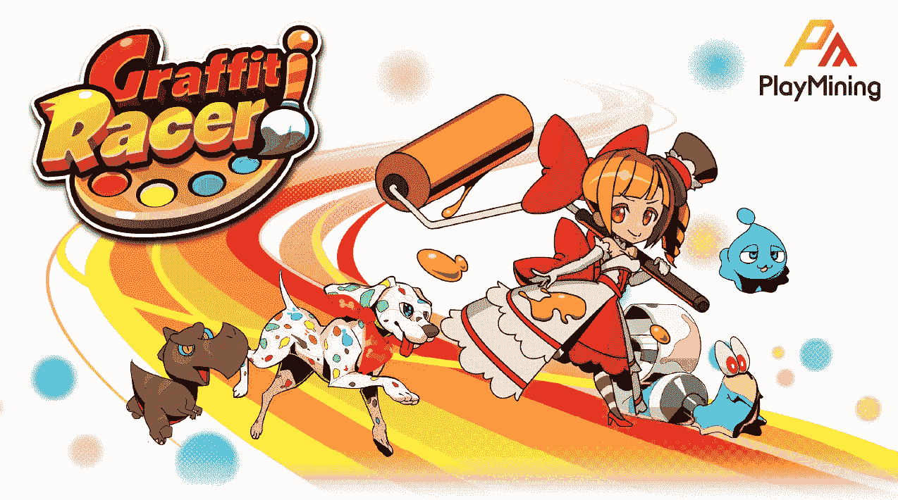

# Web3 娱乐平台 PlayMining 推出 GameFi 游戏《涂鸦赛车》

> 原文：<https://medium.com/coinmonks/playmining-a-web3-entertainment-platform-launches-4th-gamefi-title-graffiti-racer-aeb67d2f8ea4?source=collection_archive---------46----------------------->

‘Coloring + Racing’ game lets players color in their own NFT characters and race them.

*新加坡，2022 年 11 月 2 日* — Web3 娱乐公司 [PlayMining](https://playmining.com) 宣布推出 PlayMining 平台上的新 NFT 游戏 [Graffiti Racer](https://graffitiracer.playmining.com/en/) 。Graffiti Racer 加入了一个“玩到赚”(P2E) GameFi 游戏的目录，该目录允许玩家赚取 DEAPcoin ( [$DEP](https://coinmarketcap.com/currencies/deapcoin/) )代币，这些代币可以在 PlayMining NFT 市场上使用。

在 Graffiti Racer 中，玩家为“NFT 床单”角色着色，这些角色具有耐力、速度和操控性方面的赛车技能属性。一旦着色，这些角色可以参加激动人心的巡回赛或排位赛。高分为玩家赢得 DEP 奖励，可以用来购买额外的 NFT 表。NFT 也是可以收集的，越稀有的技能越强大，角色也可以通过游戏升级。

> *“涂鸦赛车的着色加赛车的组合是一种全新的 NFT 游戏，玩家肯定会喜欢，”运营 PlayMining 的公司* [*数字娱乐资产*](https://dea.sg) *(DEA)的联合首席执行官兼联合创始人*[*Kozo Yamada*](https://www.linkedin.com/in/kozo-yamada-14a56391/)*说。“我们的游戏主要迎合工作的成年人和学生，对于他们来说，涂鸦赛车这样的休闲游戏是在忙碌的一天中享受一些放松娱乐的完美方式。”*

涂鸦赛车:

**PlayMining:一个强大的 P2E 平台，提供很多东西**

PlayMining 平台上的其他游戏包括 [Job Tribes](https://jobtribes.playmining.com/en/) 、[cooking ' Burger](https://www.cookinburger.com/en/)和 [Menya Dragon Ramen](https://dragonramen.flypenguin-games.com/en/) ，它们都是非常适合休闲游戏玩家的 P2E 游戏。Menya Dragon Ramen 由 [Fly Penguin Studios](https://www.flypenguin.jp) 制作，于 2022 年 10 月初推出，是 PlayMining NFT 游戏平台上的第一款第三方游戏。值得注意的是，PlayMining 提供了一个多功能的在线生态系统，第三方游戏工作室可以在强大的 NFT 市场和即将推出的元宇宙功能的支持下开发新的知识产权。

PlayMining 还为在其平台上推出的游戏提供了竞争优势，DEAPcoin 是第一个也是目前唯一一个获得日本金融服务厅官方批准的 P2E 代币。这种令牌在 PlayMining NFT 市场上使用，该市场定期举办来自知名艺术家和创作者的 NFTs 日本著名视频游戏和动漫系列《仙女尾巴》、《最终幻想》和《勇者斗恶龙》的设计者都在 PlayMining 上展示了他们的艺术作品。

> DEA 的另一位联合首席执行官兼联合创始人[*nao hito Yoshida*](https://www.linkedin.com/in/naohito-yoshida-47498836/)*说:“虽然 PlayMining 在日本有很强的影响力，但我们希望看到这个领域有更多的竞争，因为这将真正有助于推动 NFT 博彩的主流意识。“我们的最终目标是建立一个全球性的 Web3 游戏平台，就像任天堂在游戏机游戏市场上所做的那样。我们渴望将我们的 playerbase 扩展到世界各地的游戏玩家。”*

**对抗创意知识产权领域的财务不平等**

PlayMining 的另一个主要目标是让知识产权货币化成为一种更公平的做法。众所周知，游戏行业掠夺了创作者很大一部分利润，收入的最大份额被其他利益相关者，如分销商所攫取。例如，最大的分销渠道——包括苹果、PlayStation、任天堂和微软——占每笔销售额的 30%。

PlayMining 的费用要合理得多，并使用 Web3 技术来确保整个平台以完全透明的方式运行。这在 PlayMining NFT 市场上尤为明显，在那里，销售额记录在区块链上，版税支付给官方知识产权所有者和粉丝艺术家。迄今为止，该市场已经支付了超过 900 万新加坡元的版税，并托管了 100 多位创作者的作品。

**关于 PlayMining**

PlayMining 是一个 Web3 娱乐平台，它赋予创作者权力，否则他们在传统的知识产权创作行业中几乎不会受益。PlayMining 平台是一种新的内容创作商业模式，以 PlayMining DEAPcoin 为动力的 NFT 市场为特色，与 NFT 游戏和元宇宙平台相结合，既有内部游戏，也有第三方项目，它们拥有自己的原生令牌，允许创作者捕捉他们创造的几乎所有价值。PlayMining 平台拥有 250 万用户，目前有四款游戏:Job Tribes、Cookin ' Burger、Menya Dragon Ramen 和 Graffiti Racer。

**关于数字娱乐资产**

数字娱乐资产有限公司。Ltd. (DEA)是一家总部位于新加坡的全球 GameFi 和元宇宙平台业务，成立于 2018 年 8 月。DEA 是 Play to Earn 游戏的开发商，还运营着 PlayMining NFT 游戏平台、PlayMining NFT 市场、PlayMining Verse 元宇宙项目和 DEAPcoin，这是目前唯一由日本金融厅批准的 P2E 代币。该团队由两位联合首席执行官领导——nao hito Yoshida 和 Kozo Yamada——他们共同带来了数十年的成功创业经验(3 次 IPO)，创造了热门视频游戏，制作了网络电视节目，并对 NFT 游戏有着深刻的理解。

**官方渠道**

PlayMining 网站:【https://playmining.com 

挑拨离间:【https://discord.com/invite/xWeHGdt】T4

play mining Twitter:[https://twitter.com/PlayMining_SG](https://twitter.com/PlayMining_SG)

https://www.facebook.com/PlayMining/脸书矿业公司

play mining Youtube:[https://www.youtube.com/channel/UCGWmK0RLV4SB_PSXpj2j6dw](https://www.youtube.com/channel/UCGWmK0RLV4SB_PSXpj2j6dw)

涂鸦赛车网站:[https://graffitiracer.playmining.com/](https://graffitiracer.playmining.com/)

涂鸦赛车视频:[https://youtu.be/FEc1q3rftbc](https://youtu.be/FEc1q3rftbc)(日语旁白)

DEA 网址: [https://dea.sg](https://dea.sg/jp/)

> 交易新手？试试[加密交易机器人](/coinmonks/crypto-trading-bot-c2ffce8acb2a)或者[复制交易](/coinmonks/top-10-crypto-copy-trading-platforms-for-beginners-d0c37c7d698c)