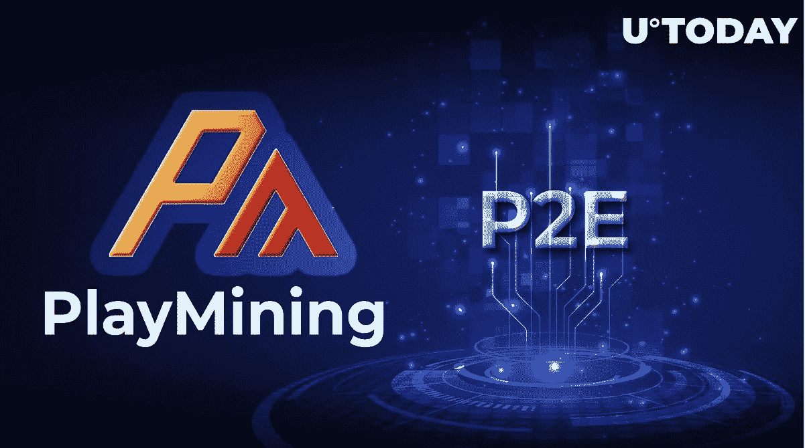

# PlayMining 凭借其“烹饪 RPG”继续改变 P2E 的叙事

> 原文：<https://medium.com/coinmonks/playmining-continues-to-change-narrative-in-p2e-with-its-cooking-rpg-826bbe76aada?source=collection_archive---------37----------------------->

PlayMining 是新加坡的一个 Web3 创意平台，由数字娱乐资产(DEA)发起和维护，它分享了其新游戏的细节。

## PlayMining 的龙拉面于 10 月 5 日在 mainnet 推出

根据 [PlayMining](https://playmining.com/) 代表分享的官方公告，其独特的玩赚游戏《龙拉面》面向大众发布。

*图片由 PlayMining*

游戏的技术设计由 PlayMining 和 DEA 的合作伙伴 Fly Penguin Studios 创建。该游戏将于 2022 年 10 月 5 日上线:每个人都可以在 Web3 部分尝试有史以来第一次“烹饪 RPG”。

在《龙拉面》中，玩家经营一家日本餐厅，管理团队，与客户互动，同时努力提供这座城市最好的拉面。玩家需要雇佣一个由熟练员工组成的重量级团队；最有价值的员工是不可替代的代币(NFT)。

自推出以来，这款名为“龙拉面”的游戏已经在 iOS 和 Android 平台的移动应用市场上免费提供。

## 高版税的社区驱动平台:什么是 PlayMining？

此外，在 2022 年第四季度，PlayMining 将发布其他游戏:涂鸦赛车和幸运农民。

PlayMining 已经成为一个新颖的 Web3 IP 工作室，专注于包容性和透明的创作体验。它允许数字创作者在他们的平台上制作基于 Web3 区块链的游戏和 metaverses，并在他们的 NFT 市场上交易等等。

截至 2022 年 10 月中旬，PlayMining 与 100 多家通过自己的数字内容市场获得版税的创作者合作。总的来说，PlayMining 已经分发了超过 900 万新加坡元的特许权使用费，远远超过大多数竞争对手。

PlayMining tokenomics 是围绕 DEAPcoin 构建的，deap coin 是 P2E 地区唯一一种由日本金融监管机构金融服务厅(FSA)正式批准的加密货币。

PlayMining C-suite 拥有一个重量级的数字专业团队，其中包括联席首席执行官 Naohito Yoshida(前三次 IPO 的连续企业家)、拥有 15 年电视经验的联席首席执行官 Kozo Yamada 以及拥有 Meta/脸书和软银经验的 CSO Tatsuya Kohrogi。

[*来源*](https://u.today/playmining-continues-to-change-narrative-in-p2e-with-its-cooking-rpg#h20)

> 交易新手？尝试[加密交易机器人](/coinmonks/crypto-trading-bot-c2ffce8acb2a)或[复制交易](/coinmonks/top-10-crypto-copy-trading-platforms-for-beginners-d0c37c7d698c)