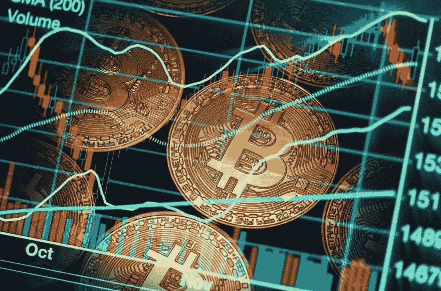

# 点加密货币？

> 原文：<https://medium.com/coinmonks/point-of-cryptocurrency-bd2dbe1e703b?source=collection_archive---------48----------------------->

A cryptocurrency, crypto-currency, or crypto is a digital currency designed to work as a medium of exchange through a computer network that is not reliant on any central authority, such as a government or bank, to uphold or maintain it.

有了加密货币，就有了一种新的交易和存储价值的方式。许多人认为，它明显优于传统的法定货币和黄金。与传统金融系统相比，通过加密货币分散金融运营具有多种效率。它削减了几乎所有的管理费用。此外，交易费用较低，可以在国际上发送和接收。

有了法定货币(政府发行的没有黄金等商品支持的货币，其价值完全来自人们对它的信任)，国家可以印刷和限制货币的印刷。因此，值可以波动。对于那些生活在恶性通货膨胀和经济不稳定国家的人来说，加密货币可能是比法定货币更好的储值选择。

然而，在加密货币的情况下，有一个定义好的货币政策，任何人都不能改变，不管他们是谁。

# 加密货币类型

加密货币旨在用于支付，在分散的用户网络中传输价值(类似于数字货币)。许多代用币(即，不是比特币，有时也不是以太币)以这种方式分类，有时可能被称为价值令牌。以下是按现存硬币的美元总值列出的流行数字货币列表:

比特币:以太坊

卡尔达诺(阿达):币安·科因(BNB)

系绳:索拉纳

XRP: Dogecoin

波尔卡多特(dot):美元(USDC)

# 优势

*   加密货币代表了一种新的、去中心化的货币范式。在这种体系中，不需要银行和金融机构等集中的中介机构来加强双方之间的信任和监管交易。因此，拥有加密货币的系统消除了单点故障(如大型银行)在全球引发一连串危机(如 2008 年美国机构故障所引发的危机)的可能性。
*   加密货币承诺使双方之间直接转移资金变得更容易，而不需要像银行或信用卡公司这样的可信第三方。这种分散的[转移](https://www.investopedia.com/terms/t/transfer.asp)通过使用公钥和私钥以及不同形式的激励系统(如工作证明或股权证明)来确保安全。14
*   由于不使用第三方中介，交易双方之间的加密货币转账比标准货币转账更快。分散融资中的快速贷款是这种分散转移的一个很好的例子。这些贷款在处理过程中无需抵押担保，可以在几秒钟内执行并用于交易。15
*   加密货币投资可以产生利润。过去十年，加密货币市场的价值飙升，一度达到近 2 万亿美元。截至 2022 年 5 月，比特币在加密市场的价值超过 5500 亿美元。16
*   汇款经济正在测试加密货币最突出的用例之一。目前，比特币等加密货币作为中间货币，可以简化跨境资金转移。因此，法定货币被转换为比特币(或另一种加密货币)，跨境转移，并随后转换为目的地法定货币。这种方法简化了资金转移过程，并使其更便宜。

# 不足之处

*   虽然加密货币声称是一种匿名交易形式，但实际上是假名。他们会留下数字痕迹，让联邦调查局(FBI)等机构能够破译。这为政府或联邦当局追踪普通公民的金融交易提供了可能性
*   加密货币已经成为犯罪分子用于洗钱和非法购买等邪恶活动的流行工具。可怕的海盗罗伯茨的案件已经众所周知，他经营着一个在黑暗网络上出售毒品的市场。加密货币也成为黑客的最爱，他们利用加密货币进行勒索活动。18
*   理论上，加密货币应该是去中心化的，它们的财富在区块链的多方之间分配。现实中，所有权高度集中。例如，麻省理工学院的一项研究发现，仅 11，000 名投资者就持有比特币飙升价值的大约 45%
*   加密货币的一个概念是，任何人都可以使用连接互联网的计算机来挖掘它们。然而，挖掘流行的加密货币需要大量的能源，有时需要整个国家消耗的能源。昂贵的能源成本加上采矿的不可预测性使得采矿集中在收入高达数十亿美元的大公司中。根据麻省理工学院的一项研究，10%的矿工占据了其 90%的采矿能力。19
*   虽然加密货币区块链高度安全，但其他加密库，如交易所和钱包，可能会被黑客攻击。多年来，许多加密货币交易所和钱包遭到黑客攻击，有时导致价值数百万美元的“硬币”被盗。20
*   在公开市场交易的加密货币会受到价格波动的影响。比特币的价值经历了快速飙升和暴跌，2017 年 12 月攀升至 17，738 美元，随后几个月跌至 7，575 美元。3 因此，一些经济学家认为加密货币是一种短暂的时尚或投机泡沫。

> 交易新手？试试[加密交易机器人](/coinmonks/crypto-trading-bot-c2ffce8acb2a)或者[复制交易](/coinmonks/top-10-crypto-copy-trading-platforms-for-beginners-d0c37c7d698c)