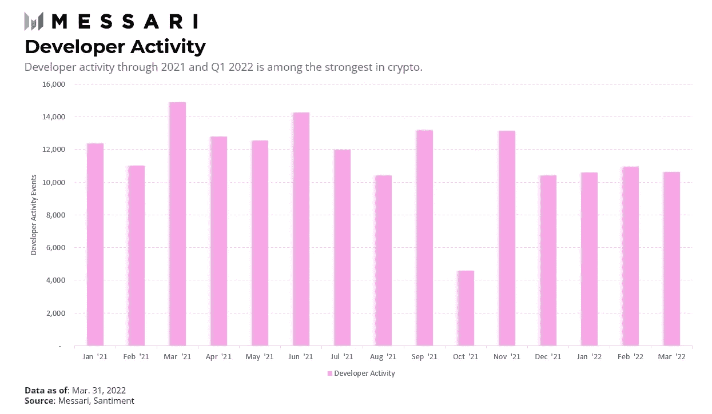
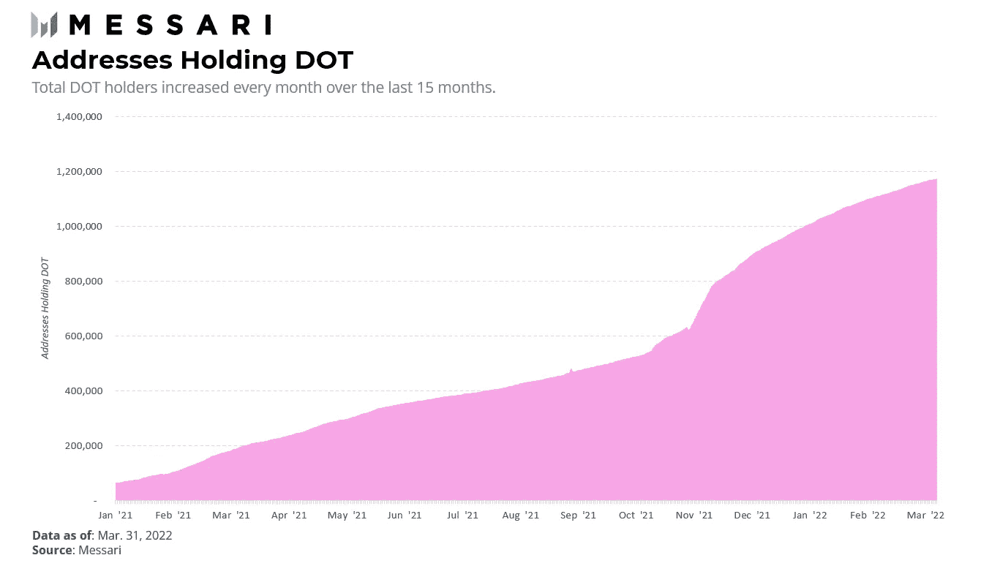
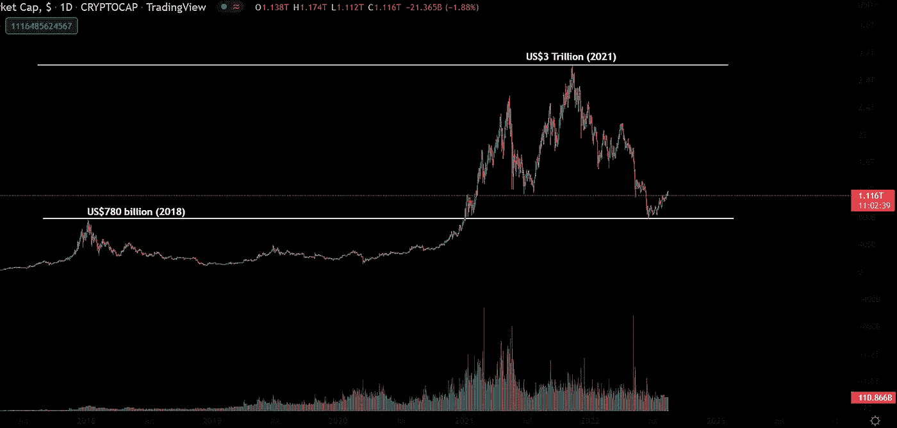
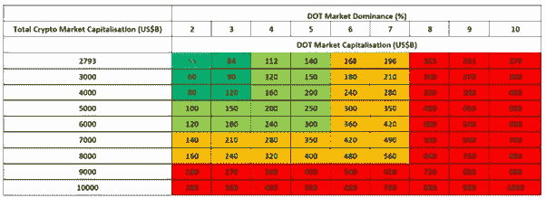

# 波尔卡多特 2024 年牛市价格预测

> 原文：<https://medium.com/coinmonks/polkadot-2024-bull-market-price-prediction-49e71e627a7f?source=collection_archive---------0----------------------->

波尔卡多特是加文·伍德博士的作品，他是以太坊的创始人之一(与查尔斯·霍斯金森(卡尔达诺)和维塔利克·布特林一起)。

他还创造了 Solidity 编程语言，这是以太坊及其庞大生态系统的基础。

伍德博士和奇偶校验的彼得·查班在 2017 年创立了 Web3 基金会。这是一个非营利实体，旨在支持 Polkadot 的研究和开发，并监督其筹款工作。

Web3 基金会选择了奇偶技术来开发 Polkadot。同样，伍德博士与尤塔·斯坦纳一起创立了奇偶技术公司，以维护 Polkadot 的开发框架。

加密市场通常围绕邪教人物集会，这导致了灾难性的内爆和财富损失。

相反，一个有过去记录的受尊敬的团队意味着这个项目有成功的机会。

**市场机会**

Polkadot (DOT)生态系统自 2017 年推出以来，一直相对落后于其他区块链生态系统。

几家开发商最近通过其众筹贷款和 para 链机制在点生态系统上建立并推出了项目。

这些项目与以太坊(ETH)上的项目相媲美，旨在克服以太坊的一些缺点。因此，部署在 DOT 上的项目包括各种分散金融(DeFi)协议、NFT 平台、数据 oracles 等等。

根据 messari.io 的研究，该生态系统最近经历了项目部署的上升，并经历了持续的开发者活动(见下图)。

根据 Messari 的研究，在比特币(BTC)和 ETH 之后，DOT 是投资基金持有最多的数字资产。

这一指标表明，投资基金对 DOT 生态系统及其项目实现显著增长和实现愿景的能力充满信心。

此外，点持有者的数量稳步增长，很可能是由于从结合点令牌到副链拍卖的回报。

DOT 生态系统可能是 ETH 生态系统的有力竞争者。

DOT 的 mainnet 2021 年正式上线；因此，它仍然非常年轻，需要一些时间来充分实现其潜力。

因此，如果 DOT 从 ETH 和加密货币总市值中获得更多市场份额(这很有可能)，其市值可能会比 2021 年的历史最高水平(ATH)翻一番。

ETH 的一部分市场份额将主要来自 DOT 的 EVM 兼容性。

这种兼容性将使开发人员能够快速部署 Polkadot 及其 parachains，其成本和工作量只是 ETH 部署的一小部分。

此外，开发人员可以将为 ETH 生态系统设计的项目复制并粘贴到 DOT 的生态系统中，从而提高跨链兼容性并缓解流动性碎片化。

例如，Moonbeam 和 Moonriver 是 Polkadot 生态系统项目，旨在将已建立和熟悉的以太坊工具与 Polkadot 的可扩展和可互操作的架构相结合。这些项目反映了以太坊的 RPC、账户、密钥、订阅、日志等等。

**价格预测**

下表显示了加密市场的过去和潜在的未来资本总额。

蓝色单元格对应的是 DOT 在最近一轮牛市高峰时的市值，其在整个加密市场的市场份额，以及总加密市值-分别为 550 亿美元、2%和 2.79 万亿美元(2793 亿美元)。

假设未来 DOT 仍持有类似数量的股份，我们可以估算 DOT 在各种市场支配地位百分比下相对于总加密市值的市值。

随着采用率、认知度和投机度的增长，加密市场的总市值在每个牛市周期都会呈指数级增长。鉴于总市值从 2018 年的约 7800 亿美元增长到 2021 年的约 3 万亿美元(见图片)，下一个牛市周期的总市值可能为 6 万亿至 8 万亿美元，增长近 4 倍。

下一波采用、增长和投机可能会推动该资产类别达到 5 万亿至 6 万亿美元的市值。考虑到采用、认识、机构参与和发展中区块链项目数量的对数增长，这个数字是非常保守的。

点生态系统相对年轻。因此，在 2024 年下一轮 BTC 减半和投机性牛市到来之前，可能没有足够的时间成熟到足以占据更多市场份额。

5 万亿美元的总加密市值和 2%的 DOT 优势将使 DOT 的市值达到 1000 亿美元左右(见下表)。

在这一水平上，DOT 完全稀释的市值将使代币的价格在 100 美元左右。但是假设象征性的通货膨胀率为 10%，这个数字会下降到大约 76 美元。

但如果代币供应总量中只有 50%是流动的，那么每枚代币的美元价值可能会翻倍，达到 150 美元左右。

*在 Twitter 上关注我在*[*@ observer _ kel*](https://twitter.com/observer_kel)*，*[*keltheobserver.medium.com*](https://keltheobserver.medium.com/)*在 Medium 上，订阅我的免费 Substack 简讯(*[*cbresearch.substack.com*](https://cbresearch.substack.com/)*)了解更多关于 Web3、NFTs 和 crypto 的前瞻性思想和 alpha。*

> 交易新手？尝试[加密交易机器人](/coinmonks/crypto-trading-bot-c2ffce8acb2a)或[复制交易](/coinmonks/top-10-crypto-copy-trading-platforms-for-beginners-d0c37c7d698c)