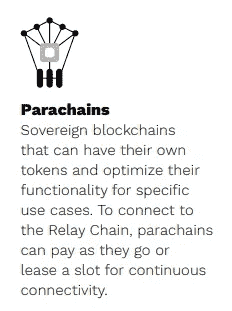
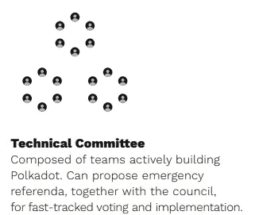
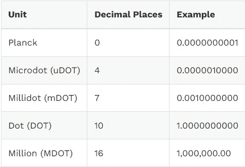
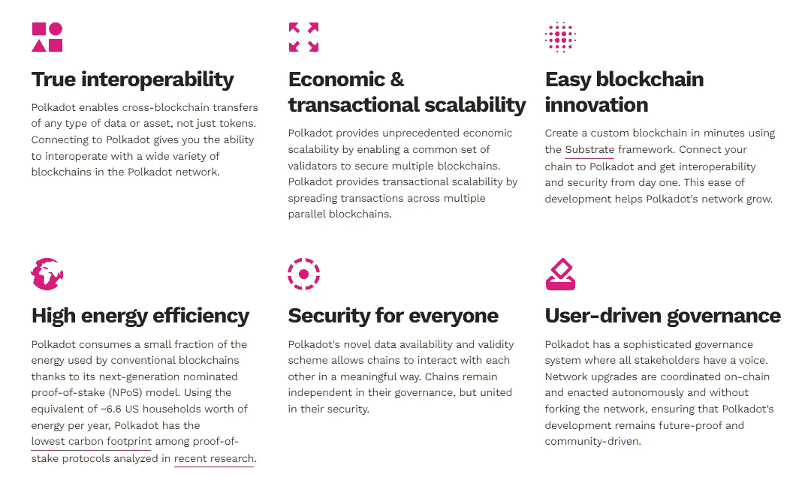

# 波尔卡多特解释道

> 原文：<https://medium.com/coinmonks/polkadot-dot-4fc40a2096f1?source=collection_archive---------18----------------------->

Source: Polkadot.network

**概述**

Polkadot 是第 0 层区块链，旨在解决区块链空间中的可伸缩性和互操作性问题。区块链喜欢以太坊，索拉纳，币安智能链等。孤立存在，不能互相交流。

Polkadot 这个名字有助于深入了解这个项目的内容。该名称引用了带有空白背景的分散圆点的织物图案。这些点代表彼此独立存在的各种区块链，它们之间没有任何联系。早期的个人电脑也有类似的问题，电脑无法相互通信，因为它们没有办法进行通信。随着互联网的兴起，计算机能够相互通信。这导致了该部门整体效率的提高。

Polkadot 旨在将所有这些链连接在一起，帮助它们更好地互操作，并改善区块链技术的整体状态，正如在计算空间中看到的那样。

波尔卡多特试图成为一个住宅区(区块链)。波尔卡多特将提供治理、公共产品和一个平台，让区块链人能够轻松地相互交流和联系。

值得一提的是，目前存在某种形式的交叉链技术，但是它存在很多缺陷，需要改进。多个跨链桥在过去遭受过攻击，需要改进。

> 交易新手？试试[密码交易机器人](/coinmonks/crypto-trading-bot-c2ffce8acb2a)或者[复制交易](/coinmonks/top-10-crypto-copy-trading-platforms-for-beginners-d0c37c7d698c)

Polkadot 由加文·伍德于 2017 年创立。他是以太坊的创始人之一，也是 Solidity 的发明者，Solidity 是一种用于实现智能合约的面向对象编程语言。

**架构**

Source: Polkadot.network

接力链位于波尔卡多特区块链的中心。它是分裂的区块链相互联系以及与外部区块链联系的枢纽。它还提供安全性和治理，并促进跨链的互操作性。

Source: Polkadot.network

副链是独立的分片链，有自己的令牌和用例。分片区块链是链分裂成更小的组件，使他们比更大的区块链更快。副链被定时与中继链相遇，以确保一切同步和安全。

Source: Polkadot.network

Parachains 并行处理和执行事务。这提高了可伸缩性，因为在一个链拥塞的情况下，它不会影响其他链的速度。这就是以太坊 2.0 寻求采用分片区块链来提高其网络可扩展性的原因。

Source: Polkadot.network

桥帮助副链与外部区块链连接。网桥专门用于使波尔卡多特生态系统兼容外部区块链，如比特币、以太坊和索拉纳等。它们连接到副链所连接的中继链上。中继链将桥和副链连接在一起，这有助于副链与外部区块链通信。

Source: Polkadot.network

**共识**

Polkadot 使用一种指定的利益相关证明(NPOS)共识机制。它由命名者、验证者、校对者和渔夫的角色组成。

**提名者**

Source: Polkadot.network

命名者是负责维护安全的节点。他们选择可信的验证基于他们的跟踪记录和点桩的数量。提名者被要求下注 DOT 来参与网络，他们也得到一部分验证者的节点奖励，在验证者行为不端的情况下，他们和选择他们的提名者的下注 DOT 被削减。

**验证器**

Source: Polkadot.network

验证器是通过标记点来保护中继链的节点。他们验证来自校对者的证据，并与其他验证者达成共识，以保持网络的更新。

它们对网络非常重要，因为它们负责向中继链以及所有副链添加新块。它们还通过中继链促进跨链交易。副链验证器有助于提供链外一致性，事务数据被提交到 tx 池，以供块生产者包含在链上。中继链验证器确保每个副链符合其独特的规则，并且可以在不可信的生态系统中的副链之间进行通信。

验证器是随机选择的，并且根据它们在每个时期的赌注来验证连接到中继链的所有副链的副链块。

在网络中验证器行为不当(例如离线、攻击网络或运行修改的软件)的情况下。他们和他们的提名者押点得到削减。划斜线的点将加入国库。

**整理器**

排序器是完全维护节点。它们从副链收集事务数据，并为中继链验证器生成状态转换证明。它们保留所有必要的信息，以便能够创建新的块和执行事务。它们整理并执行事务以创建一个未密封的块，并将其提供给一个或多个负责提出 parachain 块的验证器。

整理器节点不保护网络。在 parachain 块无效的情况下，验证器将拒绝它。

**渔民**

渔民有责任确保和促进网络上的良好行为。他们在网络上充当警察。他们不断监控网络，然后向验证者证明任何发现的不良行为。如果钓鱼者证明了某个验证者的任何不当行为，他们可能会失去部分或全部的股份给网络中的其他验证者

**基于 GHOST 的递归祖先派生前缀协议(爷爷)**

爷爷是一个用在中继链上的终结小工具。使爷爷与众不同的是它在链上而不是块上达成共识的能力。这加快了定稿过程；它甚至可以在长期网络部分事件或其他网络故障后处理数据块。

对于爷爷来说，只要 2/3 的验证者同意包含特定块的链，所有通向那个块的块就立即被终结。

**区块制作:贝贝** ( **区块链扩展盲赋值)**

BABE(block chain Extension 的盲分配)是在验证器节点之间运行并确定新块的创建者的块产生机制。BABE 根据验证者的赌注并使用 Polkadot 随机循环来分配块生产的槽。

验证者在每个时间段参与抽签，通知他们是否将被选为该时间段的块生产者候选人。时隙是离散的时间单位，通常长度为 6 秒。由于这种随机性机制，多个验证器可能是同一个槽的候选者。

**治理**

Polkadot 的链上治理由理事会成员和技术委员会组成。

**理事会成员**

理事会是一个连锁实体，由几个方面组成。每一方代表一个连锁账户；理事会目前由 13 名成员组成

该委员会负责:提出明智的公投，取消无争议的危险或恶意的公投，并选举技术委员会。他们还负责控制国库。

**技术委员会**

技术委员会(TC)由成功实现 Polkadot 运行时或 Polkadot 主机的团队组成。Polkadot 运行时是链的核心状态转换逻辑，可以随着时间的推移进行升级，而不需要硬分叉。Polkadot 主机是运行时在其中执行的环境，并且在 Polkadot 的生命周期中应该保持稳定和基本静态。委员会通过简单多数投票决定在 TC 中增加或删除哪些团队。

TC 的存在是为了防止恶意的全民公决，实现错误修复，逆转错误的运行时更新，或者添加新的但经过战斗考验的功能。

**记号组学**

Polkadot 网络的本地令牌是点令牌。波尔卡多特网络中最小的记账单位是普朗克。这类似于 Satoshis(对于比特币)和 Wei(对于以太坊)；波尔卡多特点等于 1e10 普朗克。

点令牌有三种不同的用途:网络治理、标桩和绑定。

目前有超过 10 亿点代币供应。它没有最大供应量，然而，它有 10%的年通货膨胀率。通货膨胀模型激励 DOT 持有者下注他们的硬币，因为他们可以获得战胜通货膨胀的赌注奖励。

**草间弥生**

草间弥生是波尔卡多特的金丝雀网络。这是 Polkadot 的一个早期的、未经审计的、未经提炼的版本，是为了在现实环境中测试网络的技术和经济激励而创建的。它有真正的利害关系，因为它鼓励用户在上面尝试真实的东西。它也是 parachain 开发人员在部署到 Polkadot 之前测试想法的完美地方。

该网络是一个实验性的开发环境，适合那些希望在草间弥生上快速行动和创新，或者准备在波尔卡多特上部署的团队。它有这种活得快，死得早的心态，因为它鼓励团队尽可能快地迭代，以草间弥生为基础。

草间弥生比波尔卡多特快四倍。它的原生 toke (KSM)是独立于 Polkadot 上的点标记的标记。

草间弥生由 Polkadot 创始人、以太坊联合创始人兼前 CTO 加文·伍德(Gavin Wood)于 2019 年创立。

**波尔卡多特和草间弥生的主要区别**

**链槽拍卖**

对于要添加到波尔卡多区块链的副链，它必须占用一个可用的副链插槽。

在波尔卡多特网络中，副链时隙是一种稀有资源，可用的时隙是有限的。随着副链数量的增加，每隔几个月可能只有几个槽。最终，草间弥生将有 100 个副链插槽。这些槽将在副链和副线程之间分开。如果一个副链想要在每个中继链块上有保证的块包含，它必须获得一个副链槽。

**副链槽采集**

草间弥生的副链槽数量有限，约为 100 个。这些插槽可以通过以下方式分配:

**“公共利益”副链**由 Polkadot 链上管理系统分配。这些副链被称为网络的“公共利益”;它们可能包括到其他网络或链的桥。“公益”副链通常被认为是系统级链或公共设施链。这些通常没有经济模式，有助于从中继链中移除交易，从而实现更高效的副链处理。

**拍卖授予的副链**通过无权限操作进行分配。该团队可以使用他们自己的点令牌竞标一个位置，也可以使用群体贷款功能从社区获得它们。众筹贷款功能被称为副链租赁产品(PLO)。这允许社区将他们的 DOT 或 KSM 贷款给寻求获得 parachain 插槽的项目。

借出的代币不会直接进入项目，而是锁定在一个智能合同中，直到拍卖期结束。如果项目赢得投币拍卖，出借 KSM 或 DOT 的用户将获得令牌以及项目的本地令牌。出借代币的不利之处在于锁定期。代币最多可以锁定两年。

**Parathreads** 与 parachains 具有相同的 API，但计划在现收现付的基础上执行，每个块都有一个拍卖。

parathread 模型特别适用于仅临时参与 Polkadot 系统的项目，这些项目不需要持续连接到网络，或者无法获得完整的 parachain 插槽。当副链的槽租用期结束时，它们也被降级为副线程。

Parathreads 的阻塞时间比 para chain 慢，但具有与 para chain 完全相同的安全级别和互操作性特性。此外，根据中继链上插槽的需求和可用性，任何区块链都可以在成为副链或副线程之间切换。

**好处/好处**

Source: Polkadot.network

Polkadot 与其他项目的不同之处在于它选择建造 0 层，而 1 层可以在 0 层之上建造。这是朝着解决区块链技术的三大问题迈出的新一步，这三大问题被著名地称为[区块链三元悖论](https://opeyemiegbeola14.medium.com/the-blockchain-trilemma-173412f6f945)。

无叉升级的出现也让波尔卡多特比其他项目更有优势。升级传统的区块链需要大量的时间，通常要持续几个月。网络的硬分叉容易导致社区中的争论。Polkadot 试图通过实现链升级而无需分叉链来彻底改变这一过程。这将使网络升级争议更少，实施速度更快。

**结论**

Polkadot 是一个有趣的项目，潜力巨大。该项目旨在通过解决目前困扰行业的主要问题，开创区块链技术的新时代。

然而，该项目有很多竞争，因为有很多通用的智能合同 POS 区块链，如 Cosmos，Tezos，Cardano，Solano 和 Ethereum 2.0。该项目还需要确保其外部桥梁是安全的，从利用，因为许多跨链桥梁遭受了在过去。

最终，这个项目背后的想法是一个非常创新的想法。技术是坚实的，背后的团队是非常有才华和经验丰富的。我个人很想知道这个项目如何运作。

**来源和参考:**

1.  [波尔卡多特:圆点具有令人兴奋的潜力！！](https://www.youtube.com/watch?v=wb0czKguqAY&t=14s&ab_channel=CoinBureau)
2.  [波尔卡多特莱特纸:波尔卡多特简介](https://polkadot.network/Polkadot-lightpaper.pdf)
3.  [波尔卡多特白皮书](https://polkadot.network/PolkaDotPaper.pdf)
4.  [爷爷:波尔卡多特中的区块终结](/polkadot-network/grandpa-block-finality-in-polkadot-an-introduction-part-1-d08a24a021b5)
5.  [什么是波尔卡多特？用动画解释圆点](https://www.youtube.com/watch?v=YlAdEQp6ekM&ab_channel=WhiteboardCrypto)
6.  草间弥生(KSM):副链拍卖是一座金矿！！
7.  [副线程:现收现付副链](https://polkadot.network/blog/parathreads-parathreads-pay-as-you-go-parachains/)
8.  [波尔卡多特智能合约网](https://coinloan.io/blog/polkadot-smart-contract-network/)
9.  [波尔卡多特维基](https://wiki.polkadot.network/docs/getting-started)
10.  [草间弥生维基](https://guide.kusama.network/docs/kusama-getting-started/)