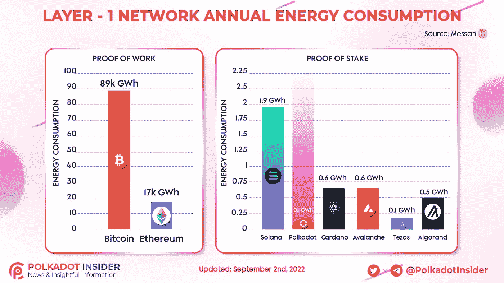

# Polkadot (DOT)是最绿色的区块链

> 原文：<https://medium.com/coinmonks/polkadot-dot-is-the-greenest-blockchain-888089197ae8?source=collection_archive---------19----------------------->

波尔卡多特(dot)显然对区块链的未来了如指掌。在一个巨大的能源危机威胁着政府的世界里，是时候在采矿设备上安装催化转换器了。可以说，监管行动的风暴即将打击比特币等耗油量大的加密货币。有鉴于此，市值领先的另类投资者正转向证明股权，这主要是出于必要。考虑到以太坊的规模和能源消耗，他们不能冒险受到任何可能限制他们活动的新法律的伤害。现在，虽然 Vitalik 和他的团队离以太坊合并还有几天，但他们必须创造奇迹才能保持相关性。与此同时，波尔卡多特(dot)仍然是 T2 最节能的区块链。再一次证明，区块链不一定需要残酷地消耗我们的电力来让鲸鱼变得富有！

# 为冬天做准备

但是 Satoshi 还没准备好过冬。其实关于中本聪最好的部分就是所有关于他的阴谋论。随着他的离去，比特币被留在了现代哲学家的手中，如[迈克尔·塞勒](https://blog.hi.exchange/michael-saylor-steps-down/)，他可悲地损失了 10 亿美元，并恭恭敬敬地失去了他在 MicroStrategy 的首席执行官职位。另一个比特币的支持者是杰克·多西，他正忙于埃隆的诉讼和推特机器人的大灾难。老实说，比特币最大化主义者没有魅力领袖，当然也没有表现出灵活性的倾向。或许，在这种危机时刻，灵活性是唯一的秘密。

说到危机，一场大危机即将来临，因为欧盟正准备迎接一场巨大的冷雨。曾经对过度依赖俄罗斯天然气的警告嗤之以鼻的欧盟领导人，现在正面临着现代欧洲历史上最大的能源短缺。说到搬起石头砸自己的脚！在采取极端措施削减能源消耗的情况下，很难想象欧盟会让 BTC 矿商运营。但是，能源短缺和干旱正在全世界发生。虽然这可能是猜测，但有大量证据表明前路坎坷。准确地说，是一个冬天。在这个政客们承诺迅速采取行动的时期，有效率的人应该面带微笑，神采奕奕。

# 波尔卡多(点)

Polkadot (DOT)网络再次成为最环保的区块链。这一定会让无所不知的格蕾塔·图恩伯格女王陛下高兴。撇开讽刺不谈，波尔卡多特在保持领先方面做了令人印象深刻的工作。

根据波尔卡多特内部人士的最新研究，点网络只消耗 0.1 GWH。客观地说，这大约相当于平均 6 个美国家庭。令人印象深刻的是，这种低油耗还伴随着巨大的可扩展性。事实上，Tezos 网络消耗相同的能量，但在可扩展性方面落后。

Source: Polkadot Insider (Twitter)

至于其他网络，阿尔格兰德以 0.5 的 GWH 排名第三，卡尔达诺和雪崩紧随其后。目前，比特币仍然以 89000 GWH 的消费成为树杀、鸟杀、柴油吸、污染之王。以太坊，应该在九月底前彻底改造。我们会让你知道事情的进展。

[本文](https://blog.hi.exchange/polkadot-dot-blockchain/)最初由同一作者[尼玛·阿斯加里发表在 HiExchange 博客上。](https://blog.hi.exchange/author/nimaasgari/)

> 交易新手？尝试[加密交易机器人](/coinmonks/crypto-trading-bot-c2ffce8acb2a)或[复制交易](/coinmonks/top-10-crypto-copy-trading-platforms-for-beginners-d0c37c7d698c)