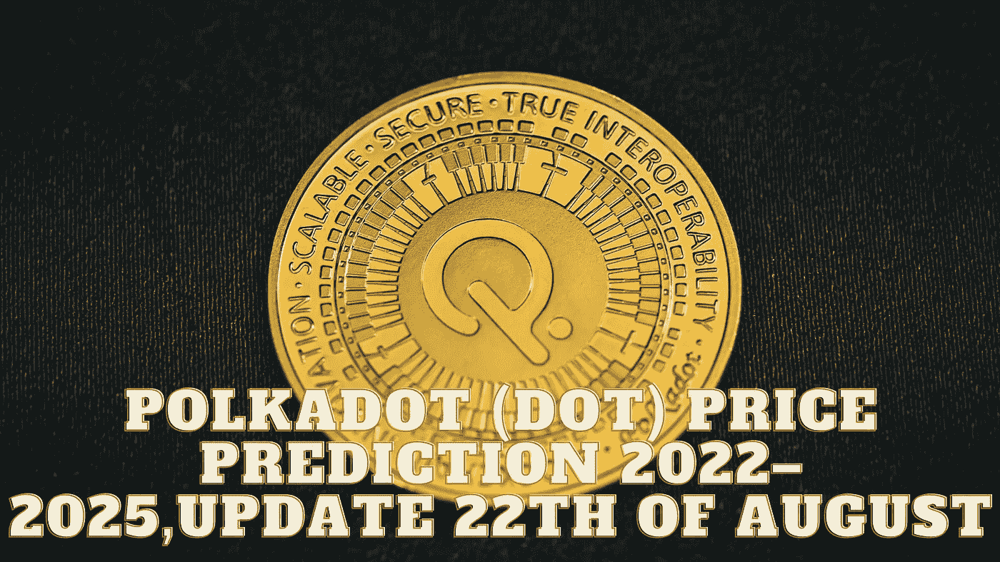

# Polkadot (DOT)价格预测 2022–2025，8 月 22 日更新

> 原文：<https://medium.com/coinmonks/polkadot-dot-price-prediction-2022-2025-update-22th-of-august-5ce898554c7f?source=collection_archive---------46----------------------->

Source photo Unsplash.com

# Polkadot(点)是什么？

Polkadot 是在瑞士的 Web3 基金会开发的，该基金会希望提供一个功能齐全、用户友好的分散平台。2016 年，Peter Czaban information 和 Robert Harbermeier 在以太坊联合创始人 Gavin Wood 的贡献下绘制了该项目。