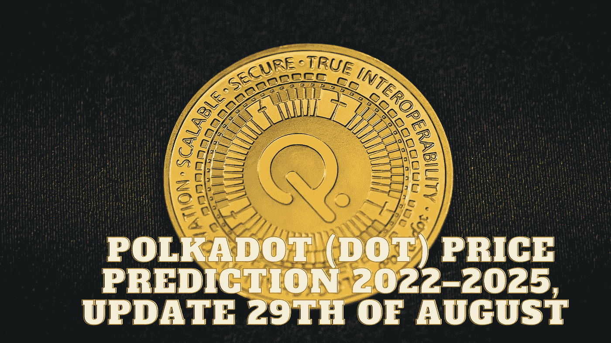

# Polkadot (DOT)价格预测 2022–2025，8 月 29 日更新

> 原文：<https://medium.com/coinmonks/polkadot-dot-price-prediction-2022-2025-update-29th-of-august-180f2a2e838a?source=collection_archive---------23----------------------->

Source photo Unsplash.com

# Polkadot(点)是什么？

位于瑞士的 Web3 基金会计划建造 Polkadot，以便提供一个功能齐全、用户友好的分散平台。联合创始人 Gavin Wood 与 Peter Czaban 和 Robert Harbermeier 一起，在 2016 年为以太坊创建了一个初步的项目计划。