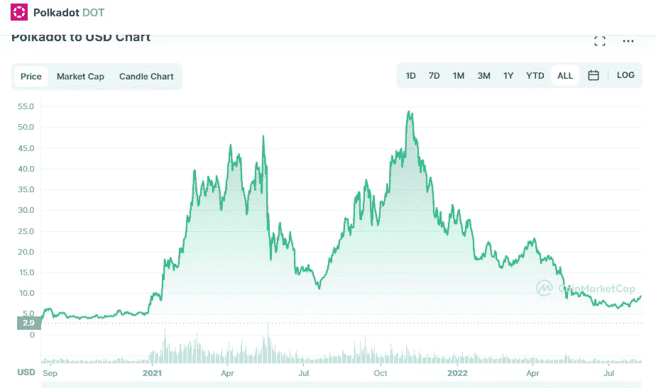

# Polkadot (DOT)价格预测 2022–2025，8 月 8 日更新

> 原文：<https://medium.com/coinmonks/polkadot-dot-price-prediction-2022-2025-update-8th-of-august-d00f13c1c479?source=collection_archive---------20----------------------->

Source photo [Polkadot price today, DOT to USD live, marketcap and chart | CoinMarketCap](https://coinmarketcap.com/currencies/polkadot-new/)

# Polkadot(点)是什么？

为了帮助 Web3 基金会的分散平台项目起步，总部位于瑞士的 Polkadot 公司同意与他们联手。2016 年，以太坊联合创始人之一的加文·伍德信息(Gavin Wood information)与彼得·查班信息(Peter Czaban information)和罗伯特·哈伯迈尔(Robert Harbermeier)绘制了该项目的地图。