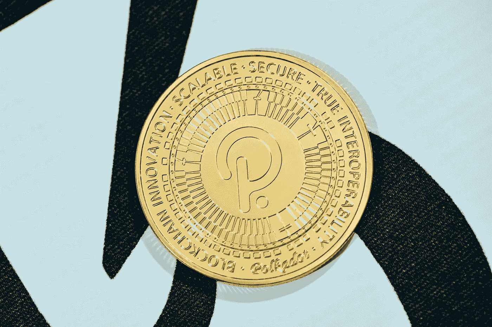

# Polkadot (DOT)价格预测 2023–2025，12 月 31 日更新

> 原文：<https://medium.com/coinmonks/polkadot-dot-price-prediction-2023-2025-update-31th-of-december-aed9e85b770c?source=collection_archive---------14----------------------->

Source photo [Free Blockchain Image on Unsplash](https://unsplash.com/photos/dyEUzgOLgZs)

# Polkadot(点)是什么？

总部位于瑞士的 Web3 基金会计划建造 Polkadot，以提供一个功能齐全且易于使用的分散式平台。以太坊的创造者之一 gavofyork 在 2016 年与 keornion 和 Robert Harbermeier 合作，为该项目起草了一份计划。