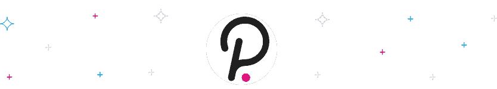
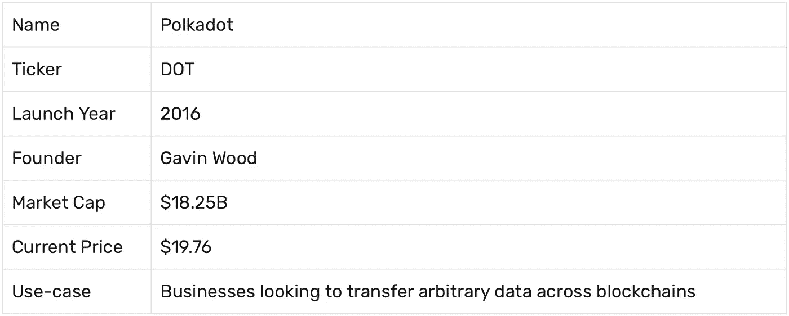

# Polkadot (DOT)价格预测:分析师怎么看

> 原文：<https://medium.com/coinmonks/polkadot-dot-price-prediction-what-do-analysts-think-b73282012fdb?source=collection_archive---------10----------------------->

作为最受欢迎的加密网络协议之一， [Polkadot](https://swapzone.io/exchange/polkadot) 已经引发了许多关于其市场前景的讨论。但是，是什么让这个生态系统的代币点值得大肆宣传呢？一个简单的答案是因为网络协议给 web3 世界带来的交互性和互操作性。我们将在这篇文章中深入探讨这意味着什么，并讨论 2022 年至 2032 年可能的价格预测。

# 什么是波尔卡多？

Polkadot 是一种加密网络协议，它将所有区块链网络集合在一起，并将其绑定到一个协议中。这是一件大事，因为大多数区块链技术本身无法突破到在现实世界中有用的应用。自 2016 年成立以来，Polkadot 加密生态系统已经解决了区块链行业的一个主要问题，即网络协议的互操作性。

Polkadot 项目的长期目标是建立一个 web3 平台(一个完全去中心化的互联网)。这个项目与其他项目的不同之处在于，它使用了副链和中继链来构建一个区块链架构，具有令人印象深刻的可扩展性，能够相应地跟随需求的趋势。

# 波尔卡多特价格分析

Polkadot 与其他区块链技术的区别在于它为其他项目面临的可伸缩性问题提供了解决方案。除了项目特殊能力之外，他们的路线图和技术是合理的。这也适用于 Polkadot 的安全和社区，这些都是该项目的光明未来的令人印象深刻的指针。自从硬币进入市场以来，DOT 看起来对长期投资者很有希望。这是唯一正确的，因为 Polkadot 的团队一直在推动该项目，增加其互操作性，并与其他改变游戏规则的网络协议合作。

还值得一提的是，本机令牌 DOT 从未出现过类似于密码行业其他大牌的“崩溃”。就像 BTC 和 ETH 一样，DOT 倾向于集成到现实世界的业务流程中，因为它的安全性和互操作性是一流的。

名称 polkadottickerdotlaunch 2016 foundergavin wood market Cap $ 18.25 BC 现价$ 19.76 使用案例希望在区块链传输任意数据的企业

# 什么是副链？

Polkadot 中继链与一些被称为“副链”的技术相关联，它们负责各个区块链项目之间快速有效的交互。他们帮助项目实现其目标，这类似于以太坊的 2.0 共享，但增加了一些步骤。为了提高安全性和效率，副链是独特的定制区块链，可以针对多种活动进行优化。它们与网络协议的连接可以通过临时使用副链槽来连续链接点，也可以作为“按块付费”的副线程，这意味着链接不必是恒定的。

# 点

该项目的原生令牌 DOT 可以充当中继链和副链之间的链接，以及 staking 管理。令牌可以由网络的一致可操作性来赌注，加上赌注确保了项目的成功和安全。验证者负责保存链接的副链和中继链，他们得到了想要持有他们的点令牌的投资者的支持。该项目旨在保守地回报长期投资者。此外，违反他们的条款和条件会受到昂贵的处罚，包括损失部分赌注。这进一步提高了他们的安全水平。

点持有者通过参与链上管理和对项目更新的投票也增加了网络协议的价值。如果你只是想看看这个项目能免费提供什么，还有一个提供的零值 testnet DOT。

# 专家预测波尔卡多特

波尔卡多特一直证明看跌的投资者是错误的。这些天来，项目领域的大多数持有人都希望这枚硬币能创下新的价格。尤其是在整个 2021 年，来自大多数知名公司的 Polkadot 新闻加密预测看涨，硬币没有令人失望。

# 2022 年波尔卡多特价格预测

Polkadot 预计不会跌破 6.9 美元，今年年初为 27.26 美元。今年晚些时候，价格下降了 77%。然而，投资者看好 DOT 将如何结束今年。预计这将带来 18%的年度潜在投资回报率*。

*DOT 是一种投机资产，我们建议您在投资前做好自己的研究。

# 2022 年 10 月:波尔卡多特价格预测

对于 10 月份，各种密码分析师(包括来自领先密码网站的专家和交易算法，如 [CryptoPredictions](https://cryptopredictions.com/) 、[trading bests](https://tradingbeasts.com/)、 [Fxstreet](https://www.fxstreet.com/) 、 [WalletInvestor](https://walletinvestor.com/) 等)预计 DOT 的平均价格将保持在 6.76 美元，可能会升至 6.9 美元。根据其迄今为止的表现，预计 10 月份该币不会低于 6.1 美元。在写这篇文章的时候(10 月初)，Polkadot crypto 的价格是 6.39 美元。预计本月的潜在投资回报率为 8% *。

# 2022 年 11 月 DOT 价格预测

专家对 DOT 11 月份价格的预测是，预计将保持在 6.7 美元以上。预计 11 月份代币的平均价格约为 7.03 美元，而最高预期交易成本为 7.29 美元。专家估计 11 月份可能有 13%的投资回报率*。

# 2022 年 12 月:波尔卡多特价格预测

考虑到全年的 Polkadot 加密价格及其经历的市场波动频率，2022 年 12 月的预测平均价格估计为 7.17 美元。分析师预测，12 月份的价格可能高达 7.64 美元，但永远不会低于 6.9 美元。预计今年最后一个月的潜在投资回报率为 18% *。

# 2023 年波尔卡多特价格预测

分析师看好 DOT 明年的表现，因为他们预测可能有 85%的投资回报率*。DOT 对 2023 年的平均价格预测为 9.92 美元。交易价值可能会升至约 11.92 美元，并在 2023 年全年保持在 9.55 美元以上。

# 2024 年波尔卡多特价格预测

Polkadot 在 2024 年的最高和最低交易值预测分别为 16.21 美元和 13.74 美元。专家预测投资回报率为 151%，两年后 DOT 的平均价格约为 14.13 美元。

# 2025 年波尔卡多特价格预测

根据 DOT 多年来的表现及其对预测的反应，我们可以预计到 2025 年潜在投资回报率将达到 270% *。平均价格应该是 20.53 美元。价格可能高达 23.85 美元，但不会低于 19.97 美元。

# 2026 年波尔卡多特价格预测

2026 年 polkadot 令牌的最高预期价格约为 34.38 美元，预计不会低于 29.6 美元。DOT 在 2026 年的平均交易价值预计为 30.43 美元。到那时，我们应该可以获得 433%的投资回报率*。

# 2027 年波尔卡多特价格预测

DOT 的业绩历史预测，其 2027 年的平均价格约为 43.78 美元，最高可能价格为 49.86 美元。它可能会触及最低 42.26 美元，但持有人应该预期 673%的潜在投资回报率*。

# 波尔卡多特交易所:如何和在哪里？

从上面广泛的分析和大范围的价格预测可以看出，波尔卡多硬币的预测并没有一个确定的共识。毕竟，未来的价格预测可能会因为新的技术解决方案、开发者声明、web3 生态系统、加密法规等等而改变。尽管如此，波尔卡多特的未来似乎令人兴奋，你不想错过。在 [Swapzone](https://swapzone.io/) 上参加派对，在那里您可以购买或兑换点币！

例如，这是如何将 BTC 换成 Swapzone 上的点:

1.  前往 [Swapzone](https://swapzone.io/) 网站。
2.  选择合适的配对(BTC 对圆点)。
3.  输入你想用 BTC 兑换点币的金额，聚合器会为你找到最好的交易。
4.  点击 ***【兑换】*** 按钮，进入一个兑换平台，并输入您想要发送点币的地址。
5.  使用生成的 BTC 地址发送您的 BTC 存款。
6.  前往 ***“继续交易”*** ，如果你愿意的话，留下你选择进行交易的网站的评论。

等待存款处理完毕，点币兑换完成。

# 2028 年波尔卡多特价格预测

到 2028 年，长期投资者的投资回报率预计将达到 1，049%，平均交易价值为 65.48 美元。分析师预测，2028 年 Polkadot crypto 的最高和最低价格将分别为 74.14 美元和 63.29 美元。

# 2029 年波尔卡多特价格预测

2029 年，密码专家预计潜在投资回报率为 1，636%，最高交易价值为 111.96 美元。预计 2029 年波尔卡多特的平均价格为 95.15 美元，最低可能为 92.53 美元。

# 2030 年波尔卡多特价格预测

分析师预计，到 2030 年，Polkadot 的平均价格将达到 138.27 美元，持有人的投资回报率可能达到 2，407%。到 2030 年，投资者预计最低价格为 133.51 美元，最高价格为 161.7 美元。

# 2031 年波尔卡多特价格预测

根据波尔卡多特的历史及其波动，预计 2031 年该代币的平均价格为 202.83 美元。到那时，我们将见证持有人获得 3，555%的投资回报率*。DOT 在 2031 年的预测最低价格应该约为 195.92 美元，预期最高价格约为 235.77 美元。

# 5 年后波尔卡多值多少钱？

专家认为，根据其表现历史，polkadot 令牌在 5 年内(2027 年)应该价值约 70 美元。

# 波尔卡多特有前途吗？

与其他项目相比，基于网络设计背后的创造力，polkadot 有着光明的未来。原生硬币 DOT 的令牌经济学(token economics)在技术上是可靠的，网络协议具有令人印象深刻的互操作性。

此外，polkadot crypto 已经存在了一段时间，并在重大市场波动中幸存下来，这主要归功于他们敬业的团队。简而言之，这种加密货币有望成为未来 web3 世界的基石。

# Polkadot 能达到 100 美元吗？

考虑到硬币在上一轮牛市中已经达到了 50 美元的交易价值，可以肯定的是，它也会在未来的某个时候突破 100 美元大关。根据 polkadot 的表现历史，市场必须经历一轮令人印象深刻的牛市，才能在短时间内达到 100 美元。

# Polkadot 能达到 500 美金吗？

token 的团队和投资者迄今为止在推广和保护 DOT 方面做得很好，所以像这样的加密货币前途无量。然而，在不久的将来，500 美元是一个极不可能的价格。

# Polkadot 能达到 1000 美元吗？

到目前为止，Polkadot 在市场上做得很好，根据他们与主要加密投资公司合作的速度，他们可以实现一些前所未有的交易价值。尽管如此，根据目前对网络协议的分析，它还不能达到 1000 美元。

# 哪里可以买到波尔卡多特？

你可以在一个收费低廉的私人加密交易平台上购买或交换波尔卡多原生硬币 dot，比如 [Swapzone.io](https://swapzone.io/exchange/polkadot)

> 交易新手？试试[密码交易机器人](/coinmonks/crypto-trading-bot-c2ffce8acb2a)或者[复制交易](/coinmonks/top-10-crypto-copy-trading-platforms-for-beginners-d0c37c7d698c)