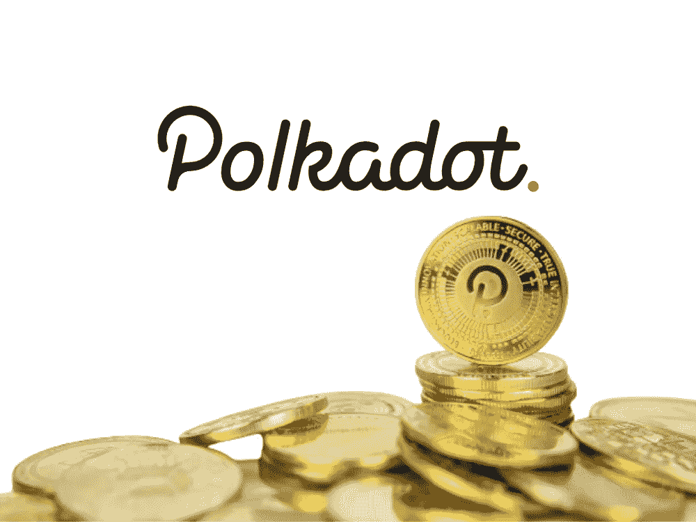

# 获得公众魅力的波尔卡多仿链

> 原文：<https://medium.com/coinmonks/polkadot-parachains-that-have-gained-public-charm-3d948901afa2?source=collection_archive---------11----------------------->

~dwulf

DOT

大多数副链(至少在波尔卡多特上)大约 8 个月大。这在区块链的生命周期中还处于非常早期的阶段。更不用说奇偶校验方面仍有一些改进，如异步支持(将块时间减少到 6 秒)、Governance v2、Kusama <> Polkadot bridge、native USDT/USDC、native bridges 等。

Polkadot.js 钱包仍然很 meh，但一个好的袖手旁观新钱包开始感觉真的很好，尤其是 Talisman。

Moonbeam 在 TVL/其他指标方面正走在一条真正伟大的道路上，直到游牧民族的情况发生。现在他们正在重建。

在众筹贷款期间支持的我个人最喜欢的 Acala，也是类似的情况，直到他们的 aUSD 事件。阿卡拉也在重建，痕迹是完整的，现在它将进入投票。

## 诺德尔

Nodle 现在在几个交易所都有硬币/令牌，采矿应用程序可以很好地为附近的蓝牙低能量传感器提供位置证明。

除了 BitCountry，其他的 parachains 大部分都还没有上线。

这是一个漫长的游戏，即使市场条件不太好，也很少有人会进入更广阔的市场。这应该会流向其他增长的副链。

## **“公众魅力”，波尔卡多特得到了什么**

有一些稳固的 parachain 团队正在成长，并朝着他们的路线图稳步前进:

*   化星为道
*   Bifrost 将其债券市场扩展到基于网络的衍生品
*   Phala 将推出 Phalaworld 作为其私有云服务的 POC
*   Moonbeam 通过互联智能合约优化多链运营
*   Litenty 为 Twitter/Discord/社交媒体/链上验证提供身份中心。
*   IntegriTEE 通过 Litentry 的 DID 基础设施提供发球服务。
*   Darwinia 将为其桥接集线器推出轻客户端消息传递协议。
*   BitCountry 及其 NFTs。

## 结论

除了比特币、以太坊和 Dogecoin，我不认为有多少区块链真正获得了公众魅力。可能有很多人对加密社区中的某些链感兴趣，但是公众的兴趣呢？我不这么认为。事实上，Dogecoin 除了每个人都听说过之外，并没有太多的兴趣。

Cosmos 有大量的追随者，主要是因为空投。在牛市中，持有 ATOM 可以免费赚到很多钱。一天下来谁不喜欢闲钱？我喜欢宇宙，这是一个伟大的项目，我喜欢以太坊，我喜欢比特币，我喜欢波尔卡多特显然。所有这些东西在一天结束时都是免费的。这个领域充斥着太多的投机行为，很多人认为最好的项目是最赚钱的项目。这里追求技术和未来潜力的人们通常倾向于像 Polkadot 甚至 Cosmos 这样的项目。我喜欢 IBC 和 XCM，他们可以一起创造更好的 Web3 体验。

我们进入 para-chains 还不到一年，XCM 还非常年轻，目前这些都不是成品。一切都将不断升级，我们将看到什么工作，什么不工作，我们可以升级没有 hardforks，任何人都可以创建一个建议链，以创造变化。

波尔卡多特的潜力巨大。

> 交易新手？试试[加密交易机器人](/coinmonks/crypto-trading-bot-c2ffce8acb2a)或者[复制交易](/coinmonks/top-10-crypto-copy-trading-platforms-for-beginners-d0c37c7d698c)