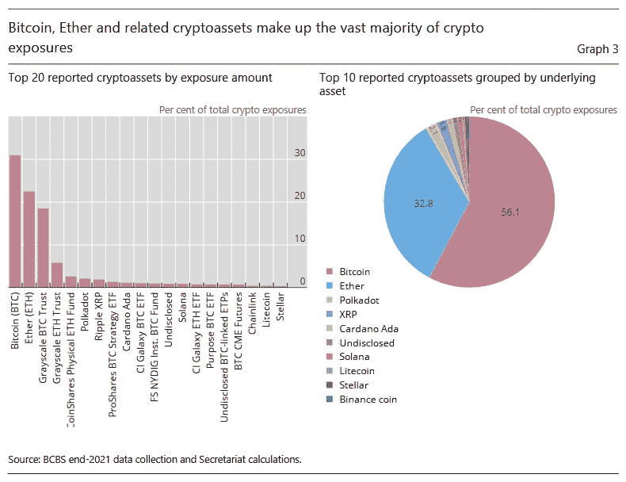

# 波尔卡多特、XRP、卡尔达诺位列银行选择的十大加密资产

> 原文：<https://medium.com/coinmonks/polkadot-xrp-cardano-among-the-top-10-crypto-assets-chosen-by-banks-a6ac93209694?source=collection_archive---------40----------------------->

尽管全球银行对加密货币市场的敞口仍然相对较小，但这些金融机构正在慢慢向数字资产敞开大门，国际清算银行(BIS)的一份新报告列出了报告加密敞口的银行中最受欢迎的加密货币。

碰巧的是，根据国际清算银行巴塞尔银行监管委员会(BCBS)9 月 30 日发布的巴塞尔协议 III 监测报告，市值最大的两种加密货币——比特币(BTC)和以太坊(ETH)——处于领先地位，31%的报告加密资产敞口属于比特币，22%属于以太坊。

# 银行中最受欢迎的密码

根据这份报告，这两种主要的加密资产“占报告风险的近 90%”，而银行中其他受欢迎的加密资产包括 Polkadot (DOT)，占报告风险的 2%，Ripple-issued XRP 占 2%，Cardano 占 1%，Solana 占 1%，Litecoin 占 0.4%，Stellar (XLM)占 0.4%。

# 国际清算银行的怀疑态度

提醒一下，BCBS 在 6 月下旬的一份名为“关于加密资产审慎处理的第二次磋商”的咨询文件中提出了一项建议，要求将银行对“第二组加密资产”的总敞口限制在一级资本的 1%

与此同时，该机构继续对数字资产持怀疑态度，称其“无法履行货币的社会角色”，并警告称，加密抛售表明其关于分散金融(DeFi)风险的预测实现了。

与此同时，Finbold 早些时候报告了国际清算银行的调查结果，即全球银行对加密货币的总敞口约为 94 亿€(91.8 亿美元)，仅占“巴塞尔协议 III 监测活动中包括的所有银行样本的 0.01%。”

> 交易新手？试试[加密交易机器人](/coinmonks/crypto-trading-bot-c2ffce8acb2a)或者[复制交易](/coinmonks/top-10-crypto-copy-trading-platforms-for-beginners-d0c37c7d698c)