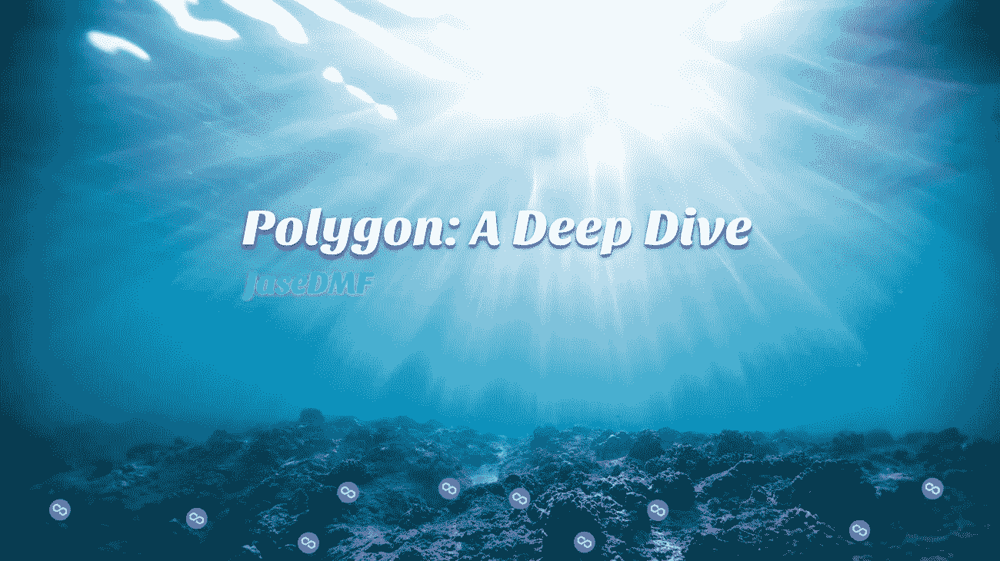

# 多边形:深潜

> 原文：<https://medium.com/coinmonks/polygon-a-deep-dive-8fc3543d5ff9?source=collection_archive---------5----------------------->

Photo by [Jeremy Bishop](https://www.pexels.com/@jeremy-bishop-1260133/) on [Pexels](https://www.pexels.com/photo/underwater-photography-of-ocean-2397651/) (modified)

亲爱的读者:

这个加密空间难道不混乱复杂、令人困惑吗？试着把你的头缠在一种叫做比特币的虚拟货币上是一回事，但是再往前推一点，你就会进入侧链、第二层、零知识等等的世界。你最好准备好锅和刷子，因为你的头脑很快就会被炸成碎片。