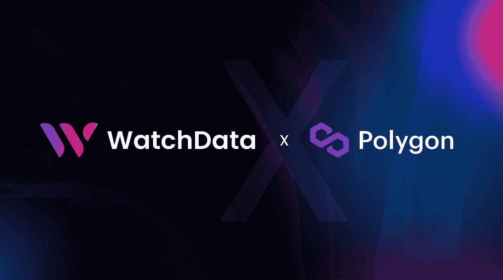
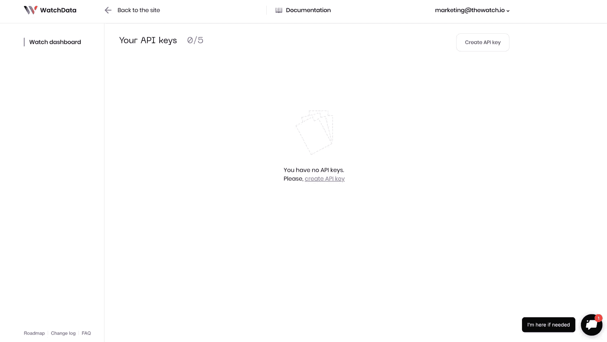
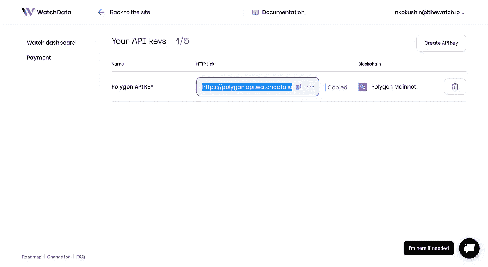

# 多边形 API——如何高效地创建多边形 Dapps

> 原文：<https://medium.com/coinmonks/polygon-api-how-to-efficiently-create-polygon-dapps-71c8cecbb64?source=collection_archive---------31----------------------->

如果你是一个对在多边形网络上创建 dapp 感兴趣的开发者，那么这个简短的指南就是为你准备的！本指南将为您提供 Polygon APIs 的全面概述，以及它们所包含的内容和您可以从哪里获得。

polygon——以前称为 Matic——是一个以太坊扩展解决方案，已经发展成为 Web3 开发的主要网络之一。由 LayerX 团队开发的 Polygon 是以太坊拥塞问题的解决方案。随着以太坊的应用越来越多，煤气费也越来越高，一些开发人员将注意力转向 Polygon，开始在它的网络上创建 dapps。

随着对 Polygon 开发越来越多的关注，编码人员发现需要 Polygon APIs 来使 Web3 开发更加容易。为了快速启动这个简短的指南，我们将仔细看看多边形网络及其包含的内容。接下来，我们将深入探讨 API 以及它们在多边形网络环境中的作用。我们还将进一步了解如何通过 WatchData 获取多边形 API。作为阅读的结果，你将获得

除了提供多边形 API，WatchData 还提供强大的开发工具，如 WatchData Blockchain API、WatchData Price API、WatchData Powered API 等。更重要的是，您可以完全免费注册 WatchData！

如果你想知道多边形网络最初为什么会被开发出来，那是因为以太坊。以太坊是区块链最突出的发展。然而，随着越来越多的人开始使用它，这已经将交易成本推高到天文数字，使得在某些情况下开发 dapps 在经济上不可行。

因此，需要一种可扩展的解决方案。一个替代方案是 Polygon，这是一个分散的以太坊扩展平台，可以解决以太坊网络的拥塞问题。Polygon 使开发人员能够以较低的气体成本创建 dapps，同时保持以太坊区块链的高级安全性。

Polygon 是一个与以太坊密切相关的区块链网络，因为它实现了与以太坊相同的令牌标准和共识机制。然而，Polygon 在一个重要的方面偏离了以太坊:它使用利害关系证明而不是工作证明。由于这种差异，多边形网络可以容纳比以太坊更低的交易成本。

# 什么是 WatchData Polygon API，它是如何工作的？

API 或应用程序编程接口是一组允许软件应用程序相互交互的工具和协议。在多边形网络的情况下，API 使 dapp 开发者能够有更无缝的体验。换句话说，它使得在多边形网络上开发 dapps 变得更加容易。如果没有 API，组成互联网的不同软件将无法相互理解或协同工作。API 是互联网生态系统的重要组成部分，在我们的日常生活中扮演着至关重要的角色，即使我们没有意识到这一点。当您使用连接到互联网的设备时，它会将数据发送到服务器或数据库。然后，接收端需要解释该信息，并在将其发送回您的设备之前找到适当的响应。

接下来，在本文中，我们将重点关注多边形网络。然而，重要的是要注意，API 支持跨链兼容性，所以我们将看到的函数和代码片段将同样适用于其他网络，如 BNB 链和以太坊。

# 如何使用 WatchData 连接多边形节点？

要从 WatchData 网站访问 Polygon API，第一步是创建一个帐户。这是完全免费的，只需要几秒钟。当您拥有一个帐户并登录后，我们可以仔细看看如何使用 WatchData 连接到 Polygon API。

1.  **登录**

转到 WatchData [仪表盘](https://dashboard.watchdata.io/login)。

**2。创建 API 密钥**

选择多边形维护网。

**3。结果**

多边形 API 键已经可以使用了。

通过使用我们的 API，您可以添加一些功能，为您的用户提供与他们的数据进行交互的新方式，为他们提供更好的体验，并使他们更有可能再次光临。

# 区块链 API

[使用 WatchData 的 API](https://docs.watchdata.io/blockchain-apis/polygon-api) ，您可以获得原始区块链数据:余额、交易、数据块、代币转账、日志等。无需运行自己的节点！节省开发成本和相关费用。通过我们的 API 调用大多数 JSON-RPC 方法，就像发送到自己的节点一样。

> [看看这几个与我们的 API 交互的例子](https://www.watchdata.io/blog/polygon-api-how-to-efficiently-create-polygon-dapps-using-watchdata#:~:text=back%20for%20more!-,Blockchain%20API,-With%20WatchData%E2%80%99s%20API)，从一个最常见的端点开始是—[**eth _ block number(Polygon)**](https://docs.watchdata.io/blockchain-apis/polygon-api/eth_blocknumber-polygon)

# 有用的链接

*   [WatchData main](https://bit.ly/3MXPMgi)
*   [观察数据推特](https://twitter.com/watchdata_io)
*   [手表数据不一致](https://bit.ly/3Ikf30D)
*   [WatchData 文档](https://bit.ly/3IgbLeZ)

> 交易新手？尝试[加密交易机器人](/coinmonks/crypto-trading-bot-c2ffce8acb2a)或[复制交易](/coinmonks/top-10-crypto-copy-trading-platforms-for-beginners-d0c37c7d698c)