# 多边形边缘:使用元掩码部署 ERC20 和 ERC721 合同的架构和本地设置

> 原文：<https://medium.com/coinmonks/polygon-edge-architecture-local-setup-with-metamask-for-erc20-erc721-contracts-9705d63ef438?source=collection_archive---------5----------------------->


在这篇文章中，我们将讨论-

1.  什么是多边形边？
2.  多边形边使用的模块有哪些？
3.  从头开始多边形边局部设置
4.  在多边形边缘部署智能合约
5.  使用元遮罩配置多边形边

# 什么是多边形边？

**Polygon Edge** 是一个可扩展的模块化框架，用于开发以太坊兼容的侧链、区块链网络和通用扩展解决方案。该框架的主要作用是引导新的区块链网络，同时提供与以太坊交易和智能合约的完全兼容性。它利用一个 [**集中式网桥解决方案**](https://chainbridge.chainsafe.io/) 来支持与多个区块链的通信，使 ERC-20 和 ERC-721 令牌的转移成为可能。

> 共识支持: [PoA](/poa-network/proof-of-authority-consensus-model-with-identity-at-stake-d5bd15463256) (授权证明) [PoS](https://consensys.net/blog/blockchain-explained/what-is-proof-of-stake/) (利益证明)

# 多边形边缘提供的模块

多边形边缘提供了广泛的模块，开发人员可以根据自己的需要定制。

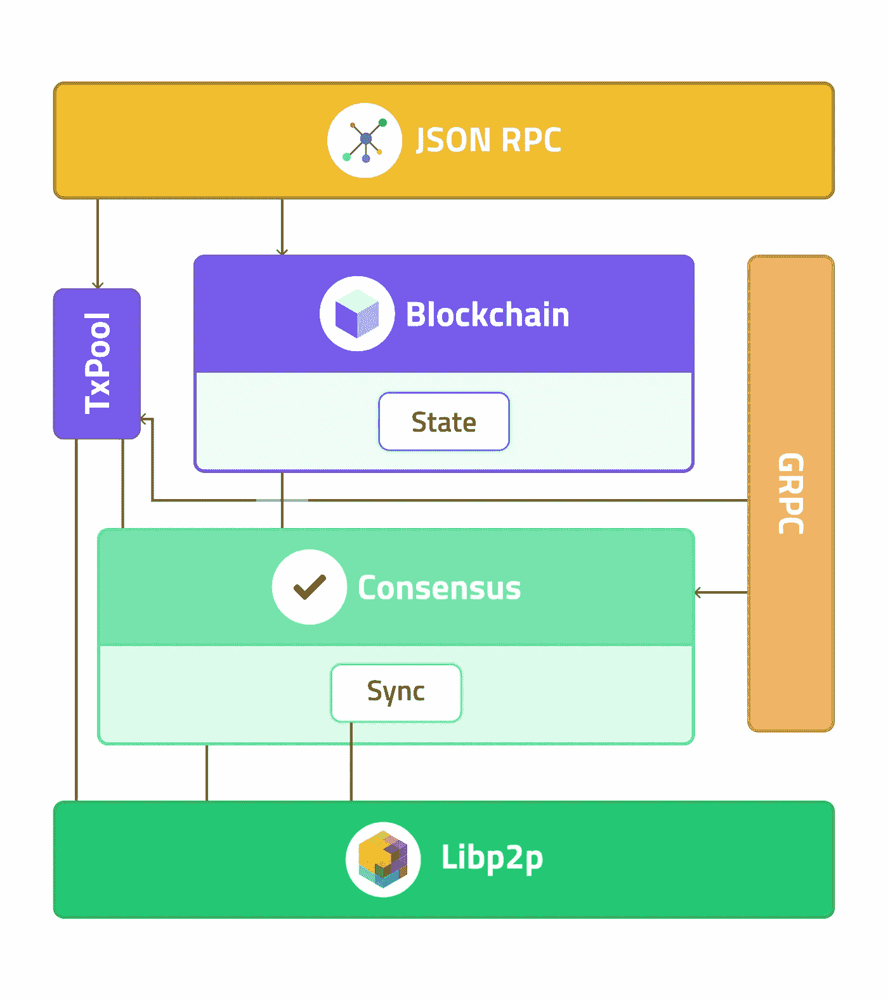

Source : Polygon Edge Documentation

## **1。区块链**和**状态**

区块链处理区块链中包含新区块时发生的所有逻辑。状态代表*状态转换*对象。它处理当包含新块时状态如何变化。

这两部分相互连接，为协议提供了蓝图。在其他功能中，它们允许执行事务和运行 EVM。

例如，当区块链层接收到新的区块(并且没有发生重组)时，它调用状态来执行状态转换。

## **2。共识**

共识为共识机制提供了一个接口。它提供了两种共识引擎-

*   IBFT 早熟禾
*   IBFT PoS

## **3。Libp2p**

Libp2p 为底层网络层提供了基础，并为多边形边缘中使用的更多高级功能提供了很好的基础。

## **4。联网(GPRC)**

GRPC 层对于操作员交互至关重要。它利用节点之间的通信，帮助节点操作员轻松地与客户端交互。

## **5。JSON RPC**

JSON RPC 层是一个 API 层，允许开发者使用它与区块链进行通信。

## **6。Tx 池**

Tx Pool 层汇集了来自系统不同部分的事务，它与系统中的其他模块紧密相连，因为可以从多个入口点添加事务。

# 多边形边局部设置

所以，在看了 Polygon Edge 使用的架构和模块之后。让我们局部地设置多边形边缘网络。在进行下一步之前，让我们讨论一下先决条件

1.本地计算机上的 Go >=1.17

2.你选择的任何编辑

3.元掩码

在你完成先决条件后，我们可以使用 *go install 安装多边形边二进制文件。*

在您的终端中粘贴以下命令-

```
go install github.com/0xPolygon/polygon-edge@develop
```

该命令之后的二进制文件将位于 GOBIN 环境变量中。

之后你可以在你的终端输入*多边形边缘*来确认你的安装。

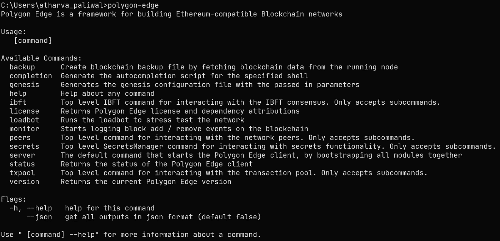

现在，我们将设置使用 [IBFT 共识协议](https://github.com/ethereum/EIPs/issues/650)的多边形边区块链网络。

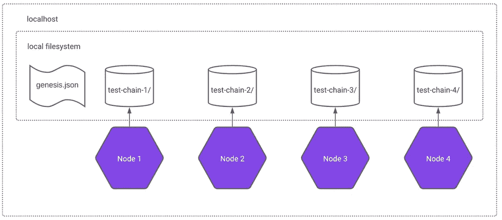

Source : Polygon-Edge Documentation

上图所示的区块链网络由 4 个节点组成，其中 4 个节点都是验证节点，因此有资格申请块和验证来自其他申请人的块。

在我们的文章中，我们将使用一个节点，这个节点既可以作为验证器，也可以提出新的块。

> 注意:集群中的节点数量没有最小值，这意味着只有一个验证器节点的集群是可能的。请记住，使用*单*节点集群，没有崩溃容忍度，也没有 BFT 保证。
> 
> 因此，为实现 BFT 保证，建议的最小节点数是 4，因为在 4 节点群集中，可以容忍 1 个节点出现故障，其余 3 个正常工作。

为了生成功能完整的 IBFT 集群，我们需要遵循以下步骤-

## 1.初始化数据目录

```
polygon-edge secrets init --data-dir test-chain-1
```

*test-chain-1* 这里指的是节点的名称。你可以根据自己的方便来命名。

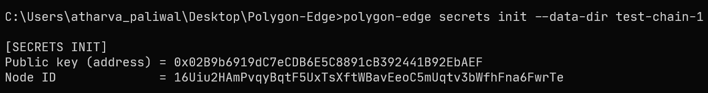

以上命令打印验证器密钥和[节点 ID](https://docs.libp2p.io/concepts/peer-id/) 。下一步我们将需要节点 ID。

您还应该看到一个由您指定的节点名创建的文件夹。

## 2.为 bootnode 准备多地址连接字符串

如果一个节点想要建立一个成功的连接，它必须知道要连接到哪个 bootnode 服务器，以便获得关于网络上所有剩余节点的信息。

由于我们将使用单个节点进行演示，因此同一个节点将充当 bootnode，因为每个多边形边节点都可以充当 bootnode，但是在多个节点的情况下，每个多边形边节点都需要指定一组 bootnode，将联系这些节点以提供有关如何与网络中所有剩余节点连接的信息。

> 注意:至少需要一个 bootnode，以便网络中的其他节点可以发现彼此。建议使用更多的 bootnodes，因为它们可以在发生故障时为网络提供弹性。

为了创建用于指定 bootnode 的连接字符串，我们需要遵循 [multiaddr 格式](https://docs.libp2p.io/concepts/addressing/)。

```
/ip4/<ip_address>/tcp/<port>/p2p/<node_id>
```

这里，

ip_address :127.0.0.1(因为我们在本地主机上运行)

端口:10001

node _ id:16 uiu 2 hampvqybqtf 5 uxtsftwbaveeoc 5 muqtv 3 bwfhfna 6 fwrte

您可能有不同的 node_id，所以用您的 node _ id 替换它。

```
*/ip4/127.0.0.1/tcp/10001/p2p/*16Uiu2HAmPvqyBqtF5UxTsXftWBavEeoC5mUqtv3bWfhFna6FwrTe
```

## 3.用单个节点生成源文件

```
polygon-edge genesis --consensus ibft --ibft-validators-prefix-path test-chain- --bootnode /ip4/<ip_address>/tcp/<port>/p2p/<node_id>
```

在执行这个命令之前，我们还可以使用- *premine* 标志将一些余额预存在我们的帐户地址中。您可以从元掩码中获取任何地址，并提供一些乙醚。

```
polygon-edge genesis --consensus ibft --ibft-validators-prefix-path test-chain- --bootnode /ip4/127.0.0.1/tcp/10001/p2p/ 16Uiu2HAmPvqyBqtF5UxTsXftWBavEeoC5mUqtv3bWfhFna6FwrTe --premine =<YOUR_METAMASK_ADDRESS>:<AMOUNT_IN_WEI>
```

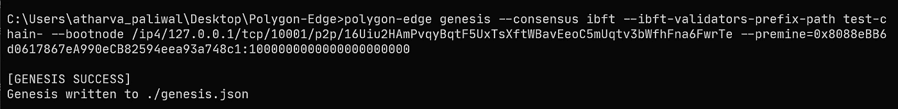

如您所见，我已经将 1000 ETH 预存在我的帐户地址中，我们的 genesis 文件现在已成功创建。

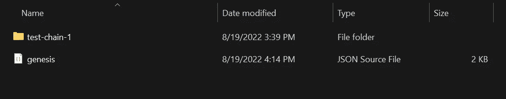

## 4.启动节点

因为我们只是运行单个多边形边节点，所以不会有任何基于端口的冲突问题，但是如果您有多个节点，请检查端口以避免冲突。

对于我们的单个节点，我们有-

10000 : gRPC 服务器

10001 : libp2p 服务器

10002 : JSON-RPC 服务器

现在，让我们使用命令-

```
polygon-edge server --data-dir ./test-chain-1 --chain genesis.json --grpc-address :10000 --libp2p :10001 --jsonrpc :10002 --seal
```

您也可以使用标志-**-*-闭塞时间，为闭塞的创建提供您想要设置的闭塞时间。*** 默认情况下封锁时间为 2 秒。

您的终端现在一定已经运行了，您现在可以通过键入您的 JSON-RPC URL 在您的浏览器中进行检查。

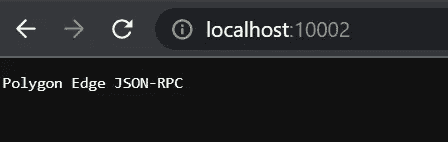

如果你得到了这样的东西，你就已经成为了 ITTT！！！您已经成功启动了多边形边节点！！！

让我们检查一下 Metamask，看看我们是否得到了预设的余额。

登录到元掩码，使用 JSON-RPC URL 添加一个新网络，如下所示-[http://localhost:10002/](http://localhost:10002/)

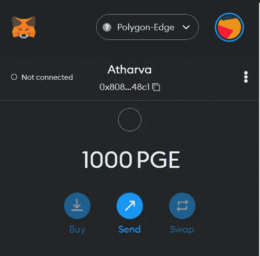

好了，我们得到了我们预先设定的第 1000 个 ETH。忽略令牌符号，因为我已经把它作为 PGE。你可以保留任何你选择的象征符号。

# 在多边形边缘部署智能合约

让我们尝试在多边形边缘部署一个 ERC20 & ERC721 契约。

为此你需要一些先决条件-

1.  您应该在本地设置 hardhat 环境
2.  设置一个基本的 Hardhat Javascript 项目

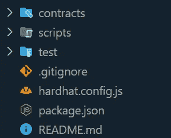

设置好您的 hardhat 项目后，您的项目结构可能如下所示。因此，首先我们将配置我们的 hardhat.config 文件，在其中添加多边形边网络。

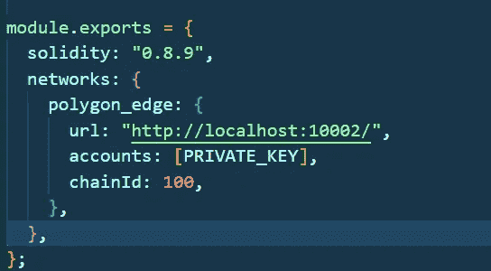

将此设置添加到 hardhat.config 文件中。从您帐户地址的元掩码中导出您的 PRIVATE_KEY。

> 注意:默认情况下，chainId 是 100，尽管我们可以在上面的步骤中使用 chainId 标志来更改它。

现在让我们写一个简单的 ERC 20 和 ERC 721 合约，分别铸造可替代和不可替代的代币。

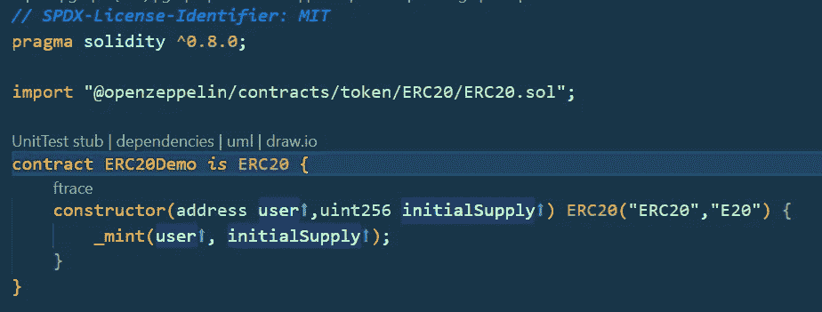

ERC20Contract

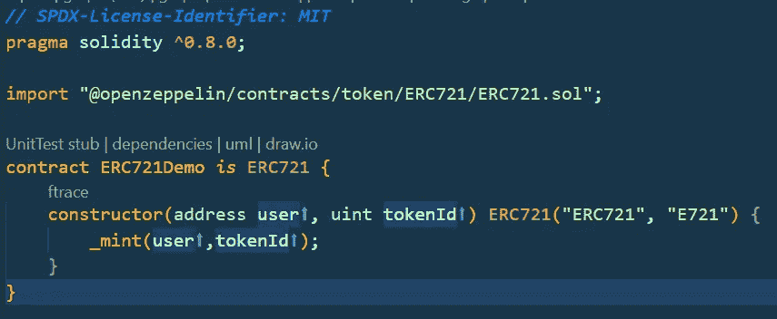

ERC721Contract

现在，让我们为我们的合同编写部署脚本来部署我们的合同。

在 scripts 文件夹中，我们创建了两个文件——ERC 20 demo . js 和 ERC721Demo.js，用于部署我们的智能合约。

> 注意:您甚至可以从单个文件部署 2 个智能合约，但是为了更好地理解我们的演示，我使用了 2 个不同的文件。

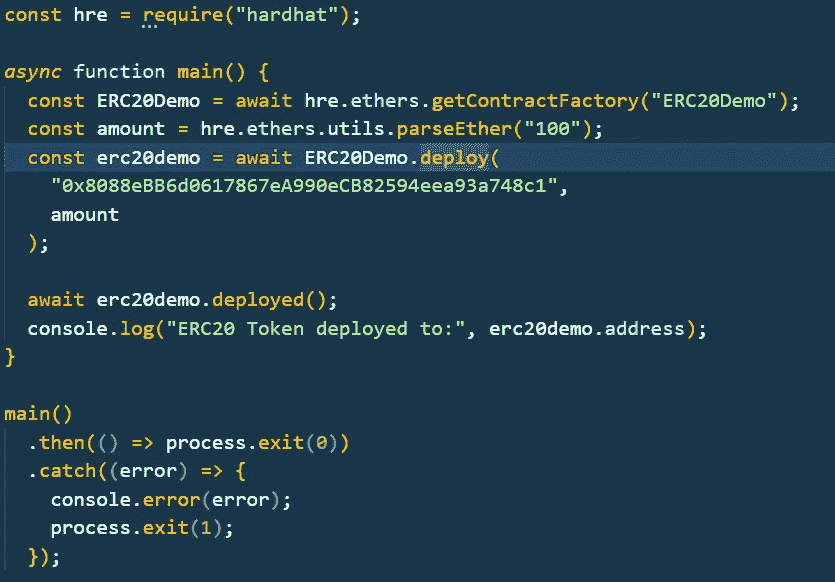

ERC20Demo.js

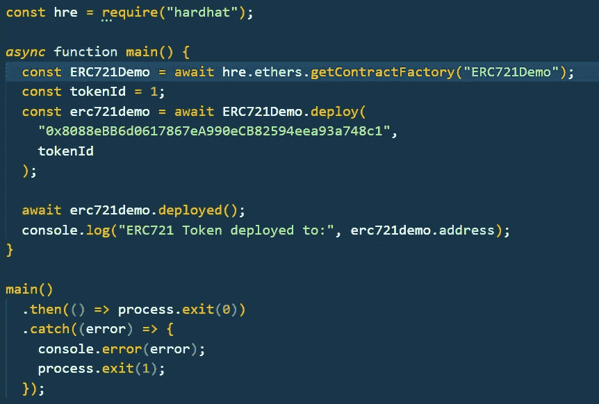

ERC721Demo.js

完成部署脚本后，现在让我们使用命令来部署契约

```
npx hardhat run scripts/ERC20Demo.js --network polygon_edgenpx hardhat run scripts/ERC721Demo.js --network polygon_edge
```

确保在运行命令之前运行多边形边网络已启动并正在运行。

部署智能合同后，您将获得 ERC20 和 ERC721 的已部署合同地址。一定要把它存放在某个地方，因为我们会需要它。

# 在元掩码 Wallet 中导入令牌

现在您已经获得了部署的合同地址，现在让我们将它导入到 Metamask wallet 中。

沿着这条路走-

元掩码 wallet ->资产->导入令牌->您部署的令牌地址

输入令牌地址后，它会自动检测您的令牌符号。

> 注意:确保你在元遮罩的多边形边网络中。

将这两个令牌添加到元掩码后，您可能会看到令牌被导入到我们的元掩码 wallet 中。

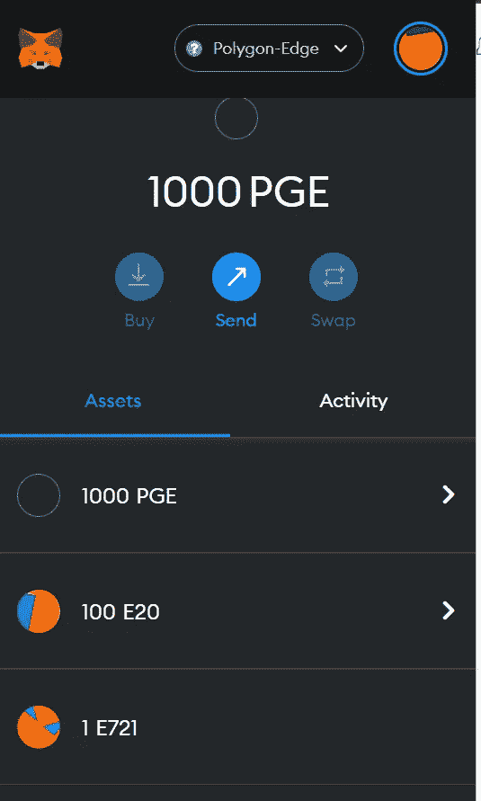

万岁！！！我们的 Metamask 钱包中现在有 100 个 ERC20 令牌和 1 个 ERC721 令牌。

嗯，这篇文章应该到此结束，但让我们通过向 Metamask 中的不同帐户发送 ERC20 令牌来完成奖金部分。

# 奖金部分

沿着这条路走-

进入您的 ERC20 令牌->发送->我的帐户间转账->指定您要发送的金额->确认。

> 注意:请确保您在 Metamask wallet 中有 2 个以上的帐户

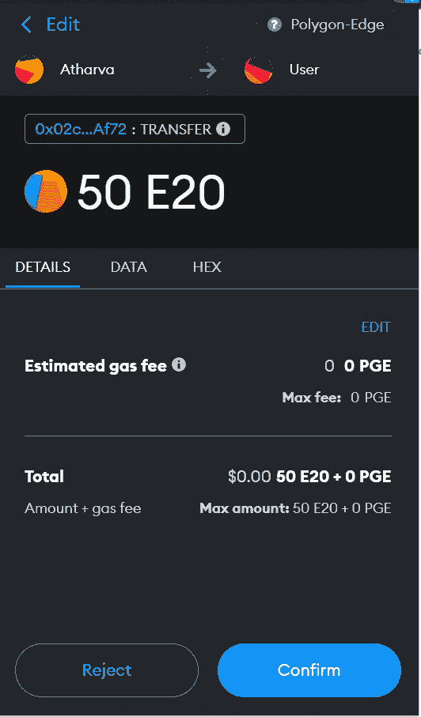

现在你可能想知道为什么我要展示这个？

在上图中，检查我们消耗的汽油费。SHOCKEDDD！！！是的，是 0。我们没有使用我们在设置多边形边网络时给出的任何预设平衡。

现在让我们检查接收者是否已经收到 50 个 E20 令牌。

嗯，如果你查一下寄件人账户的余额，现在是 50 英镑。

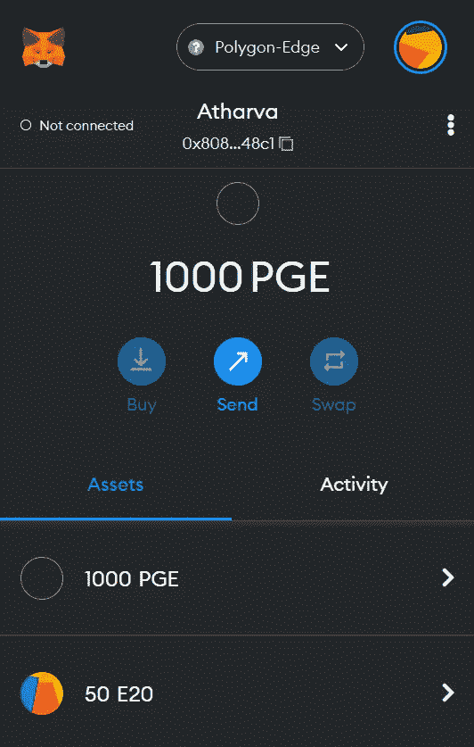

让我们在接收器端检查一下-

您需要按照之前的步骤在您的其他帐户中导入 ERC20 合同地址。

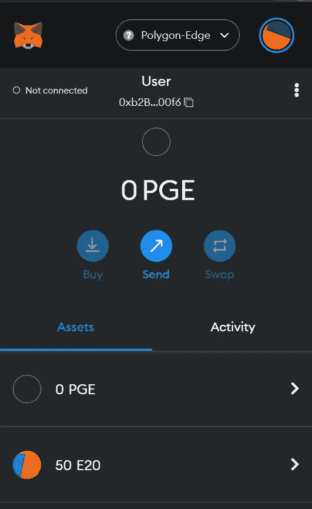

呀呀呀！！我们在接收者端得到 50 个 E20 代币。是的，这也不消耗任何汽油费:)

本文到此结束。我希望这篇文章涵盖了你开始多边形边缘之旅所需要的一切。

Codinggg 快乐！！！

如果你有任何疑问，可以联系我-

领英-[https://in.linkedin.com/in/atharva-paliwal-70676a175](https://in.linkedin.com/in/atharva-paliwal-70676a175)

参考文献-

[](https://docs.polygon.technology/docs/edge/overview/) [## 多边形边缘|多边形技术|文档

### 这是一项正在进行中的工作，因此未来可能会发生架构上的变化。代码还没有被审计，所以…

文档.多边形.技术](https://docs.polygon.technology/docs/edge/overview/) 

> 交易新手？试试[密码交易机器人](/coinmonks/crypto-trading-bot-c2ffce8acb2a)或者[复制交易](/coinmonks/top-10-crypto-copy-trading-platforms-for-beginners-d0c37c7d698c)