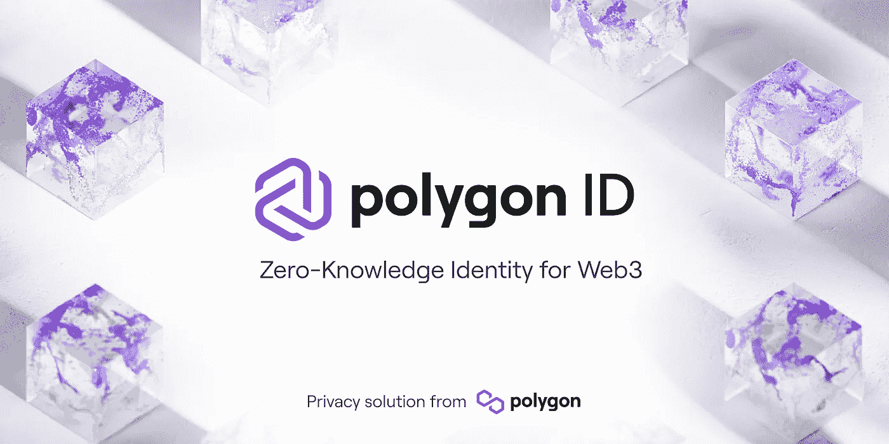
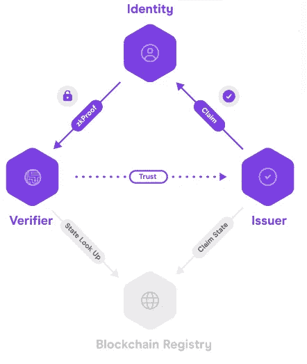
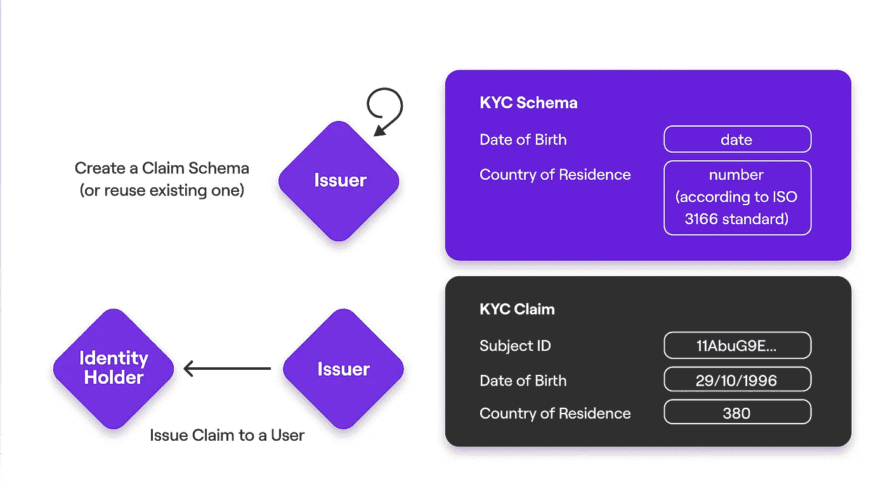
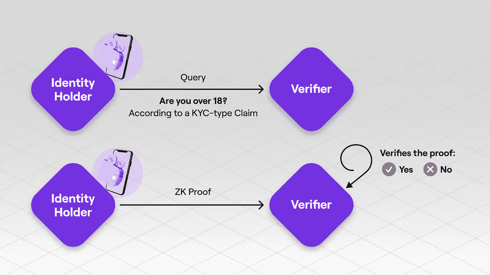
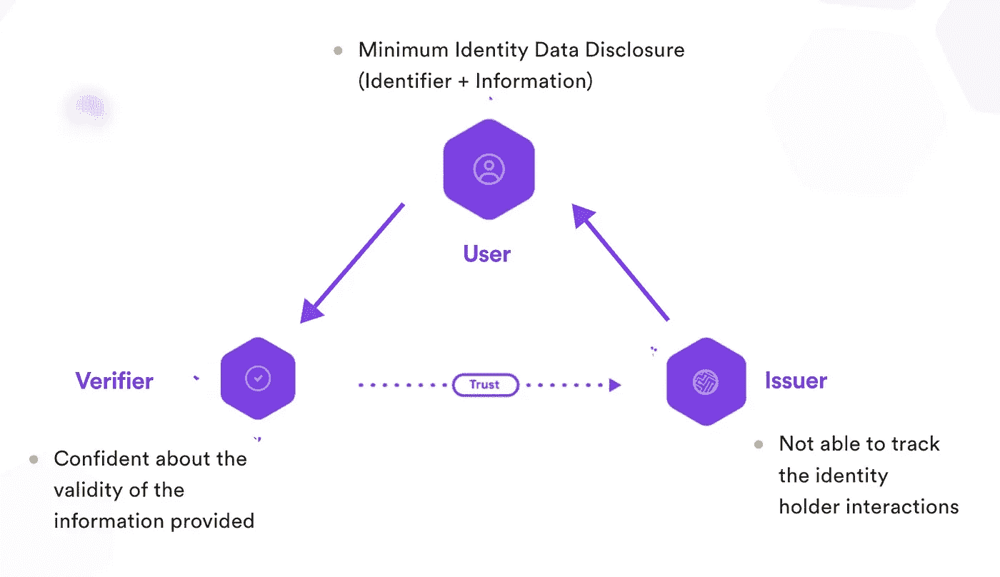
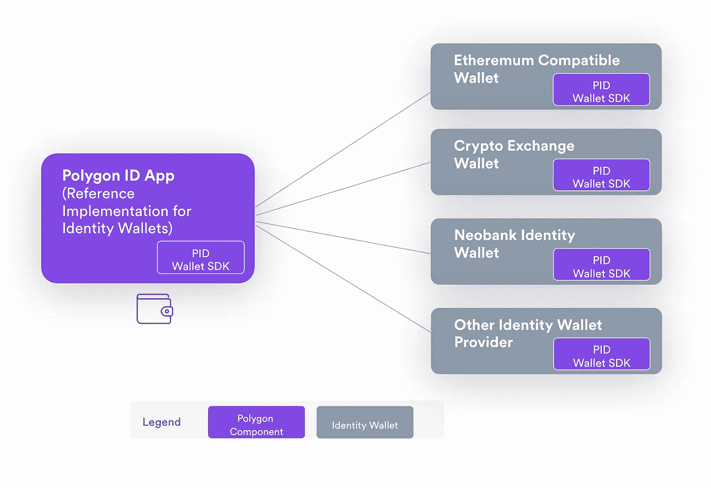

# 多边形 ID 第 1 部分:核心概念介绍

> 原文：<https://medium.com/coinmonks/polygon-id-part-1-introduction-to-core-concepts-394681549f7c?source=collection_archive---------0----------------------->



这是一个系列文章，将分为三个部分，其中第一部分我们将介绍 Polygon ID 的简介和核心概念，第二部分我们将了解如何在 Polygon ID wallet 中发出声明和接收声明，第三部分我们将了解 verifier 如何使用链验证在 Polygon ID wallet 的帮助下验证用户的身份。

我们将在本文中涉及的主题是—

1.  什么是多边形 ID？
2.  多边形 ID 的核心概念
3.  为什么是多边形 ID？
4.  多边形 ID 钱包应用程序

第二部分和第三部分涉及的主题是—

1.  实施链上验证示例
2.  使用 Polygon ID 平台发布声明
3.  核实索赔

# 什么是多边形 ID？

Polygon ID 是 web2 和 web3 应用程序的**去中心化**和**无权限身份**框架。它的工作原理是自我主权身份( **SSI** )和让个人拥有和控制自己身份的加密技术。

# 多边形 ID 的核心概念

要继续使用多边形 ID，我们应该知道四个核心概念。这是—

1.  要求
2.  发行人
3.  身份持有者
4.  核验者



Source : Polygon ID Docs

## 要求

[声明](https://docs.iden3.io/protocol/claims-structure/)表示与个人、企业或对象相关的任何类型的信息。对于 ex- A 索赔可以代表你的年龄或你的大学学位。

提出权利主张的人被称为发行人，他将权利主张发送给持有人。

我们将在文章的下一部分看到如何通过[多边形 ID 平台](https://platform-test.polygonid.com/)发布声明。你可以通过这个[视频](https://youtu.be/VClUFjs8lh8)自己试试。

## 发行人

发布者是向身份持有者发布声明的实体或组织。该声明由发布者组织或实体加密签名。

例如，给学生颁发学位的大学可以是一个声称学生已经从他们的大学获得学位的颁发者。



Source : Polygon ID Docs

发布者可以通过创建 [**模式**](https://docs.iden3.io/protocol/claim-schema/) 或使用一些预先存在的可用模式来定义他想要发布的声明的结构。

从上图中我们可以看到，发行者创建了一个带有 DOB 和 CountryOfResidence 的模式，其中在向用户发出声明时，他将分别填写用户的 DOB 和 CountryOfResidence，即 29/10/1996 & 380，然后向用户发出声明。用户现在获得该声明，并可以将该声明发送给验证者。

现在让我们看看模式实际上是什么样子的——

```
...
"countryCode": { 
    "@id": "kyc-vocab:countryCode", 
    "@type": "serialization:IndexDataSlotA" 
}, 
"documentType": { 
    "@id": "kyc-vocab:documentType", 
    "@type": "serialization:ValueDataSlotB" 
}
...
```

下面是[kyccountryofresidenccredential](https://github.com/iden3/claim-schema-vocab/blob/main/schemas/json-ld/kyc-v2.json-ld#L27)模式的例子。模式是通过 JSON-LD 文档描述的。

声明将数据存储在四个数据槽中:两个索引槽(i_2，i_3)和两个值槽(v_2，v_3)。为了正确地设计和用信息填充声明，有必要定义哪些数据应该存储在哪些数据槽中。这些规则编码在声明模式中。

countryCode 应存储在 IndexDataSlotA 中，而 documentType 则存储在 IndexDataSlotB 中。

## 身份持有者

身份持有者是像我们这样的终端用户，他们持有多边形 ID 钱包中的声明。

在该声明的帮助下，持有者可以在其钱包中生成该声明的零知识证明，并将这些零知识证明呈现给验证者。

## 核验者

验证者验证持有者出示的证据。验证者根据持有者钱包中的声明请求证据。



Source : Polygon ID Docs

验证者可以添加他的附加检查，以查看持有人的索赔是否满足他所需的标准。对于 ex- Verifier，可以添加一张支票，证明持有人拥有满足 18 岁以上年龄标准的声明，并且该声明是由一个声誉良好且可信的发行人发行给持有人的。

> 注意:在验证者和发行者之间应该存在一种信任来验证持有者的声明，因为该声明类似于密码验证不能保证其真实性。这里的验证者应该确保声明来自可信的发布者。

现在有两种类型的验证—

1.  在线验证
2.  离线验证

链上验证允许 Dapps 使用零知识证明加密来验证用户在智能合同中的声明。

离线验证提供了创建定制查询、设置验证服务器和在客户端生成 QR 码以向用户请求证明的所有元素。

但是，两种情况下生成的证明是相同的；唯一的区别在于验证过程。

我们将在文章的下一部分介绍[查询语言](https://0xpolygonid.github.io/tutorials/verifier/verification-library/zk-query-language/)以及 verifier 如何查询声明。

# 为什么是多边形 ID？

现在我们有了一些关于多边形 ID 的概述，让我们回顾一下多边形 ID 为我们提供的优势。

多边形 ID 可以让人们证明他们的身份，而不暴露他们的关键信息。这里用户的身份由零知识加密保护。让我们来讨论多边形 ID 提供的一些优势—



Source : Polygon ID Docs

## 零知识隐私

正如我们在上面看到的，身份持有者在不暴露其敏感信息的情况下，可以借助其声明向验证者发送加密证明。

对于前身份持有者，借助于验证发行者给予他的声明，他大于 18 岁，可以从验证者处得到验证，而实际上不向任何人透露他的年龄。这确保了最小的数据暴露，从而确保了任何敏感数据的安全。

> 注意:发行人无法跟踪向持有人发行的索赔，即持有人可以在任何地方使用该索赔。

## 链上验证

与以前不同的是，在智能合同的帮助下，现在可以在链上验证证据。

对于 ex- Any 验证者，只允许年满 18 岁且符合标准身份持有者访问他们的网站。

## 自我主权

自我主权意味着持有者完全控制他/她的数据、私钥等的共享。没有发行人可以跟踪索赔的使用情况。

## 传递信任

这里的信任指的是发行者和验证者之间的关系。由发行者发布的声明可以与多个验证者一起使用，但是在这里需要注意的是，每个验证者都接受由发行者发布的声明。为此，在发行者和验证者之间建立信任非常重要。

这里的另一种信任是指发行人和持有人之间的信任。持有者如果从可信发行者处收集声明，那么他可以在验证者端进行无麻烦的验证。

# 多边形 ID 钱包应用程序

默认情况下，多边形 ID 钱包是一个**隐私**钱包，它通过使用零知识证明来帮助保护用户的身份(和其他元数据)。钱包与发行者交互以获取声明，并与验证者交互以基于这些声明共享 ZK 证明。



Source : Polygon ID Docs

多边形 ID 钱包应用程序具有以下功能—

1.  设计隐私和自我主权
2.  开放且无权限。
3.  获取、存储和管理索赔。
4.  为索赔验证生成成本优化的零知识证明。
5.  与发行人和验证人的沟通。
6.  使用种子短语的身份恢复。

可以从 [Playstore](https://play.google.com/store/apps/details?id=com.polygonid.wallet&pli=1) 或者 [Appstore](https://apps.apple.com/us/app/polygon-id/id1629870183) 下载多边形 ID 钱包 app。

但是，不要将 Polygon ID wallet 应用程序与 Metamask 或任何其他加密钱包混淆，因为它们用于发送链上的交易，而 Polygon ID Wallet 用于创建和存储钱包的唯一身份，以便这些身份可用于向发行者和验证者进行认证。

所以，这就结束了文章的第一部分。我希望您在理解多边形 ID 的核心概念方面获得了一些专业知识。

喜欢这篇文章吗？在此处找到所附[系列文章的第 2 部分，该部分涵盖了索赔的发布。](/coinmonks/polygon-id-part-2-creating-and-issuing-claims-4fda0d992b1d)

我建议你浏览一下我提供的资源，以加强你对多边形 ID 的了解。如果您想更深入地了解多边形 ID 的概念，您可以阅读多边形 ID 所基于的 iden3 协议。我在参考资料部分提供了链接。

如果你喜欢读这篇文章，请留下掌声或评论，你也可以通过 [LinkedIn](https://www.linkedin.com/in/atharva-paliwal-70676a175/?originalSubdomain=in) 和 [Twitter](https://twitter.com/0xatharva7) 与我联系。你可以在 Medium 上关注我，因为我一直在写一些关于区块链的新的和不太为人知的事情。

# 重要资源

多边形 ID 文档—【https://0xpolygonid.github.io/tutorials/ 

iden 3 docs—[https://docs.iden3.io/](https://docs.iden3.io/)

Iden3 教程—[https://iden3.github.io/docs-temp-public-tutorials/](https://iden3.github.io/docs-temp-public-tutorials/)

多边形 ID 上的视频—[https://youtu.be/bmRvQNmxFkM](https://youtu.be/bmRvQNmxFkM)

EthGlobal 处的多边形 ID—[https://youtu.be/utpazrLrSbY](https://youtu.be/utpazrLrSbY)

多边形 ID 平台—[https://youtu.be/VClUFjs8lh8](https://youtu.be/VClUFjs8lh8)

多边形 ID x 多边形刀—[https://youtu.be/7qQxDz91nCA](https://youtu.be/7qQxDz91nCA)

> 交易新手？试试[加密交易机器人](/coinmonks/crypto-trading-bot-c2ffce8acb2a)或者[复制交易](/coinmonks/top-10-crypto-copy-trading-platforms-for-beginners-d0c37c7d698c)