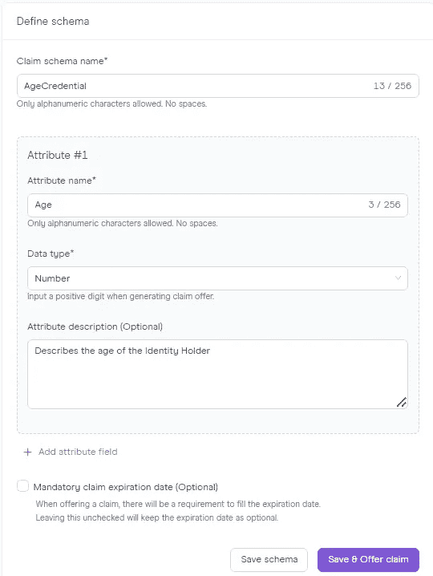

# 多边形 ID 第 2 部分:创建和发布声明

> 原文：<https://medium.com/coinmonks/polygon-id-part-2-creating-and-issuing-claims-4fda0d992b1d?source=collection_archive---------0----------------------->


Source : Polygon ID Docs

本文是 Polygon ID 系列文章的第二部分，我们将介绍发行者通过 Polygon ID 平台发出声明，以及身份持有者在其 Polygon ID 钱包中接收声明。

然而，要开始这篇文章，你应该知道一些先决条件，你可以在这个系列的第一部分 [*这里*](/coinmonks/polygon-id-part-1-introduction-to-core-concepts-394681549f7c) 找到，它以一种简单的方式覆盖了多边形 ID 的核心概念。

所以这篇文章将会涵盖所有的东西—

1.  在线验证介绍。
2.  多边形 ID 平台介绍给自己发个索赔。
3.  在您的多边形 ID 钱包中领取索赔。

在本系列的下一部分，我们将讨论—

1.  使用发布的声明，通过使用链上验证的验证器来验证您的身份。
2.  在验证者验证后，在您的 Metamask 钱包中获取已发行的 ERC20 令牌。

# 在线验证简介

链上验证工作流允许 Dapps 验证智能合同内的用户声明。零知识证明密码术使得这种验证能够以保密的方式发生，即不泄露用户(身份持有者)的任何个人信息。

例如，我们可以使用链验证有一个检查，只允许 18 岁以上的人能够投票。

现在，在进行链上验证之前，我们将首先向自己发出一个声明，我们可以用它来发送给验证者。这个声明将由一个发行人提供给我们，在我们的情况下，我们将向自己发出声明，但在现实世界中，这可以由任何受信任的组织来完成。

因此，让我们来看看多边形 ID 平台为我们提供了什么。

# 通过多边形 ID 平台发布声明

[Polygon ID Platform](https://platform-test.polygonid.com/sign-in) 是 Polygon ID team 提供的一个沙箱，任何发布者都可以在这里以简化的方式向身份持有者发布声明。

您可以登录并在平台上创建您的帐户，之后您会在邮件中收到一个验证链接，单击该链接，您会看到类似这样的内容


Polygon ID Issuer Registration Page

因此，该页面是将通过 Polygon ID 平台向持有人发布声明的发行人的注册页面。到目前为止，因为我们只向自己发布声明，所以我们可以创建自己的组织。但在现实世界中，这个组织可以是政府支持的驾驶执照发行人等。

成功创建组织后，您将被重定向到一个仪表板，该仪表板允许发行人发行声明。它看起来会像这样—


Polygon ID Platform Dashboard Page

在仪表板上，我们有 create schema 按钮，发行者可以从这里创建定制的[模式](https://docs.iden3.io/protocol/claim-schema/#schema-hash)。我已经在文章的前一部分解释了模式。然而，我们只需向多边形 ID 平台提供参数，它就会为我们生成模式文件。

让我们创建一个能让我们更加清晰的图表—

在单击 create schema 按钮时，我们注意到它询问我们模式名称，告诉我们关于什么的声明以及我们想要指定的属性。



Create Schema Page

您可以在自定义模式中添加两个属性来指定数据类型，即布尔型、数字型还是日期型。因为在我们的例子中，我们采取的场景是，我们希望向持有人发出声明，声明他的年龄，所以我们选择了数字数据类型。

单击“保存并提供声明”后，我们将获得在创建模式中提到的属性，其中我们必须输入特定于每个希望发出声明的身份持有者的值。


Offer Claim Page

现在，发行者提到用户或身份持有者的年龄是 20 岁，并且他通过填写值来为用户生成声明。他还可以指定声明到期日期，这将告诉身份持有者声明何时到期。

生成索赔要约后，您将看到一个指向生成的索赔的链接，您只需复制该链接，并与身份持有者或请求发布索赔的人共享。


Claim

当您打开链接时，您会注意到从我们指定的模式属性中生成的二维码，现在身份持有者可以从他的 Polygon ID wallet 应用程序中扫描此二维码，并可以从发布者组织为自己发布声明。

在 Polygon ID 平台上，访问控制面板，点击“*提供的索赔*标签，您会注意到关于您刚刚创建的索赔的详细信息。


Offered Claims

要查看您生成的声明的模式，只需访问“ *My schemas* ”标记，您将能够注意到一个列出的模式 URL。


Claim Schema Page

如果您打开那个链接，您会看到下载了一个扩展名为 JSON-LD 的文件。该文件将包含类似这样的内容—

```
{
    "@context": [{
        "@version": 1.1,
        "@protected": true,
        "id": "@id",
        "type": "@type",
        "AgeCredential": {
            "@id": "https://s3.eu-west-1.amazonaws.com/polygonid-schemas/33f9238b-dad0-440e-aa20-4561606c289b.json-ld#AgeCredential",
            "@context" : {
                "@version": 1.1,
                "@protected": true,
                "id": "@id",
                "type": "@type",
                "poly-vocab": "https://s3.eu-west-1.amazonaws.com/polygonid-schemas/33f9238b-dad0-440e-aa20-4561606c289b.vocab.schema.json",
                "serialization": "https://github.com/iden3/claim-schema-vocab/blob/main/credentials/serialization.md#",
                "Age": {
                    "@id": "poly-vocab:Age",
                    "@type": "serialization:IndexDataSlotA"
                }
            }
        }
    }]
}
```

模式通常以 JSON-LD 格式存储，但是将整个模式存储在声明中是非常低效的，因此只有模式散列存储在声明中。`@id`包含惟一的 url，该 URL 包含 JSON-LD 文档。`auth-vocab`包含描述存储在该声明中的值类型的 url。在我们的情况下，只有一个，即年龄。`serialization`包含将原始声明解析为 JSON-LD 文档所需的指令，最后一部分包含对值(即年龄)的引用。它们的`@id`是 auth-vocab 中相应的描述，而`@type`表示值应该存储在声明中的什么位置，在我们的例子中是 IndexDataSlotA。

在创建我们的模式时，如果我们已经创建了两个属性，它们将被存储在 IndexDataSlotB 中，正如我在文章的上一部分中所说的，将数据存储在四个数据槽中:两个索引槽(i_2，i_3)和两个值槽(v_2，v_3)。为了正确地设计和用信息填充声明，有必要定义哪些数据应该存储在哪些数据槽中。

# 在我们的多边形 ID 钱包中接收索赔

在我们继续之前，我希望你已经从 [Playstore](https://play.google.com/store/apps/details?id=com.polygonid.wallet) 下载了 Polygon ID wallet 应用程序，并且已经完成了设置。这些步骤与安装 Metamask wallet 时有些类似。

设置完成后，你会发现你的钱包里有这样的东西—


Polygon ID wallet

点击连接按钮后，我们必须扫描从发行商处获得的 Polygon ID wallet 应用程序中的二维码。扫描二维码后，我们将在 Polygon ID 钱包中收到索赔。


现在，我们已经在 Polygon ID wallet 应用程序中获得了声明，我们现在可以在任何验证者请求年龄证明时共享该声明。

这就是第二部分，我们将在本文的下一部分继续验证过程。

喜欢这篇文章吗？在此处找到文章系列的第 3 部分，它涵盖了链验证和演示。

如果你喜欢阅读这篇文章，请继续关注并关注我在 [Twitter](https://twitter.com/0xatharva7) 、 [LinkedIn](https://www.linkedin.com/in/atharva-paliwal-70676a175/?originalSubdomain=in) 和 [Medium](/@atharvapaliwal7) 上的文章，并与你对这一步感兴趣的朋友分享。

# 重要资源

多边形 ID 文档—[https://0xpolygonid.github.io/tutorials/](https://0xpolygonid.github.io/tutorials/)

iden 3 docs—【https://docs.iden3.io/ 

多边形 ID 平台—【https://platform-test.polygonid.com/sign-in 

多边形 ID 平台视频—[https://youtu.be/VClUFjs8lh8](https://youtu.be/VClUFjs8lh8)

声明和模式—[https://docs.iden3.io/protocol/claims-structure/](https://docs.iden3.io/protocol/claims-structure/)

> 交易新手？尝试[加密交易机器人](/coinmonks/crypto-trading-bot-c2ffce8acb2a)或[复制交易](/coinmonks/top-10-crypto-copy-trading-platforms-for-beginners-d0c37c7d698c)