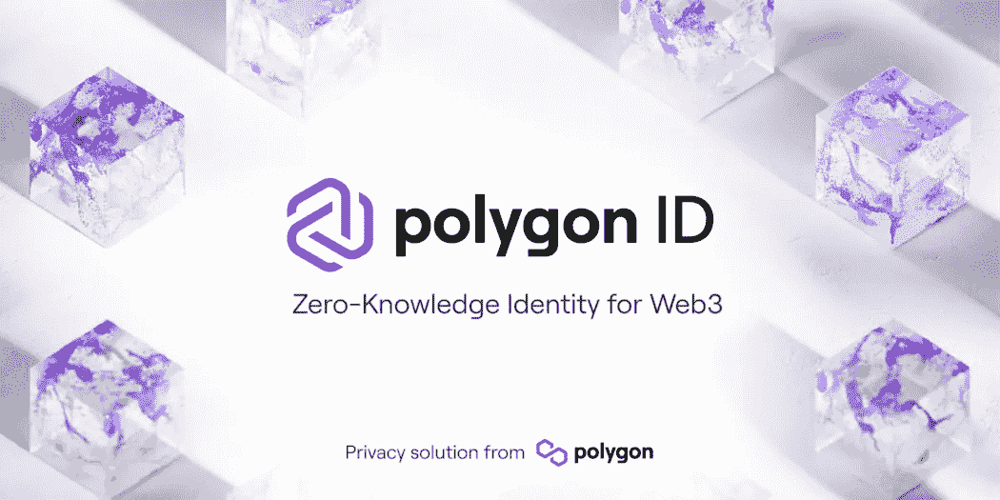
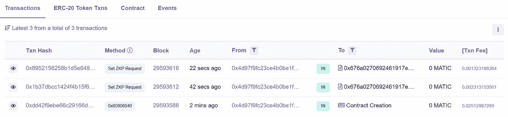
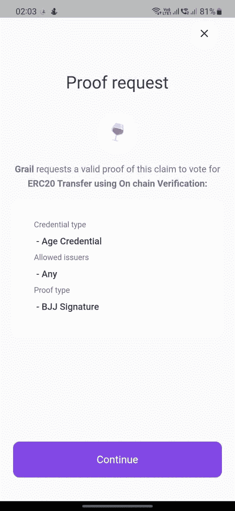
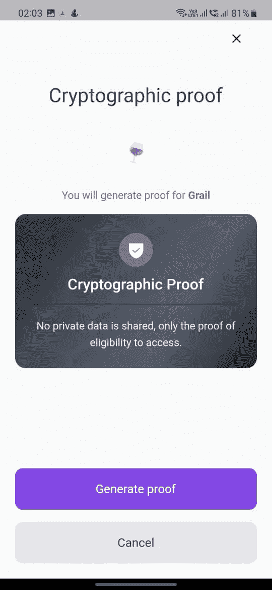
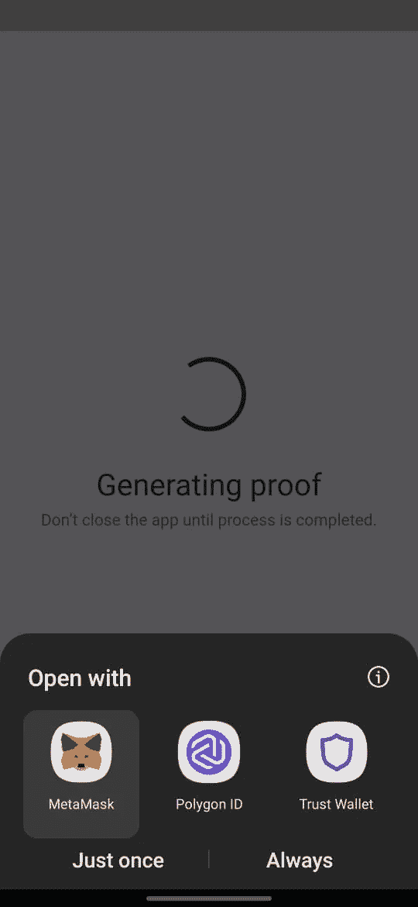
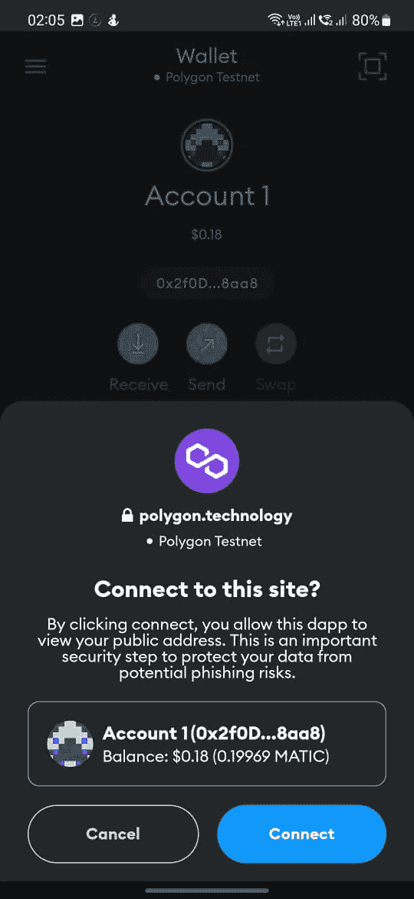
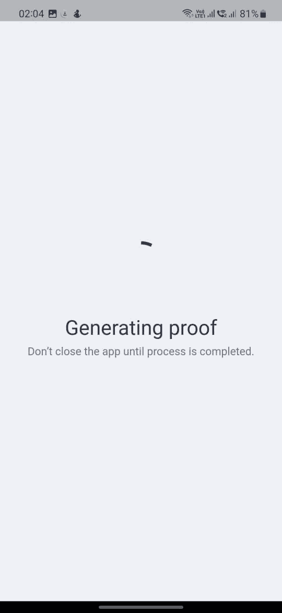
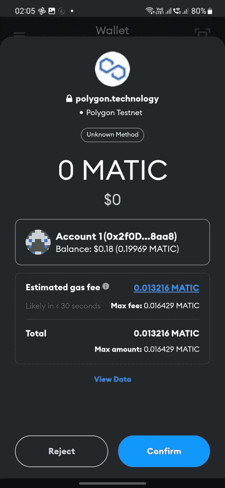
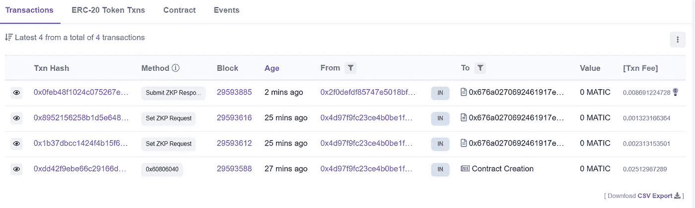
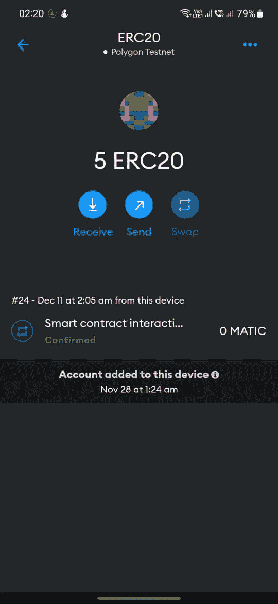

# 多边形标识第 3 部分:由验证者进行链上验证

> 原文：<https://medium.com/coinmonks/polygon-id-part-3-on-chain-verification-by-verifier-e68338cd4846?source=collection_archive---------1----------------------->



Source : Polygon ID Docs

这是正在进行的多边形 ID 系列的第三篇文章，我们将在其中讨论验证器的链上验证。

然而，如果您直接从本文开始，我建议您阅读一下本系列的第[部分-1](/coinmonks/polygon-id-part-1-introduction-to-core-concepts-394681549f7c) & [部分-2](/coinmonks/polygon-id-part-2-creating-and-issuing-claims-4fda0d992b1d) ，它们分别涵盖了核心概念和索赔的发布。

我将从我们在第 2 部分中离开的地方继续这篇文章，在第 2 部分中，我们向持有人发出了索赔。在本文中，我们将通过验证者设置请求，验证者将验证索赔持有人是否满足证明请求。

从教程开始，我会要求你克隆这个[库](https://github.com/pikachua7/On-Chain-Verification-Age)。它包含了本文中讨论的代码的完整实现。

# 设计 ERC20 zk 合同

ERC20Verifier 是 ERC20 类固醇的标准合约。零知识证明验证提供了额外的功能。所有专用于 zk 验证的函数都包含在 [ZKPVerifier](https://github.com/0xPolygonID/contracts/blob/main/contracts/verifiers/ZKPVerifier.sol) 契约中，并在 ERC20Verifier 中继承。

例如，用户将通过调用 *submitZKPResponse* 函数提交他们的证据来要求令牌。

ERC20Verifier 协定必须至少定义一个 TRANSFER_REQUEST_ID，该 ID 类似于协定向用户提出的请求的标识符。

```
// SPDX-License-Identifier: MIT
pragma solidity ^0.8.0;

import "@openzeppelin/contracts/token/ERC20/ERC20.sol";
import "./lib/GenesisUtils.sol";
import "./interfaces/ICircuitValidator.sol";
import "./verifiers/ZKPVerifier.sol";

contract ERC20Verifier is ERC20, ZKPVerifier {

    uint64 public constant TRANSFER_REQUEST_ID = 1;

    mapping(uint256 => address) public idToAddress;
    mapping(address => uint256) public addressToId;

    uint256 public TOKEN_AMOUNT_PER_ID = 5 * 10**uint(decimals());

    constructor(string memory name_, string memory symbol_)
        ERC20(name_, symbol_)
    {}    

    function _beforeProofSubmit(
        uint64, /* requestId */
        uint256[] memory inputs,
        ICircuitValidator validator
    ) internal view override {
        // check that challenge input of the proof is equal to the msg.sender 
        address addr = GenesisUtils.int256ToAddress(
            inputs[validator.getChallengeInputIndex()]
        );
        require(
            _msgSender() == addr,
            "address in proof is not a sender address"
        );
    }

    function _afterProofSubmit(
        uint64 requestId,
        uint256[] memory inputs,
        ICircuitValidator validator
    ) internal override {
        require(
            requestId == TRANSFER_REQUEST_ID && addressToId[_msgSender()] == 0,
            "proof can not be submitted more than once"
        );

        uint256 id = inputs[validator.getChallengeInputIndex()];
        // execute the logic
        if (idToAddress[id] == address(0)) {
            super._mint(_msgSender(), TOKEN_AMOUNT_PER_ID);
            addressToId[_msgSender()] = id;
            idToAddress[id] = _msgSender();
        }
    }

    function _beforeTokenTransfer(
        address, /* from */
        address to,
        uint256 /* amount */
    ) internal view override {
        require(
            proofs[to][TRANSFER_REQUEST_ID] == true,
            "only identities who provided proof are allowed to receive tokens"
        );
    }
}
```

在合同中，你会注意到两个挂钩—

1.  _beforeProofSubmit
2.  _afterProofSubmit

让我们看看为什么这两个钩子很重要。

**_beforeProofSubmit** 检查证明的发送者是否与证明质询中包含的地址相匹配。

**_afterProofSubmit** 包含了我们需要在用例中编写的逻辑。它还包含这样一个条件，即对于特定的 TRANSFER_REQUEST_ID，证明只执行一次。

接下来，我们注意到 ERC20 覆盖了 **_beforeTokenTransfer** ，ERC 20 禁止任何类型的令牌传输(即使在空投之后)，除非用户通过了证据验证。

这就完成了我们的 ERC20Verifier 合同。现在让我们转向合同的部署。

# 部署 ERC20Verifier 合同并设置 ZKP 请求

在克隆的存储库中，您将看到两个 hardhat 脚本，其中一个脚本包含合同的部署，另一个脚本包含 ZKP 请求的设置。

让我们设置 *set-request.js* 文件，它将为验证者设置证明请求。

如果您在 *set-request.js* 文件中注意到，函数 ***setZKPRequest*** 是从 ERC20Verifier 契约中调用的，它接受 3 个参数—

1.  请求 ID
2.  验证器
3.  询问

**requestID** 定义了与请求相关联的 ID。

**验证器**这里指的是[验证器智能合约](https://github.com/0xPolygonID/contracts/blob/main/contracts/validators/CredentialAtomicQuerySigValidator.sol)部署在[孟买测试网](https://mumbai.polygonscan.com/address/0xb1e86C4c687B85520eF4fd2a0d14e81970a15aFB)上。这是在用户提交的 zk 证明上实际执行验证的合同。

**查询**这里指的是验证者在他对身份持有者的证明请求中指定的一组规则。

查询是一个包含一些参数的对象—

1.  (计划或理论的)纲要
2.  插槽索引
3.  操作员
4.  价值
5.  电路 ID

**模式**是您可以从 Polygon ID Platform 上的发行者仪表板中检索的模式的散列。为了在查询中使用它，应该将它从 hex 转换为 bigint。

> 注意:如果你是 Polygon ID 文档的早期用户，文档中没有提到模式哈希转换，这在初始阶段导致了很多错误。然而没有得到解决:)

**slotIndex** 是您正在查询的属性的索引。请注意，在创建索赔时，我们提到最多可以提到 2 个属性。在我们的例子中，我们只提到了年龄(如果你对属性感到困惑，请参考我的[系列文章的第二部分](/coinmonks/polygon-id-part-2-creating-and-issuing-claims-4fda0d992b1d))。

slotIndex 值可以是 2 或 3，其中 2 表示属性-1，3 表示属性-2。在我们的例子中，因为我们将年龄信息存储在属性-1 中，所以我们将 slotIndex 值取为 2。

**运算符**的范围从 1 到 5，其中每个运算符的意思是—

运算符 1:等于

操作员 2:小于

运算符 3:大于

操作员 4:在

接线员 5:不在

因此，您可以根据您的用例选择您想要的操作符，在我们的场景中，我们将选择操作符 3，因为我们想要年龄大于 18 岁的所有身份持有者。

**值**表示您正在查询的阈值。在我们的例子中，阈值是 18，因为我们希望所有用户都年满 18 岁。

**circuitID** 是您用于验证的电路的 ID。它可以是[credentialaatomicquerymtp](https://docs.iden3.io/protocol/main-circuits/#credentialatomicquerymtp)或[credentialaatomicquerysig](https://docs.iden3.io/protocol/main-circuits/#credentialatomicquerysig)。出于演示目的，我们使用了 credentialAtomicQuerySig。

现在你已经设置好了你的 *set-request.js* 文件。但是在继续之前，请确保您已经在 github repo 文件中做了以下更改——

1.  更改了模式哈希(您可以从多边形 ID 平台获取它，请确保您复制了想要验证的模式哈希)
2.  更改查询参数:运算符& value
3.  添加 ERC20Verifier 契约部署地址(只需运行 deploy.js 文件)

现在，您可以成功设置您的 ZKP 请求了。如果您将在 Polygonscan 上打开您的 ERC20Verifier 合同地址(如果您已经在 Polygon 上部署了您的合同),您可能会注意到我们的 ZKP 请求设置成功。



SetZKPRequest

现在，让我们将这个证明请求添加到一个 QR 码中，并让我们的用户通过该证明请求。

# 在 QR 码中设置证明请求

让我们前往前端文件夹，在 App.js 文件中，我们已经准备好了 QR 码，但我们需要做一些更改，以便 QR 码现在包含我们的证明请求。

1.  使用您部署的 ERC20Verifier 协定地址更改协定地址。
2.  在 qrProofRequestJson 中，在 **req** 下添加您在声明时给出的属性名称。对我们来说，是年龄。然后，您可以告诉操作员它是小于请求值还是大于请求值以及阈值。
3.  在 **schema** 部分下，您需要指定模式 URL 和类型，即您为模式指定的名称。在我们的例子中，它是一个年龄证书。

```
id: "c811849d-6bfb-4d85-936e-3d9759c7f105",
  typ: "application/iden3comm-plain-json",
  type: "https://iden3-communication.io/proofs/1.0/contract-invoke-request",
  body: {
    transaction_data: {
      contract_address: deployedContractAddress,
      method_id: "b68967e2",
      chain_id: 80001,
      network: "polygon-mumbai"
    },
    reason: "ERC20 Transfer using On chain Verification",
    scope: [
      {
        id: 1,
        circuit_id: "credentialAtomicQuerySig",
        rules: {
          query: {
            allowed_issuers: ["*"],
            req: {
              Age: {
                $gt: 18
              }
            },
            schema: {
              url:
                "https://s3.eu-west-1.amazonaws.com/polygonid-schemas/33f9238b-dad0-440e-aa20-4561606c289b.json-ld",
              type: "AgeCredential"
            }
          }
        }
      }
    ]
  }
```

现在我们都设置好了，让我们用验证者的证明请求来验证我们的用户是否超过 18 岁。

打开 Polygon ID wallet 应用程序，扫描 react 应用程序中生成的二维码。

你会看到这样的过程—



在对多边形扫描检查之后，我们将会看到——



我们的请求已成功提交，我们的用户获得了 ERC20Verfier 令牌，因为他已超过 18 岁。



这就结束了 Polygon ID 简介系列，该系列详细介绍了核心概念、声明的发布、声明的验证。

我给那些跟随教程的人的建议是尝试一些不同的用例，并在你的 dapps 中使用多边形 ID。

如果你觉得我的文章很有用，或者如果你把这个概念用到你的 dapps 中，请在 twitter 上给我加标签。如果你觉得这篇文章有用，请给我鼓掌或在[媒体](/@atharvapaliwal7)上留言。你也可以在 [Linkedin](https://www.linkedin.com/in/atharva-paliwal-70676a175/?originalSubdomain=in) 上找到我，并与你想了解 Polygon ID 的朋友分享。

# 重要资源

本文 github Repo—[https://github . com/pikachua 7/Polygon-ID-On-Chain-Verification-Age](https://github.com/pikachua7/Polygon-ID-On-Chain-Verification-Age)

Manny 编码—[https://github . com/codingwithmanny/polygonid-on-chain-verification](https://github.com/codingwithmanny/polygonid-on-chain-verification)

多边形 ID 文档—[https://0xpolygonid.github.io/tutorials/](https://0xpolygonid.github.io/tutorials/)

iden 3 docs—[https://docs.iden3.io/](https://docs.iden3.io/)

多边形 ID 平台—[https://platform-test.polygonid.com/sign-in](https://platform-test.polygonid.com/sign-in)

多边形 ID 平台视频—[https://youtu.be/VClUFjs8lh8](https://youtu.be/VClUFjs8lh8)

声明和模式—[https://docs.iden3.io/protocol/claims-structure/](https://docs.iden3.io/protocol/claims-structure/)

> 交易新手？试试[加密交易机器人](/coinmonks/crypto-trading-bot-c2ffce8acb2a)或者[复制交易](/coinmonks/top-10-crypto-copy-trading-platforms-for-beginners-d0c37c7d698c)