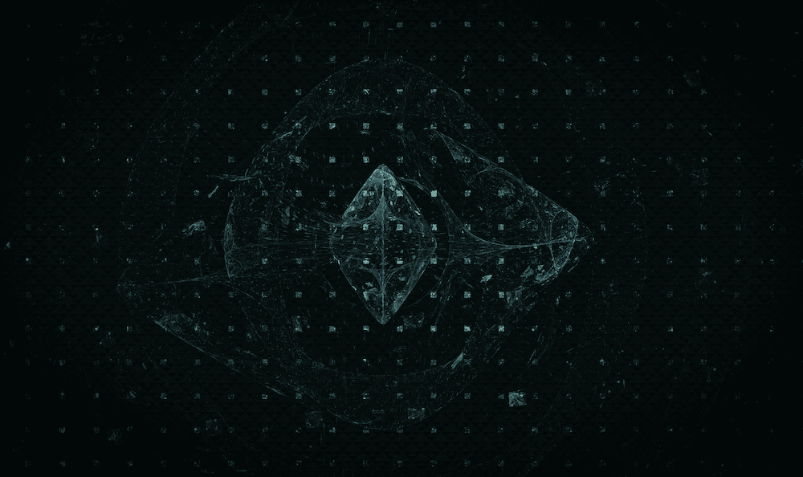

# 多边形是区块链的未来

> 原文：<https://medium.com/coinmonks/polygon-is-what-the-future-of-blockchain-looks-like-ca2c72f921f0?source=collection_archive---------15----------------------->

众所周知，区块链是未来。Polygon 在技术创新方面处于领先地位。凭借其独特的方法，他们能够提供一个可扩展、安全、分散的平台，非常适合企业和个人。

更令人印象深刻的是，Polygon 能够做到这一切，而不牺牲速度或…