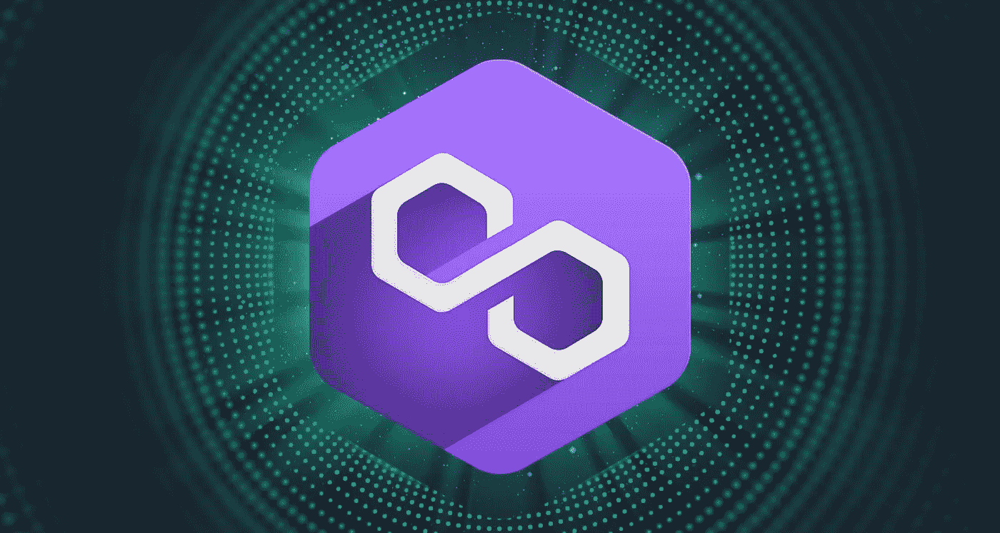

# 多边形(MATIC):将世界带入以太坊

> 原文：<https://medium.com/coinmonks/polygon-matic-bringing-the-world-to-ethereum-a965e515940a?source=collection_archive---------31----------------------->

Image reference: [**swissborg.com**](https://swissborg.com/blog/what-is-polygon)

## 什么是 MATIC 网络(Matic)加密货币？

Matic Network (MATIC)加密货币只是一个为多边形网络供电的以太坊令牌，这是一个以太坊扩展解决方案。它专注于通过利用第 2 层侧链(与以太坊主链并行的区块链)使以太坊交易更便宜、更快捷。用户可以将以太坊代币存入一个智能多边形契约，在 Matic 网络上与之进行交互，然后将代币撤回以太坊主链。Matic Network (MATIC)加密货币令牌也用于支付交易费用和参与 POS(利益相关证明)共识。

Matic Network (MATIC)加密货币是一种以太坊令牌，主要用于为多边形网络供电，多边形网络是一种用于连接和构建以太坊兼容的区块链网络的协议和框架。它被称为第二层解决方案，旨在帮助扩展以太坊网络并改善其功能。

用户还可以将 [**以太坊代币**](https://procommun.com/2022/05/news/crypto/ethereum-could-potentially-flip-bitcoin-in-3-years-this-is-the-price-target-jason-urban-youtube/) 存入智能多边形合约，在多边形内互动，然后将代币撤回以太坊主链。Matic 网络令牌用于支付交易费用并参与利益一致证明。

> 阅读更多关于 procommun.com 的[的加密文章](https://procommun.com/2022/05/technology/polygon-matic-bringing-the-world-to-ethereum/)

## Matic 网络(MATIC) [加密货币](https://procommun.com/2022/05/news/business-news/leading-cryptocurrency-costs-today-bitcoin-ether-cardano-avalanche-increase-up-to-14/)的创始人是谁？

Sandeep Nailwal、Jayanti Kanani、商业顾问 Anurag Arjun 和两位经验丰富的区块链公司开发人员于 2017 年 10 月共同创立了 Matic Network (MATIC)加密货币。在 2019 年加入该网络之前，整个 Matic 加密货币团队是以太坊生态系统的重要贡献者。该团队致力于等离子 MVP 的以太坊实现，以及广泛使用的 Dagger 和 Wallet connect 协议。

## Matic 网络(Matic)加密货币是如何工作的？

Matic Network (MATIC)加密货币是第一个结构良好、易于使用的以太坊扩展和基础设施开发平台。它的主要或核心组件是独一无二的 Polygon SDK，这是一个支持同时构建多个应用程序的模块化框架。

用户可以使用 MATIC 网络(Matic)加密货币创建乐观累计链、独立链、ZK 累计链或任何基础设施。它还通过区块链互联网将以太坊转变成一个成熟的多链系统。这个系统提供了安全、开放和以太坊的生机勃勃的生态系统的优势。

Matic Network (MATIC)加密货币是由比特币基地和币安支持的第二层扩展解决方案。该项目通过解决不同区块链上的可扩展性问题，刺激了加密货币的大规模采用。它结合了等离子框架和区块链架构的证据。这个框架是 polygon 使用的，是以太坊的联合创始人 Vitalik Buterin 提出的。它允许轻松执行可扩展和自主的智能合同。

对于建立在血浆证据链上的现有生态系统来说，什么都不会改变。然而，随着 Matic Network (MATIC)加密货币的推出，围绕当前技术也构建了新的功能，以扩展容量来满足开发者生态系统中的多样化需求。它还将继续开发核心技术，以便能够扩展到更大的生态系统。

## 是什么让 [Matic 网络](https://procommun.com/2022/04/news/crypto/polygon-matic-is-going-to-blast-in-2022-cryptocurrency-youtube/) (Matic)加密货币独一无二？

Matic Network (MATIC)加密货币表面上是一个自我描述的第二层解决方案。也就是说，该项目作为一个整体并不打算在短期内升级当前的基本区块链层。相反，这个项目降低了即时区块链交易的复杂性和可伸缩性。此外，Matic 网络采用了基于 POS(利益证明)检查点的等离子体框架的修改版本，该检查点贯穿以太坊主链。Matic Network 的独特技术允许网络上的每个侧链每块执行多达 65，536 个事务。

Matic 网络侧链旨在支持以太坊生态系统中可用的各种 Defi(分散金融)协议。虽然该网络目前仅支持基于以太坊的链，但它打算根据社区建议和共识扩展对其他基础链的支持。因此，Matic Network (MATIC)加密货币是一个可互操作的分散式双层区块链平台。

> 原创文章发表在[T3【procommun.com】T5](https://procommun.com/2022/05/technology/polygon-matic-bringing-the-world-to-ethereum/)

> 交易新手？尝试[加密交易机器人](/coinmonks/crypto-trading-bot-c2ffce8acb2a)或[复制交易](/coinmonks/top-10-crypto-copy-trading-platforms-for-beginners-d0c37c7d698c)