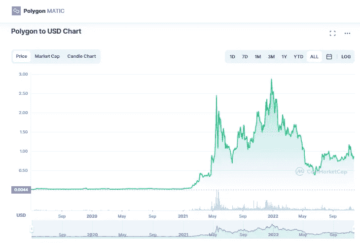

# 多边形(MATIC)价格预测 2022–2025，11 月 25 日更新

> 原文：<https://medium.com/coinmonks/polygon-matic-price-prediction-2022-2025-update-25th-of-november-769e5d76843a?source=collection_archive---------20----------------------->

Source photo [Polygon price today, MATIC to USD live, marketcap and chart | CoinMarketCap](https://coinmarketcap.com/currencies/polygon/)

## 到底什么是多边形令牌(MATIC)？

Jaynti Kanani、Sandeep Nailwal 和 Anurag Arjun 在印度建立的加密平台解决了某些加密货币面临的可扩展性问题。结合增强的交易速度和可扩展的网络。