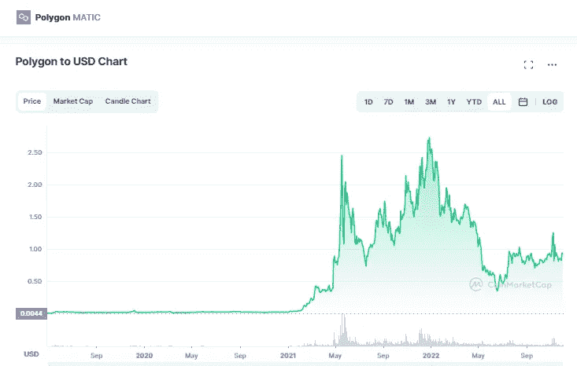

# 多边形(MATIC)价格预测 2022 年 12 月–2025 年，12 月 2 日更新

> 原文：<https://medium.com/coinmonks/polygon-matic-price-prediction-december-2022-2025-update-2nd-of-december-f0058ac1c642?source=collection_archive---------8----------------------->

Source photo [Polygon price today, MATIC to USD live, marketcap and chart | CoinMarketCap](https://coinmarketcap.com/currencies/polygon/)

## 多边形令牌(MATIC):是什么？

例如，印度的 Jaynti Kanani、Sandeep Nailwal 和 Anurag Arjun 构建了一个加密货币平台，解决了某些规模问题。它提高了网络的可扩展性和交易速度。