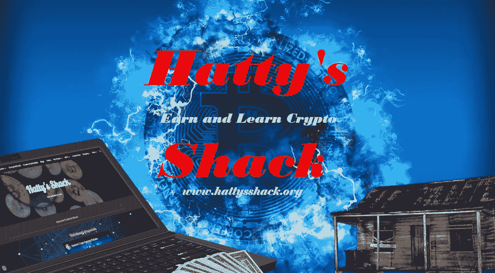

# 多边形-所有的 Web3

> 原文：<https://medium.com/coinmonks/polygon-web3-for-all-fc3c2f25b7db?source=collection_archive---------14----------------------->

**什么是多边形(MATIC)？**

[Polygon](https://polygon.technology/) ( [MATIC](https://coinmarketcap.com/currencies/polygon/) )是一个建立在以太坊区块链之上的分散缩放平台。它旨在为用户提供一种安全、快速、经济的方式，在以太坊网络上创建他们自己的应用程序。

Polygon 将以太坊和主权区块链的精华结合成一个成熟的多链系统。

*   它能够充分受益于以太坊的网络效应
*   它本质上更安全
*   它更加开放和强大

**为什么多边形很重要？**

以太坊网络的当前状态对于开发 dApps 来说并不理想。为了扩展，网络需要一个硬分叉来增加其块大小限制。然而，这将导致 ETH 网络和 ETC 网络之间的分裂。因此，许多 dApp 开发者被迫在两个网络之间做出选择。多边形为这个问题提供了一个解决方案。通过使用 Polygon 协议，dApp 开发人员可以同时使用 ETH 和 ETC 网络，同时保持兼容性。

超过 37k 以上的 dApps 使用 Polygon 来扩展其性能

Polygon 致力于通过提供 Web3 所需的基础设施来促进 Web3 应用的发展。

多边形使以太坊对所有人开放。

以太网兼容性

行业主导地位、成熟的技术体系、工具、语言、标准、企业采用

可量测性

专用区块链、可扩展共识算法、定制 Wasm 执行环境

安全性

模块化的“安全即服务”，由以太坊或一群专业验证者提供

开发者体验

相当于以太坊，不需要协议级的知识，也不需要代币押金、费用或权限

[查看多边形生态系统。](https://polygon.technology/ecosystem)

建立在 Polygon 上的 Web3 应用程序提供了低费用和高可伸缩性，并保持了最高的安全标准。

Polygon 的汽油费比以太坊低很多，这使得它对用户更有吸引力，这可能是人们开始从以太坊转移到 Polygon 的原因。直到我们看到以太坊的天然气费有了很大的变化，我相信我们会看到更多的人为了更低的天然气费而转向 Polygon 和 Algorand 这样的项目。在上海和分片更新后，我们可能会看到以太坊的巨大变化，但在此之前，我们将会看到更多的人转向更便宜的天然气费用项目。

Polygon 强调了其在持续的加密市场熊市期间的增长数据，强调该网络在 Q2 的平均每笔交易成本下降了 49%，至 0.018 美元。最新消息:Polygon $MATIC 报告称，2022 年 Q2 奥运会有 534 万个唯一地址和 2.84 亿次网络交易。

**[**多边形**](https://polygon.technology/)**(**[**MATIC**](https://coinmarketcap.com/currencies/polygon/)**)如何工作？****

**Polygon 使用一种混合共识机制，称为利益证明(PoS)和工作证明(PoW)。PoS 确保只有验证者能够标记令牌并验证交易。PoW 确保没有单一实体控制网络的大部分。**

**Polygon 也是碳负的，并且正在努力成为气候正的。**

****

****多边形背后是谁？****

**Polygon 团队由经验丰富的工程师组成，他们曾在谷歌、微软和亚马逊等主要科技公司工作。如你所见，Polygon 是由开发人员为开发人员构建的。它不仅是为开发者构建的，也是为所有人构建的。任何做一点研究的人都可以很容易地找到如何使用这个神奇的区块链来为自己服务。**

**联合创始人 **Jaynti Kanani** 是 Polygon 的现任 CEO。他与联合创始人兼首席运营官 Sandeep Nailwal 和联合创始人兼首席产品官 Anurag Arjun 一起开发了这个项目。三人组于 2017 年创建了 Polygon。**

****结论****

**区块链技术仍然相当年轻。Web 2.0 才 18 岁。这向你展示了这项技术的发展有多快。Web 3.0 这个术语是在大约六年前引入的，并且正在被广泛采用。这种变化是不可阻挡的，在它被广泛应用于我们的日常生活之前，最好在早期阶段就参与进来，以获得最大的利益。无论如何，我都不是一个财务顾问，但当有事情发生时，我确实有一种良好的感觉。我不知道会有什么项目，但在我看来 Polygon 可能只是其中之一。**

**如果你决定想要尝试赚取多边形，你可以查看一个名为 [PipeFlare](https://pipeflare.io/r/1m86) 的游戏赚取网站。**

**我写了关于 PipeFlare 和其他一些很棒的游戏赚钱网站和应用的文章。文章名为“[玩赚——回顾与思考](https://read.cash/@HattyHats/play-to-earn-reviews-and-thoughts-db09608d)”。**

**你也可以使用名为 [Crypto Sense](https://play.google.com/store/apps/details?id=com.oak.cryptosense&referrer=JWNWpjaM) 的应用来获得多边形。加密感知允许你玩游戏或看广告来获得感知，你可以将感知转换成多种不同类型的加密。如果你决定看看这些赚钱的应用程序，请留下评论，让我知道你的想法。**

**如果你想看所有的顶级多边形 Dapps，你可以在 [DappRadar](https://dappradar.com/rankings/protocol/polygon) 上找到它们。**

**Polygon 还有很长的路要走，但它正在快速成长。没有人知道未来会怎样，但如果区块链是未来，那么我相信 Polygon 将是其中的一大部分。**

**[阿尔格兰德](https://www.algorand.com/) ( [ALGO](https://coinmarketcap.com/currencies/algorand/) )是另一个很棒的气候友好型，天然气费用低，是一个快速的区块链项目。如果你想了解更多关于 Algorand 的信息，请查看这篇文章。"[为什么 Algorand 区块链可能是去中心化应用的未来](https://read.cash/@HattyHats/why-the-algorand-blockchain-could-be-the-future-of-decentralized-applications-37f07491)"**

**检查我的网站，我所有的内容和更多的方法来赚取和了解加密！**

****

**[哈蒂的小屋](https://www.hattysshack.org/)**

**我的下一篇文章将是关于最好的人工智能艺术创作者之一。这个项目最近以测试版的形式发布给公众。你可以获得 50 个免费积分，这意味着你可以获得一堆免费的创作。你还可以每月获得免费学分。你可以支付一个计划，但如果你像我一样，那么你投资你赚的一切，这意味着你没有任何秘密可言。**

**我认为一个人能做的最聪明的事情就是赚到密码，并继续将密码投资于你认为有前途的高 APY 项目，并为你相信的项目提供流动性。随着时间的推移，你将开始赚取被动收入，所有这些都是有意义的。耐心、奉献和对你所做的事情的热爱可以改变一切。**

**对我来说，能够成为历史上最伟大的事情的一部分也是值得的。**

**如果你想与志同道合的加密爱好者联系，那么就去看看这些社交区块链项目。**

**[托罗姆](https://www.torum.com/?referral_code=hattyhats)**

**[u 五](https://rt.uhive.com/deeplink?action=InvitationCode&ref_code=VD4R7R)**

**[noise.cash](https://noise.cash/u/HattyHats)**

**[钻石](https://diamondapp.com/u/HattyHats?feedTab=Following&tab=posts)**

**感谢您花时间阅读我的文章。喜欢，关注，并留下评论说嗨！**

**[上的原创文章 read.cash](https://read.cash/@HattyHats/polygon-web3-for-all-c22c3107)**

> **交易新手？尝试[加密交易机器人](/coinmonks/crypto-trading-bot-c2ffce8acb2a)或[复制交易](/coinmonks/top-10-crypto-copy-trading-platforms-for-beginners-d0c37c7d698c)**