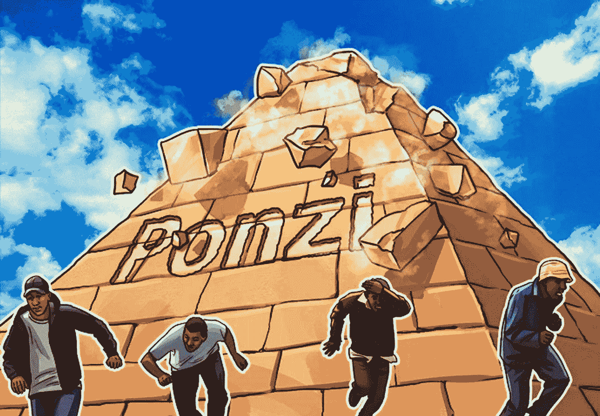
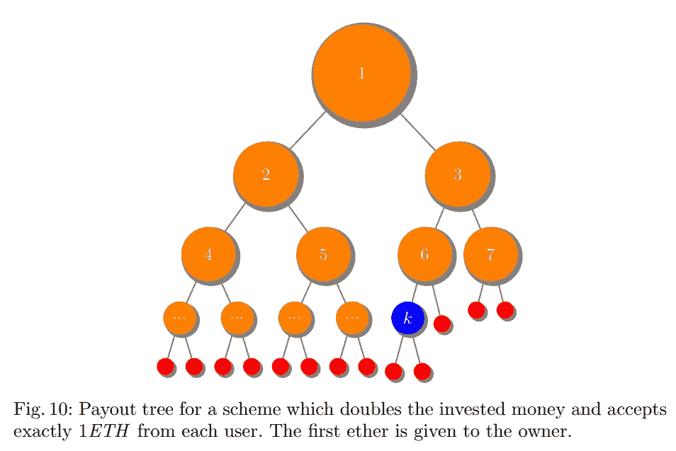
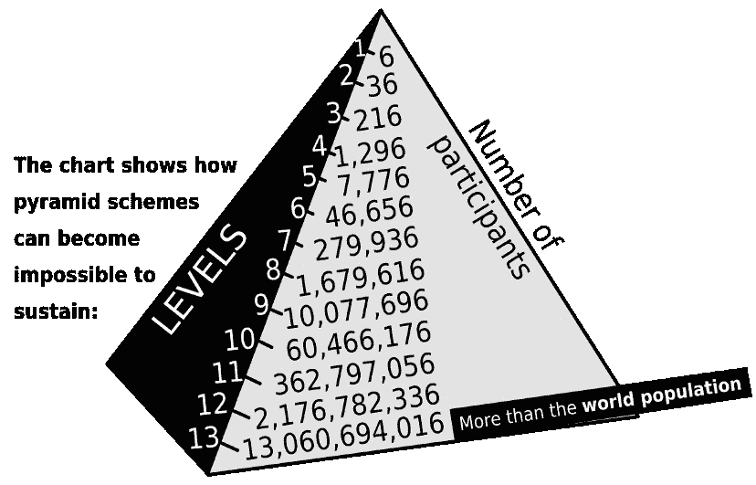
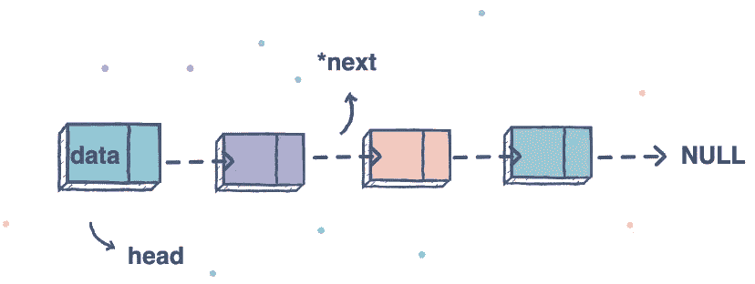
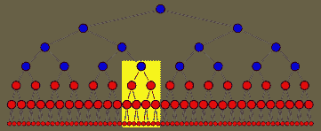

# 以太坊中的庞氏骗局(可靠性)

> 原文：<https://medium.com/coinmonks/ponzi-schemes-in-ethereum-solidity-6c0de9adcfb?source=collection_archive---------3----------------------->

# 什么是庞氏骗局

“庞氏骗局是一种投资欺诈，涉及从新投资者投入的资金中向现有投资者支付所谓的回报。庞氏骗局的组织者经常通过承诺将资金投资于声称可以产生高回报且几乎没有风险的机会来招揽新投资者。由于几乎没有合法收入，庞氏骗局需要新投资者源源不断地提供资金才能继续。庞氏骗局不可避免地会崩溃，最常见的情况是，招募新投资者变得困难，或者大量投资者要求返还他们的资金。— 美国证券交易委员会
委员会(SEC)。

# 为什么选择智能合约

智能合同为新一波欺诈者提供了完美的滋生地。传统金融诈骗犯需要担心法律、第三方机构及其公众形象，而智能合同则不存在同样的问题:

*   方案可以由任何以太坊地址部署，确保(几乎)完全匿名。
*   没有一个中央权力机构可以关闭智能合同。
*   由于智能合约的不变性，投资者可能会产生虚假的信任感。

# 金字塔庞氏骗局

金字塔庞氏骗局正是你所期待的:一个 ***老板*** 在顶端，比如说，5 个 ***投资者*** 在他下面。每一个 ***投资者*** 被激励获得 5 个以上 ***投资者*** 在他们下面，以此类推。

金字塔顶端的 ***投资者*** 通过引进新的 ***投资者*** 来偿还他们的原始投资，然后再进行一些投资。每增加一层，金字塔中的每个人都会赚很多钱。

> 将合同归类为庞氏骗局的标准。R1 根据某种逻辑，合同在投资者之间分配资金。R2 合同只从投资者那里收钱。如果有足够多的投资者在合同中投入足够的资金，那么每个投资者都将获得一份合同。
> **R4** 投资者越晚加入合约，损失投资的风险就越大。

# 1.简单链式庞氏骗局

链式庞氏骗局是金字塔的一个简单版本。而不是每个 ***投资人*** 下面有多个 ***投资人*** ，他们只有一个。这是一个大连锁店。

在这个例子中，我将建立一个**“保证让你的钱翻倍”**(直到它不能)。

它是这样工作的。

## 让你的钱翻倍

作为所有者，我签订了一份合同，允许任何人加入我的保证你的钱翻倍的计划。我拿的只是每次有人投资的一小笔费用，比如说 10%。

这里有一个循序渐进的步骤:

1.  爱丽丝投资 1 英镑。
2.  我拿 0.1ETH 作为我的主人费，锅站在 0.9ETH。
3.  鲍勃决定也投资 1 英镑。
4.  我拿了我的酬金，底池现在是 1.8 倍。还没有人把他们的钱翻倍，但我什么也没做就赚了 0.2 倍。
5.  查理带着另一个人进来了，这就是有趣的地方。我拿了我的费用，现在底池是 2.7ETH，足以让 Alice 的原始投资翻倍。
6.  爱丽丝得到了 2ETH，她的钱翻了一倍，她削减和运行。锅立于 0.7ETH
7.  爱丽丝不敢相信这真的成功了，所以她带来了她的朋友戴夫，他想当然地认为我的钱翻倍了！投资第三。
8.  我拿了我的佣金，底池现在是 4.4ETH，Bob 和 Charlie 都拿到了他们的奖金，底池是 0.4ETH。
9.  等等，等等。

# 密码

*这个代码的完整项目可以在* [*这里*](https://github.com/kumancev/ponzi-scheme-eth/blob/main/contracts/Doubler.sol) 找到

如你所见，这是一份非常容易签订的合同。

每当一个新的投资者加入聚会，函数 ***join()*** 被调用并执行以下操作:

*   将新用户及其投资金额添加到投资者列表中。
*   将 10%转让给所有者。
*   用底池中的钱尽可能多地支付给早期投资者。

在庞氏骗局中，每个新成员只与之前加入的成员联系在一起，其口号是“我们保证让你的钱翻倍”。接下来，我将解释

# 2.树形庞氏骗局

顾名思义，树型方案不是将方案的每个新成员以 1:1 的比例链接到前一个成员，而是从原始根分叉出来。把它想象成一个金字塔。

根节点在顶部，新成员在投资时知道先前加入的成员的地址。

它是这样工作的。

## 引荐奖金平台！

作为该计划的所有者，我部署合同并宣传我的计划是一个千载难逢的投资机会，50%的推荐奖金让你的朋友加入！

我到处张贴链接，人们可以在那里加入我的推荐计划，最后，我得到了一口。

1.  爱丽丝用我的推荐码(我的以太地址)投资 1 ETH。这些都归我，因为我是她的父节点，也是树的根节点。
2.  她知道每介绍一个新会员，她就能获得 50%的推荐奖金，所以她邀请了 Bob。
3.  Bob 使用 Alice 的推荐代码(她的以太网地址)投资 1 ETH。Bob 的父节点现在是 Alice，她的父节点是我。合同将 Bob 的投资资金分配到树上，每次平分，直到树根被击中。所以，爱丽丝得到 0.5 ETH，我得到 0.25 ETH，因为我是根，所以我也得到剩下的 0.25 ETH。我站在+1.5 ETH，爱丽丝站在-0.5 ETH，鲍勃站在-1 ETH
4.  爱丽丝设法邀请另一名成员查理，谁投资 1 ETH。0.5 ETH 归爱丽丝，0.25 ETH 归我，剩下的 0.25 ETH 也归我。我在+2 ETH，爱丽丝不赔不赚，鲍勃仍然在-1 ETH。
5.  鲍勃邀请了投资 1 ETH 的戴夫。Bob 得到 0.5 ETH，Alice 得到 0.25 ETH(因为她是 Bob 的父母)，我得到 0.125 ETH 加上剩下的 0.125 ETH。我的金库现在是+2.25 ETH，爱丽丝:+0.25 ETH，鲍勃:-0.5 ETH。

对参与者来说，最大的吸引力在于，越多的人使用他们的推荐代码注册，他们就能直接获得奖励。如果不是他们分支的其他现有成员抢先一步，他们根本不会收到任何佣金。

会员还会因为他们的新会员带来的*新会员的数量而获得奖励，因为推荐人数会不断上升。用一些更常见的术语:每个成员因其 ***下线*** 的表现而获得奖励，其 ***上线*** 也因此获得奖励。*

这可能听起来非常熟悉的人谁参加了多层次营销计划。

# 密码

*此代码的完整项目可以在* [*这里*](https://github.com/kumancev/ponzi-scheme-eth/blob/main/contracts/Tree.sol) 找到

很像连环庞氏契约，这是一段简单的代码。

一旦合同的创建者调用了构造函数，每次有新成员加入方案时，就会使用 ***enter()*** 函数。它采用一个表示引用地址的参数，并使用它通过使用 ***用户*** 结构在 ***树*** 中创建新节点。然后，它会立即向树的上方分发推荐奖金。

## 结论

不像链式庞氏骗局，它能让你的钱翻倍，树形庞氏骗局对每个成员的潜在利润有更高的限制。只要你能在你的 ***下线*** 中吸引很多参与者，并鼓励那些人也这样做，你就能在此后不费吹灰之力地赚钱。

这对于多层次营销人员来说听起来很熟悉，因为这是相同的盈利模式。问题是，由于加入这一计划的好处，这棵树可能会成倍增长。

Each member has 6 child members.

上图显示了如果每个级别的每个成员都用他们的推荐代码注册了 6 个成员，那么需要在该计划中投资的人数。到第 13 级，保持该计划向前发展所需的人数几乎是全球人口的两倍。

如果这个计划真的到了那一步，唯一的赢家将会是早期投资者，他们会大获全胜。不幸的是，对于那些能够找到更多人加入他们下线的新成员来说，他们的钱已经一去不复返了，沿着树向上分配，分散在早期采用者中。

# 3.瀑布

前面的例子涵盖了链式和树形庞氏骗局。比较它们，两者之间最明显的区别是它们组织节点间关系的结构。

链模式的节点最多连接到另外两个节点:前一个和后一个。这在整个结构中保持了一个分支。(为了使代码更简单，这种结构可以表示为一个数组，其中节点之间没有知识)。

Chain structure

树形结构中的节点有更多的链接。它们有一个先前节点:*父节点*，但是它们也可以有 ***n 个*** 后续节点，其中 ***n=0..**** 。这些被称为*孩子*。这种关系导致了一种分支结构，这种分支结构通常会随着成员数量的增加而使树变得更宽。

Tree structure

**瀑布**方案在结构上与链状方案几乎相同。每个节点最多连接到两个其他节点:在它们之前加入的节点，以及在它们之后加入的节点(或者只是按照它们加入的顺序排列的数组)。然而不同的是每个节点投入的资金的分配逻辑。

在链状方案中，当新成员加入时，支付通过链向后传播。就当是“先到先得”吧。它鼓励投资的快速回报，但收益是固定的，取决于接受支付的节点的初始投资。第一部分中使用的例子叫做 Doubler，它使每个成员的钱翻倍，仅此而已。

瀑布应用相反的分布逻辑，因为它从起点开始，并通过链向前传播。每个成员获得的奖金取决于三个因素:

1.  他们在链条中的位置
2.  他们的初始投资
3.  新成员投资的价值

这里有一个演练

## 超级交易算法！

作为该方案的所有者，我部署合同并宣传我的方案是一生一次的投资机会，利用我们的超级 DUPER 比特币交易算法！你所要做的就是投资一些钱，看着你的利润飙升！

这完全是一个谎言，但足以让人上当…

1.  爱丽丝通过投资两个 ETH 加入了这个计划。她是这个链条中的第一个节点。作为业主，我拿 10%的费用。锅站在 1.8 ETH。分配逻辑取那 1.8 ETH，按每个成员原始投资的 10%的比例从链的开头开始分配，不包括这个投资者。因为爱丽丝是唯一一个，也是投资方，所以她什么都不赚。收益:我:0.2 ETH，爱丽丝:-2 ETH。锅站在 1.8 ETH。
2.  鲍勃是下一个加入并投资 1 ETH。我拿 10%，所以现在底池是 2.7 ETH，开始分配。Alice 从底池中获得 0.2 ETH(她原始投资的 10%，并且处于链的顶端，她首先获得她的)。因为鲍勃是投资者，分配停止。收益:我:0.3 ETH，爱丽丝-1.8 ETH，鲍勃-1 ETH。锅在 2.5 ETH。
3.  查理加入了 2 连。我取 10%，加入 1.8 ETH，现在总共 4.3 ETH。分销开始了。爱丽丝得到 0.2 ETH，鲍勃得到 0.1 ETH，查理没有，因为他是投资者。收益:我:0.5 ETH，爱丽丝:-1.6 ETH，鲍勃:-0.9 ETH，查理-2 ETH。锅在 4 ETH。

最终，早期投资者不赔不赚，随着每个新成员的加入，开始获利。

你会注意到，在我们的例子中，底池价值越来越大。只要投资价值有上限，这种情况就会发生。作为合同的所有者，这是有利的，因为我们可以编写一个函数，当我们对利润感到满意时，就可以有效地终止这个方案。

## 投资上限

如果投资金额没有上限，一个新成员的投资额是平均投资额的 100 倍，就会极大地阻碍后来的成员获利的机会。每次支付给那个大投资者时，分配逻辑都会充分耗尽资金。

假设第 7 个投资者 Gareth 投资 200 ETH。假设接下来加入的 18 个左右的成员每人最多只投资 2 个 ETH。底池位于大约 26 ETH。第 26 位成员 Zak 投资 2 ETH。分配算法从头开始，支付每个成员初始投资的 10%。当加雷思到达时，他的 200 ETH 的 10%就是 20 ETH。算法会把它支付出去，把锅里剩下的都抽干。由于这种逻辑，除非有更多的价值，从而有更多的用户，否则分销根本无法继续，所以加雷斯之后的每个人都会有一段时间没有报酬。

就像树形图一样，早点进场是赚钱的最好机会。不过，唯一保证获利的是所有者，他们从每个投资者那里收取少量费用，如果他们使用正确的合同代码，就可以清空账户。

# 密码

*这个代码的完整项目可以在* [*这里*](https://github.com/kumancev/ponzi-scheme-eth/blob/main/contracts/Waterfall.sol) 找到

如您所见，一个函数负责所有的加入和分发功能。

*   第 8 行显示了链中使用的结构
*   第 13–17 行初始化结构和分布中使用的状态变量
*   第 23 行显示了 join 函数，它在新成员加入时接收付款，并将利润分配给现有成员。

## 结论

尽管瀑布式庞氏骗局的结构与链式骗局相同，但它们的产出却大相径庭。链式计划拥有固定利润，而瀑布计划拥有可变利润。成员加入得越早，他们获得的好处就越多，并且将继续获得好处，直到该计划失败。新成员最不可能从这类计划中获得任何利润。

尽管每个方案的结构或分配逻辑可能不同，但它们都有相同的理念。他们利用那些想快速轻松赚钱的人的情绪。它围绕着我们天生的贪婪和成为一个排他性的、有利可图的俱乐部成员的诱人感觉。

# 4.移交庞氏骗局

尽管展示了各种各样的激励和风险，到目前为止，本系列中讨论的所有方案都具有非常相似的数据结构。

大多数被分析的方案利用了两种数据结构中的一种。第一个是我们传统上认为的庞氏骗局和传销:树形。第二种是更简单的结构:链状。

我们在这里深入探讨的移交方案是链式的。

**移交** 与基本的链式计划不同，该计划有一个静态的最低入场费，移交有一个初始入场费，每次有新的投资者加入该计划，入场费就会增加。这确保了新成员加入后，之前的投资者会立即得到回报，但这也意味着，随着越来越多的用户因入场费上涨而投资，该计划变得不那么诱人了。

它是这样工作的。

## 游戏攻略

作为所有者，我部署了智能合同，并宣传它是一个让你的钱翻倍的又快又简单的方案。每次有人投资我都拿一小笔 10%的费用。假设初始入场费为 0.1，每有一个新投资者加入，入场费就会翻倍。

1.  爱丽丝投资的入门费:0.1ETH，链上的前一个成员是我作为所有者，所以我得到 0.09ETH，加上 10%的费用。利润:我:+0.1 th，爱丽丝:0.1ETH，我已经交给爱丽丝了，所以下一个发工资的是她。入场费现在是 0.2ETH。
2.  鲍勃投资 0.2ETH，我拿 10%，爱丽丝拿剩下的。爱丽丝交给鲍勃。利润:我:+0.12ETH，爱丽丝:+0.08ETH，鲍勃:-0.2ETH，入场费现在是 0.4ETH
3.  查理投资 0.4ETH，我拿我的 10%，鲍勃拿剩下的。鲍勃把球交给了查理。利润:我:+0.16ETH，爱丽丝，+0.08ETH，鲍勃:+0.18ETH，查理:-0.4ETH，报名费 0.8ETH。

因为费用每次都会翻倍，所以只要有新的投资者加入，前一个参与者的报酬(几乎)就是他们原始投资的两倍。风险在于，如果入场费变得太高，其他任何人都无法加入，那么任何一个投资者都可能是最后一个投资者。

再说一次，对于所有的庞氏骗局，保证盈利的唯一方法就是在骗局开始时就介入。

# 密码

*这个代码的完整项目可以在* [*这里*](https://github.com/kumancev/ponzi-scheme-eth/blob/main/contracts/Handover.sol) 找到

在图 1 中，我们在第 19 行使用 fallback 函数来存放条目和分发逻辑。我们首先要求发送到合同的金额等于或高于当前的入门费。第 21-22 行将支付给前一个成员，第 23 行执行移交，第 24 行将下一个成员的入场费翻倍，然后第 25 行将剩余余额发送给合同所有者。

## 使用回退功能的好处

在我们探索的其他方案中，我们使用特定的函数来接受新的投资者。在这种情况下，智能契约需要在事先知道函数名和参数的情况下执行。通常，在这种情况下，保证投资者的唯一方法是构建一个前端，或者假设他们具有如何向区块链提交特定功能交易的技术知识。

使用后备功能意味着投资者不需要知道智能合约中的功能名称或参数。相反，执行该方案需要将以太网直接发送到智能合约地址，就像发送到任何钱包地址一样。好处是不需要开发 web 前端。尽管人们可以选择创建一个。

众所周知，Twitter 机器人会利用这一点。在 2017 年的加密泡沫中，一些账户被称为冒充加密领域有影响力的人物，声称“让你的钱翻倍！”如果您将以太网发送到特定的智能合同地址。

# 结论

DeFi 是此刻每个人都挂在嘴边的词，很容易陷入兴奋中。每隔几个小时就会出现新的协议和产品。

幸运的是，对于我们当中更邪恶的人来说，这种时候标志着从不太知情的人身上快速赚钱的成熟机会。这在过去的加密领域已经发生了(如果你不知道我在说什么，谷歌“卡洛斯·马托斯”)。

我的预测是，我们将会看到更多“有争议的”关于借助 DeFi 运动的骗局的新闻。保持你的智慧，因为它们会捕食我们的情绪，把你吸引进来。

更多信息可在[激发本系列](https://arxiv.org/pdf/1703.03779.pdf)的研究论文中获得。

*这篇文章的灵感来自于 Massimo Bartoletti，Salvatore Carta，Tiziana Cimoli，Roberto Saia 的一篇题为“* [*剖析以太坊上的庞氏骗局:识别、分析和影响*](https://arxiv.org/pdf/1703.03779.pdf) *”的论文。也亚历克斯罗恩的文章。*

> 交易新手？尝试[加密交易机器人](/coinmonks/crypto-trading-bot-c2ffce8acb2a)或[复制交易](/coinmonks/top-10-crypto-copy-trading-platforms-for-beginners-d0c37c7d698c)