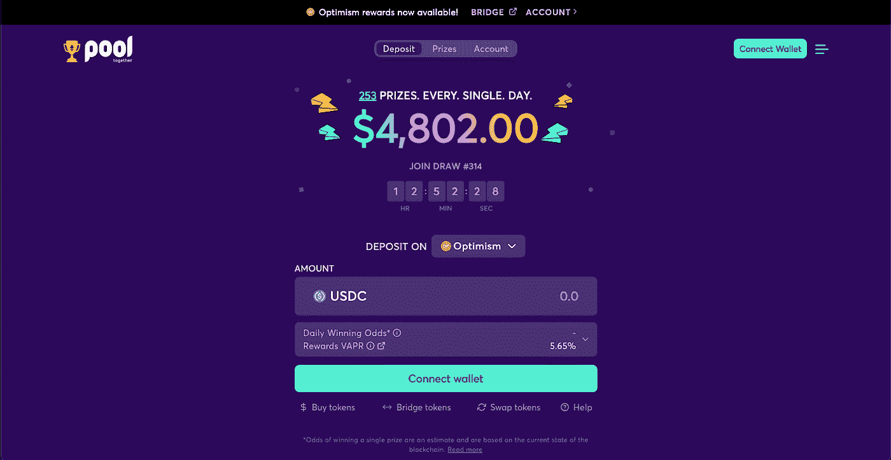
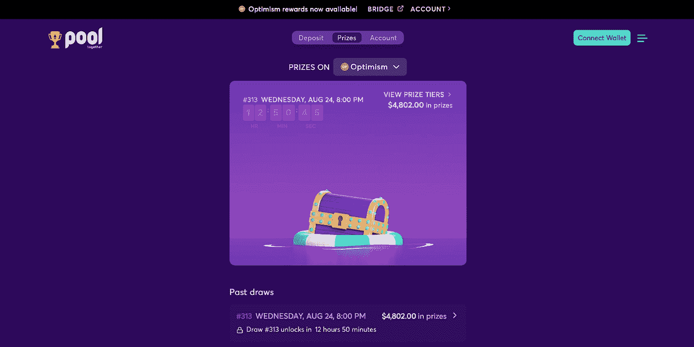
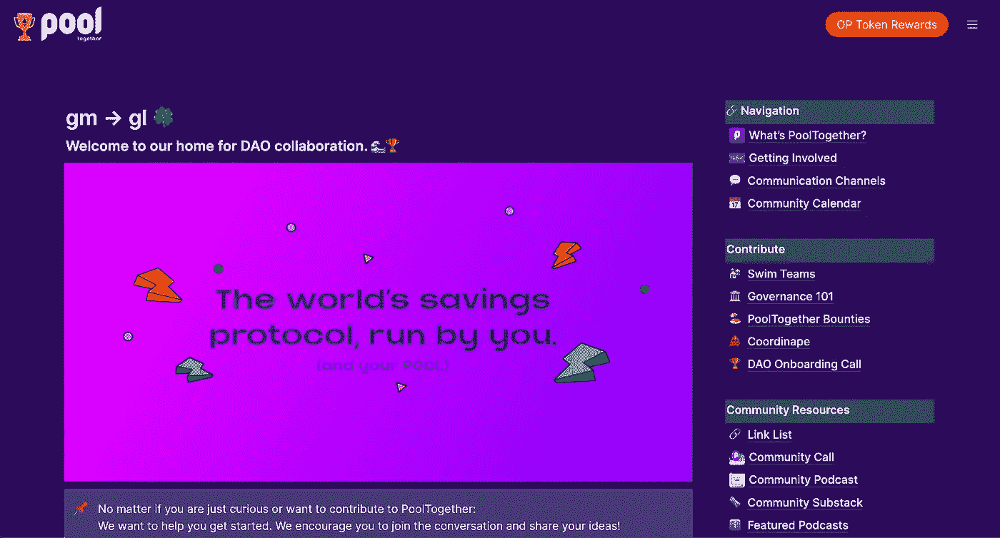

# 集中起来——现代储蓄账户

> 原文：<https://medium.com/coinmonks/pool-together-the-moderns-savings-account-5cd04a781365?source=collection_archive---------10----------------------->

【DeFi 武器库中的必备工具。

[PoolTogether](https://pooltogether.com/) 是 OG DeFi 应用程序之一，已经发展了 3 年多。这是一个由其社区运行的奖金储蓄协议，结合了传统彩票系统的机制和加密赌注。随着时间的推移，用户会牺牲较小的收益来赢得头奖。该协议类似于政府发行的溢价债券，只是它具有 DeFi 的效率，并有机会赢得更多的钱。

简而言之，PoolTogether 吸收存款人的钱，并将其用于跨 DeFi。这笔钱产生利息，然后每天重新分配给储户。然而，利息被分配给少数幸运的赢家，这意味着奖金总额更加集中，远远高于你在 DeFi 中获得的收益。在本文中，我将向您展示如何以“无风险”的方式获得赢得大奖的机会，以及为什么我认为 PoolTogether 是您 DeFi 武器库中的一个重要工具。

# 如何无风险赢钱？

首先，让我们解决风险部分。当我说“无风险”时，我的意思是你可以在任何时候提取你的钱，你不需要付钱去玩。这不像买彩票。它更像是一个储蓄账户，让你有机会赢得大奖。该协议是去中心化和开源的，并且其智能契约代码被定期审计。然而，重要的是要注意，这仍然是加密。这是金融的一个新领域，同时也伴随着固有的风险。当一起使用 pool 时，不会消除 crypto 和 DeFi 的潜在风险。解决了这个问题，让我们开始吧。

在 PoolTogether 上存款之前，你需要把 USDC 放在钱包里。这可以在以太坊主网，乐观，多边形，或雪崩网络(这些是 PoolTogether 上支持的网络)。如果你没有 USDC，去 [Uniswap](https://app.uniswap.org/#/swap?chain=mainnet) 用一些代币换它。

接下来，一起前往[泳池](https://app.pooltogether.com/)。您将进入存款屏幕，在这里您会找到一些关于抽奖的基本信息、下次抽奖的时间、每天的奖品数量等..

[PoolTogether App](https://app.pooltogether.com/deposit?network=optimism)

以下是向池中存款以赢取机会的步骤。

1.  选择你所在的网络(我很乐观)
2.  在右上方连接你的钱包
3.  选择您想存入多少 USDC
4.  批准交易
5.  你的代币被存入池中

恭喜你。你已经正式参加抽奖了。就这么简单。一旦您将 USDC 代币放入池中，您应该会看到一个新的代币出现在您的钱包中。在我的例子中，这个令牌被称为 PTaOP，因为我在乐观网络上。这个代币代表您将 USDC 存入 PoolTogether pool，当您从协议中提取资金时，可以兑换成 USDC。你可以把这些代币想象成彩票，每一张都会增加你中奖的机会。

每 24 小时都有奖品可以领取。点击“[奖品](https://app.pooltogether.com/prizes?network=optimism)”标签，您将看到下一次抽奖的倒计时，并且您可以在此页面上查看您是否有任何奖品可以领取。您可以在 60 天内申领奖励，因此请记得在此期限内登记，以免错过您的奖励。

[PoolTogether Prizes](https://app.pooltogether.com/prizes?network=optimism)

# 它是如何工作的？

PoolTogether 的所有奖金都来自总奖金池产生的利息。该协议是非托管的，这意味着当用户将 USDC 存入池中时，该协议会自动将资金部署到像 [Aave](https://aave.com/) 这样的 DeFi 协议中。这是由管理协议的智能契约决定的，这意味着没有人能够控制总的资金池。类似地，用于确定奖励如何分配的抽奖机制被写入智能合同。

像 Aave 这样的借贷协议是完全流动的，这意味着你可以随时取款。这就是为什么联合存款人也可以这么做。像 Aave 这样的协议如何实现这一点超出了本文的范围，但长话短说，DeFi 的效率允许比我们在传统金融中习惯的更具流动性的借贷市场。

如果你自己曾经探索过一个市场，你会知道你从供应 USDC 中得到的收益并不是特别高。除非你坐拥大量 USDC 存款，否则很难从中获得任何有意义的回报。在撰写本文时，PoolTogether 的锁定总价值(存款总额)为 6020 万美元。当你使用该协议时，所有的钱都在为你和你的存款人服务，这让你有机会获得比你自己冒险进入 DeFi 时大得多的收益。

每当我发现自己持有一些多余的 USDC，我总是先把它存到 PoolTogether，然后再重新分配到其他地方。这是显而易见的。PoolTogether 是我的 DeFi 工具箱中的一个主要工具，在我知道我想在哪里分配令牌之前，它是我的笔。当我的钱在场外等待时，我也有机会让它增值。你永远不知道什么时候会是你的幸运日。

真的没什么更多的了。美就在于它的简单，那么有什么大不了的呢？为什么要写这方面的文章？

# 为什么我喜欢一起打台球

我认为 PoolTogether 比作为现代加密用户 DeFi 武器库中的一个工具有更大的用途。PoolTogether 是一种可以改变人们生活的储蓄账户。对于世界各地努力实现收支平衡或获得金融机会有限的人来说，尤其如此。只需要几美元就有机会参加每日抽奖。想象一下，1000 美元的现金注入可以为一个勉强维持生计的单亲父母做些什么。或者想想 1000 美元对第三世界国家的贫困社区会有什么影响。这个协议是为了所有用户的利益而存在的，在我看来，它代表了 DeFi 最好的一面。

此外，在许多不发达国家，人们没有台式机、笔记本电脑，甚至没有银行。这使得参与现代经济和获得金融机会变得极其困难。然而，他们能接触到的是智能手机和加密钱包。目前全球有[66 亿智能手机用户](https://www.bankmycell.com/blog/how-many-phones-are-in-the-world#:~:text=According%20to%20Statista%2C%20the%20current,world's%20population%20owns%20a%20smartphone.)。与拥有银行账户的[38 亿人相比](https://www.worldbank.org/en/news/press-release/2018/04/19/financial-inclusion-on-the-rise-but-gaps-remain-global-findex-database-shows#:~:text=Globally%2C%2069%20percent%20of%20adults,crucial%20step%20in%20escaping%20poverty.)，你会开始意识到 DeFi protcols 可以有多重要，PoolTogether 为没有银行账户的人提供了多少机会。诸如此类的统计数据强调了让 web3 和 DeFi 工具日益成为移动优先技术的重要性。[现在，索拉纳打造 web3 智能手机 Saga 的举动对我来说越来越有意义了。](https://solana.com/news/saga-reveal)

在区块链和 DeFi 之前，这些机会对于没有银行账户的人来说是不存在的。既然我们的金融体系对每个人都开放了，我们就能制造出造福世界公民的产品，而不仅仅是富裕的精英阶层。出于这个原因，我爱上了 PoolTogether 这样的协议，并将继续赞美它。

# 一起为池道做贡献

[PoolTogether DAO](https://dao.pooltogether.com/)

如本文前面所述，PoolTogether 是完全分散的，由社区控制。该社区由池令牌持有者组成。他们在不和谐和治理论坛上有一个活跃的贡献者和管理者社区。如果你喜欢 PoolTogether 为 DeFi 世界所做的事情，并且你想参与治理和想法，我在下面为你列出了一些资源。

[**一起加入不和谐池**](https://pooltogether.com/discord)

[**入门指南**](https://dao.pooltogether.com/how-to-contribute)

[**拿一些池代币**](https://app.uniswap.org/#/swap?chain=mainnet)

[**参与治理论坛**](https://gov.pooltogether.com/)

[**熟悉协议并使用**](https://pooltogether.com/)