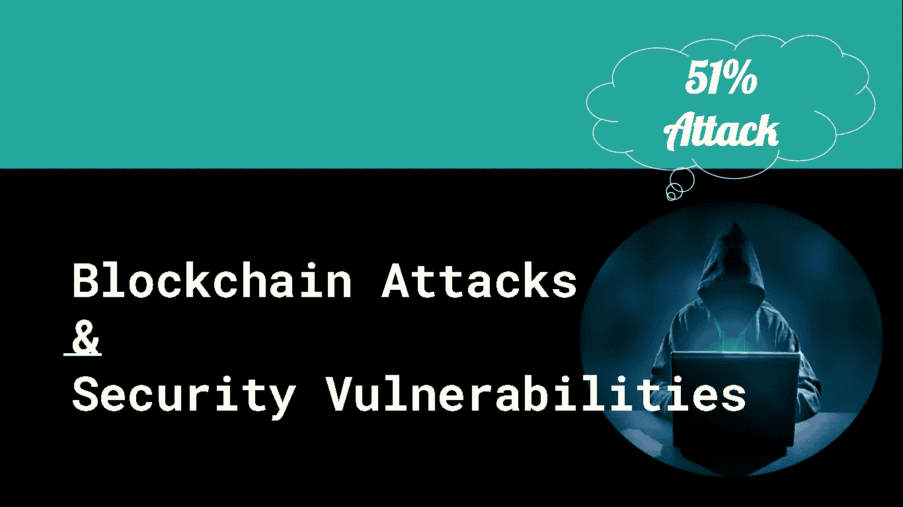
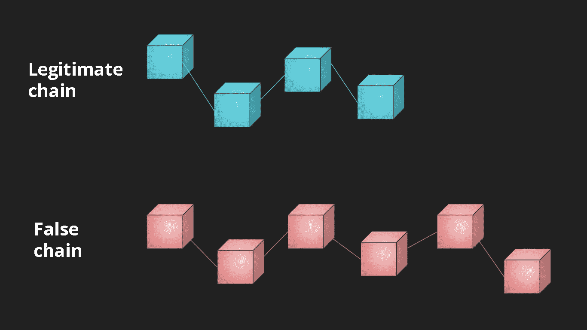

# 流行的区块链攻击和安全漏洞—第 1 部分

> 原文：<https://medium.com/coinmonks/popular-blockchain-attacks-security-vulnerabilities-part-1-309bcbf83cd8?source=collection_archive---------10----------------------->

## 区块链安全系列

## 51%对区块链的攻击

*在本系列的第 1 部分，我们将讨论区块链上的* ***51%攻击*** *。*

每当一个交易正在通过区块链时，每个矿工都会验证这个交易。他们使用强大的计算机来开采一个区块。他们不断审查区块链，以决定发送者是否有足够的加密货币来支付，而不是试图欺骗系统。如果大多数采矿者验证了一个交易，那么它将被认为是一个有效的交易，一个新的区块将被添加到区块链中。这些矿工也可以组成矿池来更有效地采矿。

基本上，在区块链中，矿工之间正在进行竞争。每当两个或两个以上的矿工同时解决密码难题时，就会有一段时间出现额外的链。但是最终，最长的链条会战胜其他的，然后每个人都会跟随最长的链条。

*等一下！—如果有人获得了超过 51%的采矿权，并试图为了自己的需要操纵整个系统，该怎么办？*

51 **%攻击发生在一个矿工或一群矿工(矿池)设法获得网络 51%以上的矿力时。那么相应的实体将有权控制整个网络。**

如果攻击者获得此威能，他将能够 *:*

*   加倍花他的钱。他可以用同一个加密货币支付两次甚至更多。
*   **防止交易被确认。**
*   **防止新比特币的产生。**

Image Credit: [RLV ZCACHE](https://rlv.zcache.com/the_boss_baby_i_am_the_boss_i_say_you_do_poster-r3c3d4f57ca84440f9d1f17954de24359_aw4hr_8byvr_540.jpg)

这种情况被认为是极度违反安全的，因为所有网络参与者都需要信任一个集中的实体。此外，这将大大降低加密货币的价格。

## 51%攻击是如何工作的？

起初，单个矿工或一群矿工获得网络中超过 51%的开采权。这种情况很可能发生在小型网络上，而不是大型网络上。

一旦攻击者获得权力，他就开始挖掘他的私有链上的块，私有链与公共链同时运行，所有其他节点都在公共链上挖掘块。合法的公共区块链不会意识到现有的私有伪链。

同时，攻击者向合法链传输一定数量的令牌，而不被虚假链确认。

由于攻击者有更多的矿权，他很快就把私有链上的区块挖矿了。最终，假链在长度上战胜了合法链。

Credit: Author

按照长链规则，区块链的冗长版本考虑区块链的合法版本。因此剩余的节点被迫接受假链作为合法链。

最后，当合法链上的交易失败时，攻击者可以再次花费他的钱。

## 51%攻击的真实案例

*   **GHash.io，【2014 年 1 月，一个受欢迎的比特币挖矿池获得了该网络总挖矿能力的近 51%。它在比特币社区制造了一些恐慌。但它立即被离开游泳池的矿工们修复了，以保持平衡。**

 [## 一个集团控制了 51%的比特币开采，威胁着安全神圣性

### 人们担心，比特币矿池控制了用于创造数字世界的一半以上的计算能力…

www.pcworld.com](https://www.pcworld.com/article/439835/bitcoin-price-dips-as-backers-fear-mining-monopoly.html) 

*   **CoinGeek** 矿池在 2015 年 11 月的一周内控制了比特币 SV 超过 51%的散列率。

 [## 一个矿池控制着 BitcoinSV 散列率中危险的主导份额

### 比特币 Satoshi Vision (BitcoinSV)的完整性仍然受到质疑，因为一群加密货币矿工…

thenextweb.com](https://thenextweb.com/news/calvin-ayre-coingeek-bitcoin-sv-hash-rate-51-percent-double-spend) 

*   **比特币黄金**网络在 2018 年 5 月和 2020 年 1 月两次面临 51%的攻击，分别造成 1800 万美元&7 万美元的双重损失。

 [## 比特币黄金 51%被攻击-网络损失 70，000 美元的双重支出

### 比特币黄金(BTG)网络在 1 月 23 日至 24 日遭受了另一轮 51%的攻击，大约有 29 个区块被移除…

news.bitcoin.com](https://news.bitcoin.com/bitcoin-gold-51-attacked-network-loses-70000-in-double-spends/) 

*   **以太坊经典**区块链 2020 年 8 月三次击中 51%攻击。

 [## 以太坊经典受到一个月内第三次 51%的攻击

### 以太坊经典区块链周六晚上遭受了 51%的攻击，这是本月第三次这样的攻击，引起了…

www.coindesk.com](https://www.coindesk.com/markets/2020/08/29/ethereum-classic-hit-by-third-51-attack-in-a-month/) 

*   加密货币网络 Verge 连续三次遭受 51%的攻击。

 [## 隐私硬币边缘遭受第三次 51%的攻击，分析显示 200 天的 XVG 交易被删除

### 根据各种报道，加密货币网络 Verge 遭受了 51%的攻击，导致 560，000+…

news.bitcoin.com](https://news.bitcoin.com/privacy-coin-verge-third-51-attack-200-days-xvg-transactions-erased/) 

在比特币和以太坊这样的大型网络上，很难实现 51%的攻击。拥有更多的矿权，有点费钱，得不偿失。但是较小的网络更容易受到这种攻击。

防止 51%攻击的最好方法之一就是改变共识机制。要么将网络升级到利益证明(PoS ),要么创建一个使用 PoS 的网络。与工作证明(PoW)不同，PoS 不依靠挖矿力量达成共识。取而代之的是，下注硬币的所有者有权核实交易。

## 参考

1.  [https://www . the guardian . com/technology/2014/jun/16/比特币-货币-销毁-51-攻击-ghash-io](https://www.theguardian.com/technology/2014/jun/16/bitcoin-currency-destroyed-51-attack-ghash-io)
2.  [https://then extweb . com/news/Calvin-ayre-coin geek-bit coin-SV-hash-rate-51-percent-double-spend](https://thenextweb.com/news/calvin-ayre-coingeek-bitcoin-sv-hash-rate-51-percent-double-spend)
3.  [https://news . bit coin . com/privacy-coin-verge-third-51-attack-200-days-xvg-transactions-erased/](https://news.bitcoin.com/privacy-coin-verge-third-51-attack-200-days-xvg-transactions-erased/)
4.  [https://news . bit coin . com/bit coin-gold-51-attached-network-loss-70000-in-double-spends/](https://news.bitcoin.com/bitcoin-gold-51-attacked-network-loses-70000-in-double-spends/)
5.  [https://cryptoandfire . com/ether eum-classic-51-percent-attack/](https://cryptoandfire.com/ethereum-classic-51-percent-attack/)

## 谢谢:)

> 交易新手？尝试[加密交易机器人](/coinmonks/crypto-trading-bot-c2ffce8acb2a)或[复制交易](/coinmonks/top-10-crypto-copy-trading-platforms-for-beginners-d0c37c7d698c)