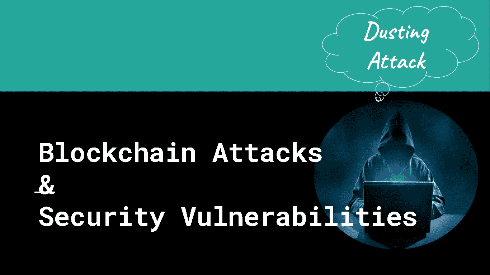

# 流行的区块链攻击和安全漏洞—第二部分

> 原文：<https://medium.com/coinmonks/popular-blockchain-attacks-security-vulnerabilities-part-2-2bad5dafc082?source=collection_archive---------13----------------------->

## 区块链安全系列

## 对区块链的除尘攻击

在本系列的第 2 部分，我们将讨论区块链上的除尘攻击。

D usting 攻击是一种恶意活动，攻击者可以通过向加密货币用户的加密钱包发送少量硬币来破坏他们的隐私。

因此，这些加密钱包的交易活动可以很容易地被黑客追踪到，进而发现钱包背后的个人/机构。

## 什么是尘埃？

灰尘指的是极少量的硬币。
这个数量非常小，以至于大多数用户甚至不会注意到。

例如
如果考虑比特币，比特币的最小单位是一个 Satoshi。

1 BTC = 100，000，000 SATOSHI (1 亿)
1 BTC = 0.000000001

这里的尘埃指的是一只聪到几千只聪。

## **喷粉攻击有什么用？**

除尘攻击用于确定加密钱包背后的个人或组织的身份。

当局也可以通过追踪加密货币用户来识别非法活动。

公司、研究实验室和政府机构也在部署灰尘攻击来消除区块链网络的匿名性。

## 除尘攻击是如何工作的？

**第一步**:

攻击者首先向大量目标地址发送 dust 事务。由于这些交易金额很小，人们甚至不会在钱包里注意到这一点。

**第二步:**

然后，攻击者跟踪这些资金和被盗钱包的所有交易，并进行综合分析，以确定哪些地址属于同一个钱包。我们都知道，任何有加密钱包的人都可以创建多个地址。

**第三步:**

主要目标是将这些钱包与他们各自的个人或组织联系起来。最终，攻击者会发现这个人或一个组织存在于被弄脏的钱包后面。如果钱包被去匿名化，那么攻击者可能会通过网络钓鱼攻击或网络勒索威胁来利用这些信息攻击他们的目标。

## 现实中的除尘攻击

2019 年 8 月，币安和莱特币社区面临潜在的除尘攻击。大约 50 个币安莱特币地址收到了一小部分莱特币(0.00000546)。

 [## 理解 Litecoin 的除尘攻击:发生了什么，为什么

### Cointelegraph.com 新闻在莱特币减半两周后，网络经历了一次重大的灰尘攻击，这…

mycryptohub.blogspot.com](https://mycryptohub.blogspot.com/2019/08/understanding-litecoins-dusting-attack.html) 

## 如何防止喷粉攻击？

除尘攻击纯粹依靠对多个地址的综合分析。你可以通过简单地不动你收到的灰尘基金来防止这一点。如果你成功了，攻击者将无法建立他们需要的连接来解除钱包的匿名。

**热门区块链攻击&安全漏洞——第一部分:51%攻击**

 [## 流行的区块链攻击和安全漏洞—第 1 部分

### 51%对区块链的攻击

medium.com](/coinmonks/popular-blockchain-attacks-security-vulnerabilities-part-1-309bcbf83cd8) 

## 谢谢:)

> *加入 Coinmonks* [*电报频道*](https://t.me/coincodecap) *和* [*Youtube 频道*](https://www.youtube.com/c/coinmonks/videos) *了解加密交易和投资*

# 另外，阅读

*   [有哪些交易信号？](https://coincodecap.com/trading-signal) | [Bitstamp vs 比特币基地](https://coincodecap.com/bitstamp-coinbase) | [买索拉纳](https://coincodecap.com/buy-solana)
*   [加密交易机器人](/coinmonks/crypto-trading-bot-c2ffce8acb2a) | [维护审查](https://coincodecap.com/uphold-review)
*   [如何给 MetaMask 钱包添加 Arbitrum？](https://coincodecap.com/how-to-add-arbitrum-to-metamask-wallet)
*   [KuCoin vs 北海巨妖 vs BitYard](https://coincodecap.com/kucoin-vs-kraken-vs-bityard)