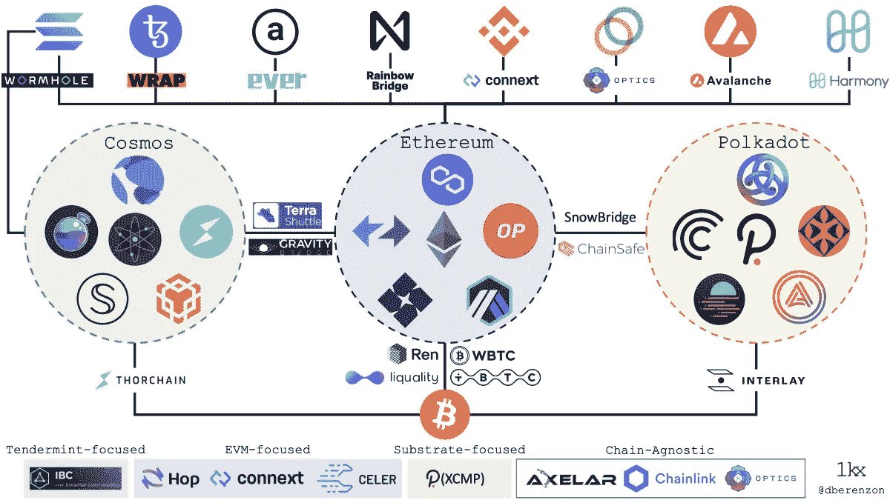

# 流行的加密桥及其工作原理

> 原文：<https://medium.com/coinmonks/popular-crypto-bridges-and-how-they-work-73bb8126a261?source=collection_archive---------26----------------------->

*Web3 已经发展成为一个由 L1 区块链和 L2 扩展解决方案组成的生态系统，每个解决方案都设计有独特的功能和权衡。随着区块链协议数量的增加，* [*跨链*](https://dune.xyz/eliasimos/Bridge-Away-(from-Ethereum)) *移动资产的需求也在增加。为了满足这一需求，我们需要桥梁。*

Diagram of how crypto bridges works.

就像我们在现实世界中熟悉的桥一样，区块链桥的功能完全一样。一座区块链桥连接了两个区块链生态系统，就像一座物理桥连接了两个真实的地点一样。通过资产和信息的传输，桥梁使整个区块链联系起来。

# 介绍

一般来说，区块链天生就不具备互操作性，这意味着一个区块链上的资产和数据不能移动到另一个。在它们之间建立加密桥梁以支持数据和资产传输是几个项目解决这个问题的一种方式。然而，每个加密桥仅链接特定的区块链，因此它不是通用的解决方案。

例如，一个团队不能通过他们在 ETH 和 BTC 之间建立的桥梁将资产从 XRP 转移到 ETH。此外，只有拥有能够使用特定网桥的加密钱包的用户才被允许使用该网桥。

# 什么是加密桥？

被称为“加密桥”的技术使数字资产能够在各种区块链网络之间转移。这可以帮助很多事情，包括促进跨链交易，使用区块链各地的资产，以及使用区块链各地的分散应用程序(dApps)。

不同区块链的标志、共识技术、社区和治理模式各不相同。区块链的互操作性是通过加密桥实现的，加密桥可以在链之间传输数据和数字资产。

由于加密桥的存在，区块链也可以从彼此的优势中获益。例如，由于其他网络可能会填补这一空白，比特币不需要为了纳入智能合约而重组其区块链。

加密桥还使开发人员无论使用什么网络都可以进行交互和协同工作。因此，协议可以更容易地链接，并扩展其他协议的功能和用例。

**下面列出了三个众所周知的加密桥及其工作原理:**

宇宙**:由宇宙中心提供动力，宇宙是一个由独立的、另类的区块链组成的分散网络。通过 Cosmos Hub 这一单一中心，Cosmos 网络中的多个区块链之间的数字资产移动变得更加容易。peg 是一种独特的账户，用于持有转移资产，并使其能够在其他区块链之间转移。**

Polkadot: Polkadot 是一个区块链平台，允许开发分散式应用程序(dApps)以及在不同区块链之间交换虚拟货币。这是通过使用“副链”，或连接到波尔卡多特网络并能相互合作的独立区块链来实现的。这使得在波尔卡多特网络的几个区块链之间转移数字资产成为可能。

**票据交换协议(ILP)** 是一种在各种分类账或支付系统之间转移资金的方法。它通过在两个分类账之间创建一个“管道”来实现这一点，使价值能够在它们之间转移。ILP 可用于在任何两个支持它的系统之间转移价值，因为它独立于底层的分类帐或支付系统。

# 结束语

加密桥提高了加密货币生态系统的互操作性，但您应该始终进行研究，以确定哪种桥最符合您的需求。

重要的是要记住，桥接对流通中的所需加密货币的数量没有影响。通过简单地锁定发送网络上的硬币，并在接收端创建新的令牌，网桥产生包装的令牌。

在另一端释放原始令牌之前，如果包装的令牌返回到本机链，则它们会被烧掉。

> 交易新手？试试[密码交易机器人](/coinmonks/crypto-trading-bot-c2ffce8acb2a)或[复制交易](/coinmonks/top-10-crypto-copy-trading-platforms-for-beginners-d0c37c7d698c)