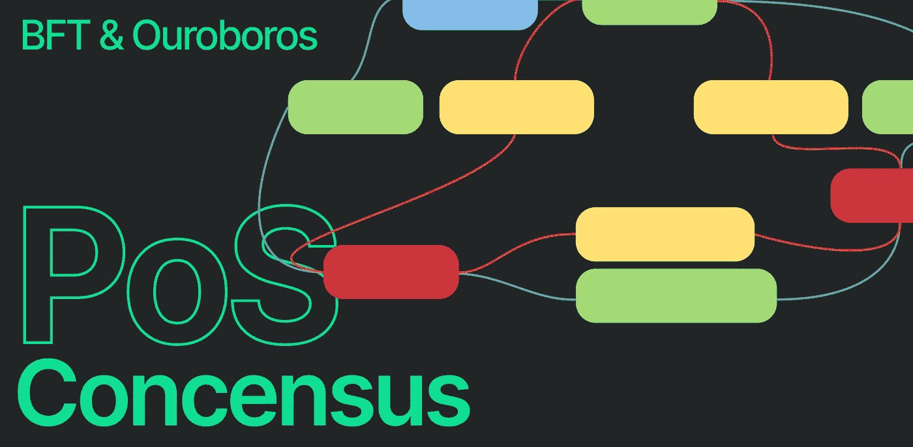
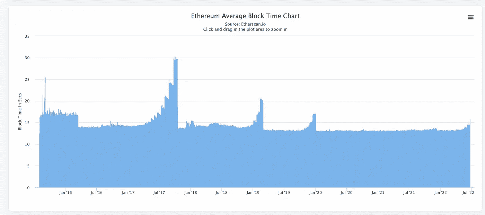
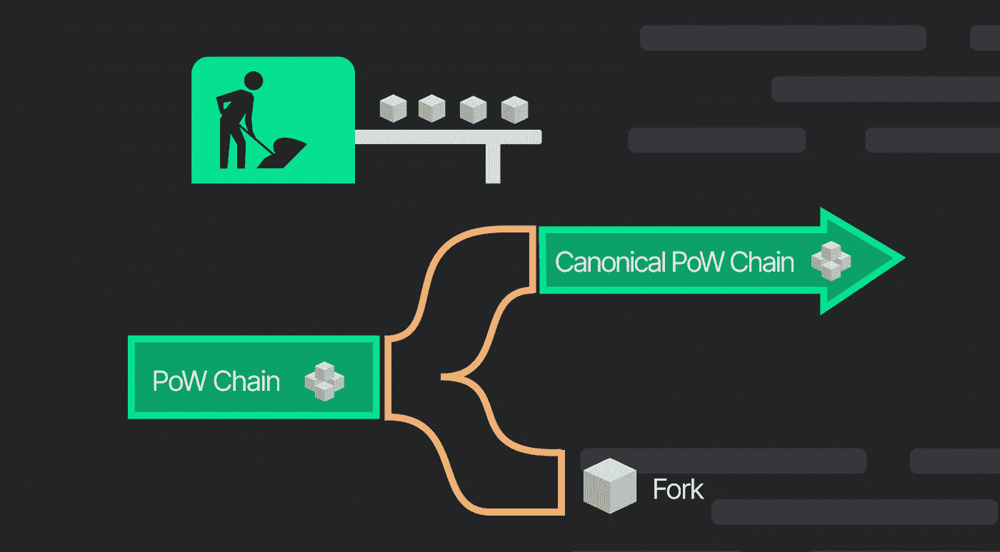
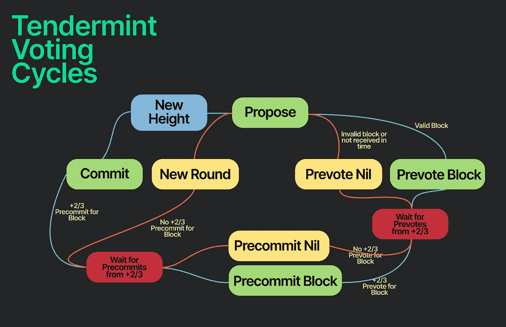
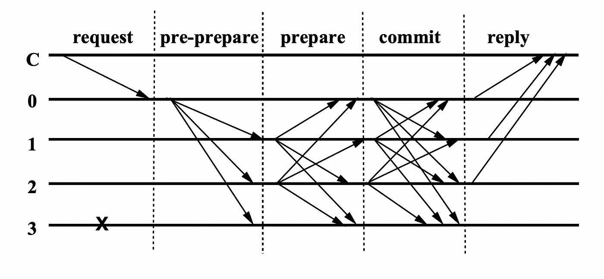

# PoS 共识

> 原文：<https://medium.com/coinmonks/pos-consensus-a404adeebeeb?source=collection_archive---------37----------------------->

以太坊正在从 PoW 转向 PoS。然而，PoS 推出时间一再推迟。

以太坊用[难度弹](https://docs.ethhub.io/questions-about-ethereum/what-is-the-difficulty-bomb/)切换网络到 PoS。难度炸弹生效后，战网上的采矿难度会成倍增加。封锁时间急剧增加。在 PoW 网络上没有人可以铸造新的块之后，所有的参与者只能切换到 PoS 网络。下图显示了平均阻塞时间。

*Source:* [*Etherscan*](https://etherscan.io/chart/blocktime)

每一波都代表难度炸弹的冲击力。封锁时间增加了很多。波消失是因为难度炸弹在网络升级时延期了。

PoS 的推出对于以太坊来说是必不可少的。在这篇文章中，我们将解释 PoS 的历史以及为什么以太坊转换到 PoS 如此困难。

# 如何学习一个共识

PoW 和 PoS 是两种常见的共识方法。在了解共识时，我们可以问自己这两个问题:

*   谁有权提议新区块
*   如果有一个分叉，那将是规范链

# 电源概述

有了上一节的框架，我们就可以简单分析一下 PoW 了。首先得到计算难题正确答案的节点可以提出新的块。如果有一个分叉，最长的分叉将成为规范链。如果有人想操纵这个链，攻击者至少需要 51%的计算能力。相比 PoS，PoW 相对简单。PoW 不会利用随机数之类的问题。

电力网受到工程费用的保护。从长远来看，节点将获得与其计算能力成比例的回报。

# 位置深潜

先来回答一下开头的问题，以太坊转行 PoS 为什么这么难？部分原因是以太坊正在推动去中心化，鼓励更多的节点加入网络。这就需要更复杂的协议来支持成千上万个节点的 P2P 通信。

大多数网络采用 PoS 是因为[可持续性](/@VitalikButerin/a-proof-of-stake-design-philosophy-506585978d51)、[安全性](https://vitalik.ca/general/2020/11/06/pos2020.html)、更高的 TPS 和快速终结。如果任何节点作弊，网络可以立即削减他们的赌注。

> 交易新手？尝试[加密交易机器人](/coinmonks/crypto-trading-bot-c2ffce8acb2a)或[复制交易](/coinmonks/top-10-crypto-copy-trading-platforms-for-beginners-d0c37c7d698c)

# PoS 的历史

PoS 经历了两个阶段的发展。PoS 1.0 是总部位于区块链的 PoS consensus。PoS 2.0 基于 BFT(拜占庭容错)。

PoS 1.0 的例子有 PeerCoin、NextCoin、BlackCoin 和 Ethereum Serenity。

PoS 2.0 基于 BFT，被以太坊 2.0、Tendermint 和 Cosmos 等项目广泛采用。

# 位置 1.0

在 1.0 阶段，大多数 PoS 看起来像这样:

*   节点标记令牌
*   随机选择一个节点来产生新的块。该概率与赌注标记的数量成比例

这个工作流程最大的问题是随机数的生成。如果随机数生成基于时间戳和块散列，则块提议者将以增加再次被选为块提议者的概率的方式生成新的块。

# 攻击媒介

下面列出了常见的攻击媒介:

*   [打桩研磨](https://dyor-crypto.fandom.com/wiki/Grinding_Attack#:~:text=In%20a%20stake%20grinding%20attack,%20the%20attacker%20has,once%20again.%20From%20the%20Ethereum%20Github%20PoS%20wiki:):积木提议者试图影响随机数发生器，以获得更多产生积木的机会
*   [无利害关系](/@abhisharm/understanding-proof-of-stake-through-its-flaws-part-2-nothing-s-at-stake-8d12d826956c):在 PoS 网络中，产生新的块并不耗费大量的计算资源。当有分叉时，节点将在每个分叉上产生新的块。这样，节点可以最大化其收益率。然而，这对网络稳定性是有害的
*   [远程攻击](/@abhisharm/understanding-proof-of-stake-through-its-flaws-part-3-long-range-attacks-672a3d413501):早期确认器可以回滚到未来状态。这样很容易造成分叉

你可以在本文第 58 页找到更多的攻击媒介。

# 位置 2.0

PoS 2.0 采用 BFT。BFT 的目标是在不同的节点之间达成共识。

领导会提出建议。在所有节点中，有拜占庭节点。拜占庭节点以下列方式作弊:

*   未能返回结果
*   以不正确的结果回应
*   用故意误导的结果来回应
*   对系统的不同部分作出不同的反应

除了拜占庭节点，其余节点都是诚实节点。最困难的情况是领导者节点是拜占庭式的。

除了这些设置之外，还有其他一些限制:

*   节点只能对等通信
*   节点保存发出消息的日志

P2P 通信导致不同的节点有不同的视图。例如，节点 A 发现 3 个新块，但节点 B 只看到 1 个新块。

BFT 的主要目标是，在领导者提出建议后，除拜占庭节点外的每个节点都能达成一致。次要目标是找到拜占庭节点。

当前算法可以在以下条件下实现主要目标:

*   在 4 个节点中，1 个是拜占庭节点
*   在 25 个节点中，有 8 个是拜占庭节点
*   在 100 个节点中，33 个是拜占庭节点

网络运行状态可分为以下几种情况。f 是拜占庭节点的数量。网络中共有 3k+1 个节点。

*   f ≤ k，网络是稳定的
*   k < f < 2k+1, some nodes may fail to reach consensus. The blockchain pauses
*   f ≥ 2k+1, there are security risks

The popular BFT algorithms are [PBFT](http://www.cs.cmu.edu/~dga/15-712/F13/papers//castro99.pdf) 和[嫩薄荷](https://arxiv.org/pdf/1807.04938.pdf)。Tendermint 可以在 3k+1 个节点中有 k 个拜占庭节点的情况下保持网络稳定。

# BFT

现代 BFT 算法采用多轮投票来确保每个节点都知道超过 2/3 的节点赞成该提议。块完成后，诚实节点将永远不会恢复它。

每一轮沟通都有四个步骤:

*   客户端向领导者发送请求
*   领导者将请求传递给所有节点
*   节点向领导者反馈执行结果
*   在得到 f+1 个相同的结果后，领导者响应客户端(f 是拜占庭节点的数量)

下图显示了执行过程中的 5 个阶段。c 是客户端，0 是领导，3 是拜占庭节点。

准备和提交阶段用于确保不同节点之间的同步。

对于 Tendermint，它有几个限制:

*   P2P 通信不能支持网络中超过 100 个节点
*   复杂 P2P 通信设计
*   执行延迟。节点首先决定新的块。然后，节点执行新块中的所有事务。尽管单个事务运行良好，但是一次执行所有事务可能会导致问题，比如重复支出问题

如果你想了解更多关于 PBFT 的事情，看看这个[博客](http://muratbuffalo.blogspot.com/2020/01/practical-byzantine-fault-tolerance.html)。

# 大毒蛇

与 BFT 算法相比，Ouroboros 可以支持越来越多的节点，并且它还支持节点随时进出。大毒蛇比 BFT 更加分散和灵活，但是有更长的终结时间。卡尔达诺和米娜使用大毒蛇。

大毒蛇将时间划分为纪元。历元可以被分成时间段。每个时隙使用 VRF 来产生随机数，并使用该随机数来决定块提议者。标有更多令牌的节点更有可能成为块提议者。

当有分叉时，大毒蛇会用预定义的选择规则选择正确的链。例如，它可以选择最“密集”的链。

# 将来的

区块链正在平衡权力下放和绩效。从 PoW 到 PoS 的转变表明，区块链正在追逐 TPS、分权、象征经济学和快速终结。我们会看到更多围绕这四个特点的创新。

一些区块链使用采样技术来降低节点之间的通信频率。 **ZK 可以适用于它。**拜占庭节点需要用它们的消息发送证明。这样可以防止拜占庭节点作弊。通过验证证明，诚实节点也可以发现拜占庭节点。

GameFi 和 DeFi 应用中的记号组学创新可以在共识中应用。例如，我们可以**使用 Ve 令牌来提高赌注比率**。**使用双令牌设计**可能也是一个有趣的方向。分离奖励和共享代币以获取更多价值。

应用程序迭代比底层协议快得多，比如共识。很难将应用程序的创新应用于底层协议。模块化区块链可以解决这个问题。然而，对区块链来说，对关键模块进行热插拔仍然是有风险的。

# 参考

[https://www.youtube.com/watch?v=J34dCMIMxd4](https://www.youtube.com/watch?v=J34dCMIMxd4)

[https://www . geeks forgeeks . org/practical-Byzantine-fault-tolerance pbft/](https://www.geeksforgeeks.org/practical-byzantine-fault-tolerancepbft/)

[http://muratbuffalo . blogspot . com/2020/01/practical-Byzantine-fault-tolerance . html](http://muratbuffalo.blogspot.com/2020/01/practical-byzantine-fault-tolerance.html)

[https://medium . com/@ carloslopezdelara/whats-ouroboros-the-cardano-proof-of-stake-protocol-ad4b 958 e 152 e](/@carloslopezdelara/whats-ouroboros-the-cardano-proof-of-stake-protocol-ad4b958e152e)

[https://Mina protocol . com/blog/how-ouroboros-sama sika-holdings-minas-goals-of-decentralization](https://minaprotocol.com/blog/how-ouroboros-samasika-upholds-minas-goals-of-decentralization)

[https://iohk . io/en/research/library/papers/ouroboros-a-provable-secure-proof-stage-区块链协议/](https://iohk.io/en/research/library/papers/ouroboros-a-provably-secure-proof-of-stake-blockchain-protocol/)

[https://arxiv.org/pdf/1807.04938.pdf](https://arxiv.org/pdf/1807.04938.pdf)

[http://www.cs.cmu.edu/~dga/15-712/F13/papers//castro99.pdf](http://www.cs.cmu.edu/~dga/15-712/F13/papers//castro99.pdf)

[http://muratbuffalo . blogspot . com/2020/01/practical-Byzantine-fault-tolerance . html](http://muratbuffalo.blogspot.com/2020/01/practical-byzantine-fault-tolerance.html)