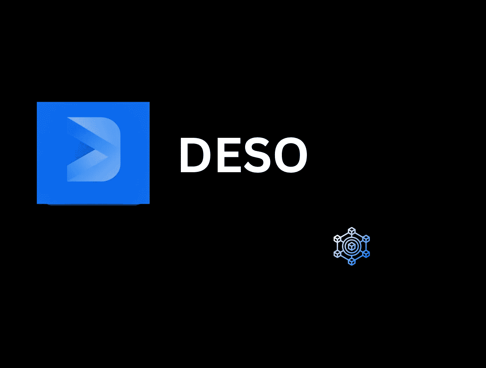
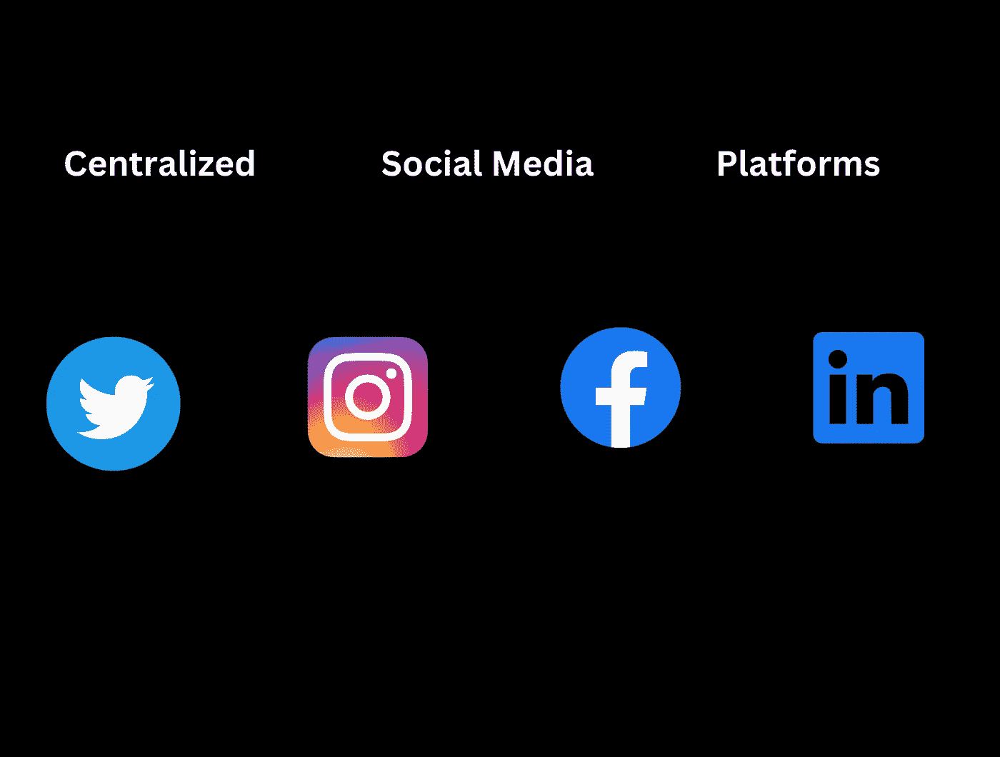

# 发布赚取-如何赚取 DESO 协议加密

> 原文：<https://medium.com/coinmonks/post-to-earn-how-to-earn-crypto-with-deso-protocol-d3fb04a43265?source=collection_archive---------5----------------------->

社交媒体正在迅速影响我们的日常生活和业务。它为建立一个强大的形象，网络和吸引客户铺平了道路。Instagram、Twitter、脸书、Tiktok、Snapchat 等平台。帮助品牌和组织接触潜在客户，并方便地向他们销售。然而，除了其他缺陷之外，这些网络社交是由一个中央机构控制的。

目前，一切都在从 Web2 向 Web3 发展，甚至社交媒体也不例外。我们体验了 Web3 用 Play2Earn 重新定义游戏，用 Learn2Earn 重新定义学习，用 Move2Earn 重新定义健身。这一次，它是关于将社交媒体带到另一个层面，这项创新背后的技术是 DESO 区块链。在这篇文章中，你将了解新创建的 DESO，以及如何开始从中获利。

## 什么是 DESO 协议？

DESO 是一个社交媒体设计的网络，建立在第一层区块链之上。它利用链上开放数据存储用户信息。这意味着你可以注册一次，之后，你的信息和关注者会在你所有的社交媒体平台上关注你。

> 交易新手？在[最佳密码交易所](/coinmonks/crypto-exchange-dd2f9d6f3769)上尝试[密码交易机器人](/coinmonks/crypto-trading-bot-c2ffce8acb2a)或[复制交易](/coinmonks/top-10-crypto-copy-trading-platforms-for-beginners-d0c37c7d698c)

该协议使用 DESO 硬币作为其本地令牌，并允许您在每次发帖时积累密码，并从您的追随者或其他用户那里获得提示。除此之外，他们还可以喜欢，评论，分享，标记甚至引用你的帖子，这可以帮助你建立你的追随者和吸引未来的提示。

## DESO 是谁的？

DESO 是为那些擅长写作、设计和创造任何能抓住观众的内容的创意人员准备的。这是给任何理解区块链基本概念的人看的，他们可以想出让人们思考、欢笑、娱乐或保持更新的在线内容。

## 为什么 DESO 与众不同？集中式与分散式社交媒体

Instagram、LinkedIn 和 Twitter 等社交媒体由公司所有和控制。它们之所以被集中化，是因为这些公司拥有存储在其平台上的数据，并管理可以保留在平台上的内容和用户账户。

这些集中式平台的问题是，它们侵犯了我们的隐私，并私下将其货币化。这些公司使用算法来跟踪我们的在线活动，并通过向广告商出售这些数据来产生收入。

**一种不同的社交媒体**
分散的社交媒体是加密的，将你的数据存储在多台被称为“节点”的电脑上。它保证您的隐私，并保持您的内容在多个平台上的完整性。例如，如果你在 Instagram 上有一个帐户，你就不需要在 Twitter 上创建一个单独的帐户，因为你可以使用相同的钱包或登录详细信息来访问它。因此，它为你省去发布旧内容或试图在另一个平台上重塑自己的压力。除此之外，它允许你在一个地方获得你的收入，这意味着你在每个社交平台上积累的加密量，所以你不必在你创建的新社交上从头开始赚取。

## 分散式社交平台和应用

每天都有新的应用程序在 DESO 区块链上开发，但这里有一些现有的 Post2Earn 平台:

[**钻石**](http://diamondapp.com) :这是一个去中心化的平台，与 Twitter 的功能相似。你可以发布，标记，喜欢，评论和分享内容，但是，不管你的追随者数量多少，你都可以赚钱。以下是钻石的其他特征:

它允许你创造你自己的创造者的硬币，让人们投资你创造的社会令牌。此外，它帮助你作为一个创作者建立一个强大的社区，也支持你最喜欢的创作者。例如，你可以购买埃隆·马斯克(Elon Musk)的创造者硬币，享受潜在的好处。创作者还可以通过他们购买的硬币数量看到他们的顶级支持者，并可能决定奖励他们的顶级支持者。

二。你可以将任何文字内容或设计转换成 NFT，并在平台上拍卖。

三。如果你觉得别人的帖子有趣，你可以给他们小费。

**:这是钻石的应用；这有助于轻松访问平台。你可以安排你的帖子，创建投票，插入链接，发布 gif，甚至在 Twitter 上分享你的帖子。您的分析可在 OpenProsper 上获得，以便您跟踪参与度和客户增长。**

**[**Pearl**](http://pearl.app) :这款 app 是最近才上线的，和 Instagram 有类似的功能。它允许用户创建可视内容并获得加密。**

**[**Stori**](http://storiapp.co) :这是一个去中心化的应用，可以让你用日常活动的图片和视频在线讲述你的故事。它有类似 Snapchat 的功能，每当你在帖子上得到提示时，它就会为你赢得加密。**

**[**呵呵**](http://huh.so) :平台让你借助社群的力量学习、建设、赚取。它有类似于 Reddit 和 Quora 的功能，让你通过在积极参与的社区中创造价值来获得 crypto。其他用户可以对你的帖子发表评论，喜欢它，或者决定在你提供的每个内容上给你钻石提示。**

**[**Videso**](http://videso.xyz) :这是一个去中心化的视频内容创作平台。它有类似于 Youtube 的功能，让你从你的内容中获得加密，而不管你的用户数量。**

**[**Zirkel** s](http://zirkels.com) :去中心化的社交博客允许你发布内容，同时将其货币化。它有类似于 Medium 的功能，让你从读者那里得到提示，不管他们是不是你的订户。**

**[**Mousai**](http://mousai.com) :无论你是音频内容创作者还是粉丝，这款 dApp 都能让你在旅途中赚到钱。作为一个创作者，你的粉丝可以通过给小费来支持你，你也可以从其他用户那里为你的播放列表和更多其他内容赚钱。**

**作为一名音乐艺术家，您可以轻松地将您的独家直播、专辑封面和在线门票转换为 NFT，让您的粉丝可以轻松购买。即使你是一个播客，你也可以通过创造者的硬币将你的粉丝群货币化，并在你的粉丝购买你的令牌时获得创始人奖励。**

**[**NFTz**](http://nftz.me) :这是 DESO 的 NFT 市场，你可以在这里以更低的价格创作和出售你的数码收藏品。它还允许你申请带有社交功能的免费 NFT，将你与你的社区联系起来。**

**[**Nametrade**](http://nametrade.io) :你可以以非常便宜的价格买卖域名。**

**这是一个专业的社交网络，与 LinkedIn 有相似的特点，但是它是分散的，允许你通过你在帖子上的投票来获得加密。**

## **DESO 的好处**

****改善隐私****

**您的数据是安全的，您的在线活动存储在区块链上。它不会对您的个人信息进行任何控制或访问，没有您的允许，您的数据不会被访问。**

****您内容的所有权****

**由于内容存储在区块链上，因此您可以完全控制哪些人可以查看您的内容，并且可以跨多个平台访问这些内容。所以，你的内容跟随你从一个社交媒体到另一个。**

****将您的内容货币化****

**DESO 允许你通过给小费，让人们购买你的创造者的硬币或 NFT，同时发布和赚取。不管你有多少追随者，你都可以通过你的内容赚钱，你发布的有趣内容越多，你赚钱的机会就越高。**

## **DESO 的未来**

**自 2021 年 6 月 DESO 首次推出以来，它经历了价格波动的起伏。DESO 未来能否表现出色，取决于分散化社交媒体的采用。**

**与其他 dApps 的合作和集成将允许更多用户登录 DESO。例如，与 Metamask 的合作允许用户使用现有帐户登录，并跨多个社交网站进行跨链互动。因此，用户现在可以访问不同的社交网站，而无需 DESO 种子作为初始注册方法。投资也很重要，例如，2021 年筹集的 50 美元辛烷基金有助于扩大生态系统。**

**也有可能我们会经历更多的创新，因为 DESO 是开源的，它允许开发者很容易地为区块链做出贡献。例如，像 CreaTiers 这样的平台允许用户使用他们的单一 DESO 账户从事自由职业和雇佣工作。根据对分散化社交媒体的需求，结合团队的坚韧和未来的投资，DESO 可能会开花结果。**

## **关闭**

**分散式社交媒体是一种 Web3 技术，它重新定义了我们如何通过区块链使用社交媒体。它有广泛的开发应用，更便宜，更安全，毫无疑问，这种新技术的未来将是非常令人兴奋的。**

> **加入 Coinmonks [电报频道](https://t.me/coincodecap)和 [Youtube 频道](https://www.youtube.com/c/coinmonks/videos)获取每日[加密新闻](http://coincodecap.com/)**

# **另外，阅读**

*   **最好的比特币[硬件钱包](/coinmonks/hardware-wallets-dfa1211730c6) | [BitBox02 回顾](/coinmonks/bitbox02-review-your-swiss-bitcoin-hardware-wallet-c36c88fff29)**
*   **[block fi vs Celsius](/coinmonks/blockfi-vs-celsius-vs-hodlnaut-8a1cc8c26630)|[Hodlnaut 审核](/coinmonks/hodlnaut-review-best-way-to-hodl-is-to-earn-interest-on-your-bitcoin-6658a8c19edf) | [KuCoin 审核](https://coincodecap.com/kucoin-review)**
*   **[Bitsgap 评审](/coinmonks/bitsgap-review-a-crypto-trading-bot-that-makes-easy-money-a5d88a336df2) | [Quadency 评审](/coinmonks/quadency-review-a-crypto-trading-automation-platform-3068eaa374e1) | [Bitbns 评审](/coinmonks/bitbns-review-38256a07e161)**
*   **[加密复制交易平台](/coinmonks/top-10-crypto-copy-trading-platforms-for-beginners-d0c37c7d698c) | [Coinmama 审核](/coinmonks/coinmama-review-ace5641bde6e)**