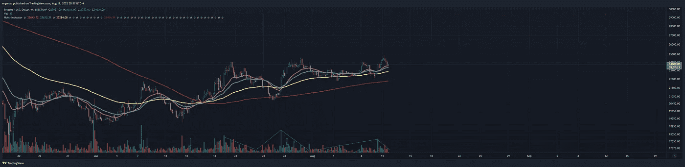
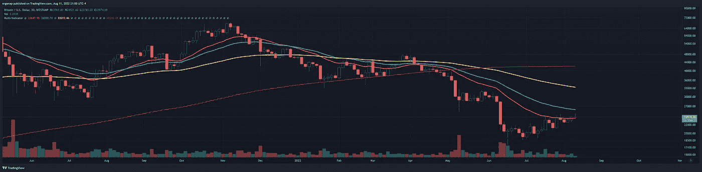
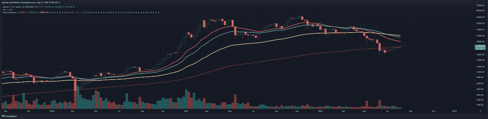

# 假期后的忧郁

> 原文：<https://medium.com/coinmonks/post-vacation-blues-b1ba1b574168?source=collection_archive---------25----------------------->

比特币/加密货币市场分析 8/11

假期后我觉得很累，我想我还需要一天才能回到正轨。纵观我们所拥有的，BTC 正处于相当不稳定的基础上，或多或少地在犹豫不决中巩固/缓慢地旋转。请记住，我们已经攀升了大约 4000 美元，通货膨胀率也上升了。

4h 指标自 7 月 18 日以来一直看涨，没有变化。然而，我确实看到了一些变化——数量趋势。

notice volume trend kinda dying here, thats’ a bit of an issue. [https://www.tradingview.com/x/0M8Q9X8d/](https://www.tradingview.com/x/0M8Q9X8d/)

如果我们低于 22.4 任何时间超过 4 小时，我想我们会看到一个地狱般的后果。这当然是可能的，但是我们也可以从这里发射到月球。相同的指标每天都在相同的位置，所以如果我们反弹，这可能是一个坚实的时间框架。

然而，3d perspective 表示，我们正处于不试图看跌的风口浪尖，但甚至没有真正投入太多精力。自去年 3 月以来，买方的交易量一直停滞不前，没有变化。

it’s just not there. Doesnt’ mean I didn’t enjoy the free money, but it’s not. [https://www.tradingview.com/x/ojMotcAW/](https://www.tradingview.com/x/ojMotcAW/)

weekly — [https://www.tradingview.com/x/ecib0Aql/](https://www.tradingview.com/x/ecib0Aql/)

周刊也好不到哪里去。欢迎来到当你欢迎机构进入 crypto 时会发生什么，在那里他们以他们想要的方式控制事情。这是“成功”，也就是缺乏自由和保护。这是“每个人都被操”除了有钱人。干得好，加密高手。

我看到的另一件事是从今年 5 月开始呼吁做空，仅此而已。甚至没有显示出任何可能改变的模糊迹象，但现在几乎完全是一个困难的没有。当然也没有什么乐观的。

简而言之，我明天会看得更多，但没有什么是不清楚的。

> 交易新手？试试[加密交易机器人](/coinmonks/crypto-trading-bot-c2ffce8acb2a)或者[复制交易](/coinmonks/top-10-crypto-copy-trading-platforms-for-beginners-d0c37c7d698c)