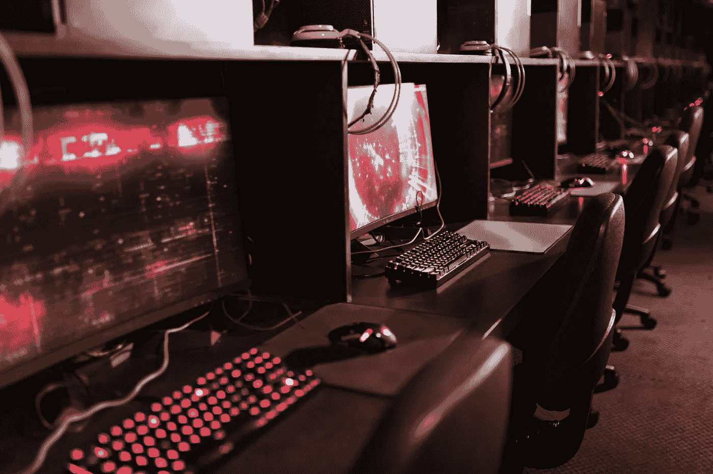

# 区块链对于视频游戏创作者的潜力

> 原文：<https://medium.com/coinmonks/potential-of-blockchain-for-video-game-creators-d5db9aa68ed9?source=collection_archive---------46----------------------->

由于区块链技术在视频游戏中的引入和积极使用，预计未来几年视频游戏市场将出现显著增长，并且游戏在日常生活中的角色很可能将被完全重新定义。区块链已经在改变行业，并为长期存在的问题提供新的解决方案，为用户创造更有吸引力的环境。许多游戏开发公司正在考虑在未来的项目中使用这项技术，或者已经开始开发区块链游戏。这导致越来越多有趣的游戏和机会出现在区块链游戏中，迅速增加了人们对这项技术的兴趣。

区块链吸引了如此多的关注，这是很自然的，因为它创造了使用加密货币进行快速安全交易的环境，而无需使用第三方服务。技术在区块链和 NFT 奥运会上的应用给了玩家更多玩游戏的理由，并对他们付出的努力和时间给予了回报。它允许用户获得对游戏过程的控制，并创建更个性化的故事情节、角色等，增加艺术表达和个性化的机会。区块链技术为用户驱动的游戏内经济创造了[基础，允许玩家以更愉快的方式获利，提供了赚取加密货币的机会，加密货币随后可以转换为真实的货币。NFT 和区块链也提供安全保障，以防某个游戏被关闭，即使在此之后也允许交易。](https://isotopic.io/)

另一个吸引人的因素是增强的安全性、所有权和验证过程，这也是区块链技术广受欢迎的原因。区块链提供了交易的透明度、额外的信心和安全级别，保护了用户数据，并提供了一种存储资产的安全方式。此外，作弊、黑客和游戏修改变得几乎不可能。这之所以成为可能，是因为在区块链，数据不是存储在一台服务器上，而是由分布在世界各地的计算机网络共享。

另一个有趣的方面是能够通过许多游戏拥有一个集成的个人资料和钱包，使跨游戏平台和应用程序的访问更容易。这改善了用户体验，使应用程序更易于访问。甚至有可能创建可以绑定档案并在游戏间转移的[资产](https://isotopic.io/)，将视频游戏行业向前推进一步，并产生完全闻所未闻的体验和数字存在。

# 限制

当然，没有什么是完美的，区块链也不例外。为了从这项技术中受益，需要拥有一个钱包并购买加密货币，这可能会阻碍一些用户，特别是那些不熟悉这一过程的用户。理解与区块链和非功能性测试相关的概念存在一定的复杂性，这种复杂性由于缺乏经过认证且值得信赖的信息而变得更加突出。一旦我们克服了这些限制，就有可能在各种各样的应用中部署该技术，利用上述所有的好处，并进一步发现它。

文章由 Jenny Lis 撰写，来自[同位素](https://isotopic.io/)

[**同位素**](https://isotopic.io) **是一个支持区块链的软件分发服务，托管整合了 NFTs 和加密货币的游戏和应用。**

> 交易新手？在[最佳加密交易](/coinmonks/crypto-exchange-dd2f9d6f3769)上尝试[加密交易机器人](/coinmonks/crypto-trading-bot-c2ffce8acb2a)或[复制交易](/coinmonks/top-10-crypto-copy-trading-platforms-for-beginners-d0c37c7d698c)