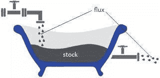
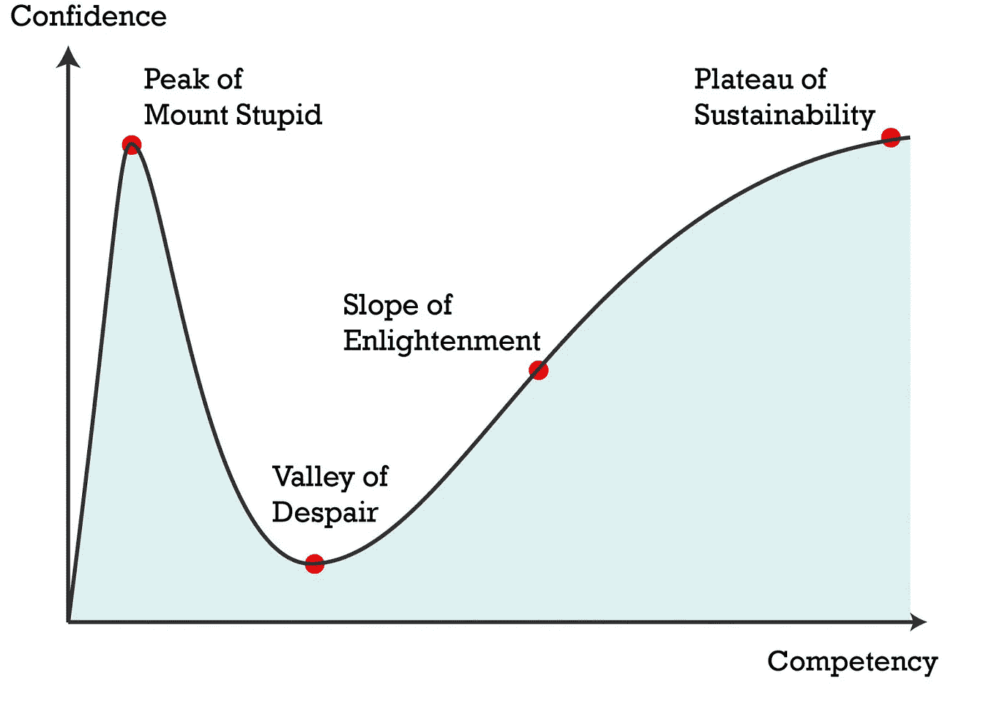
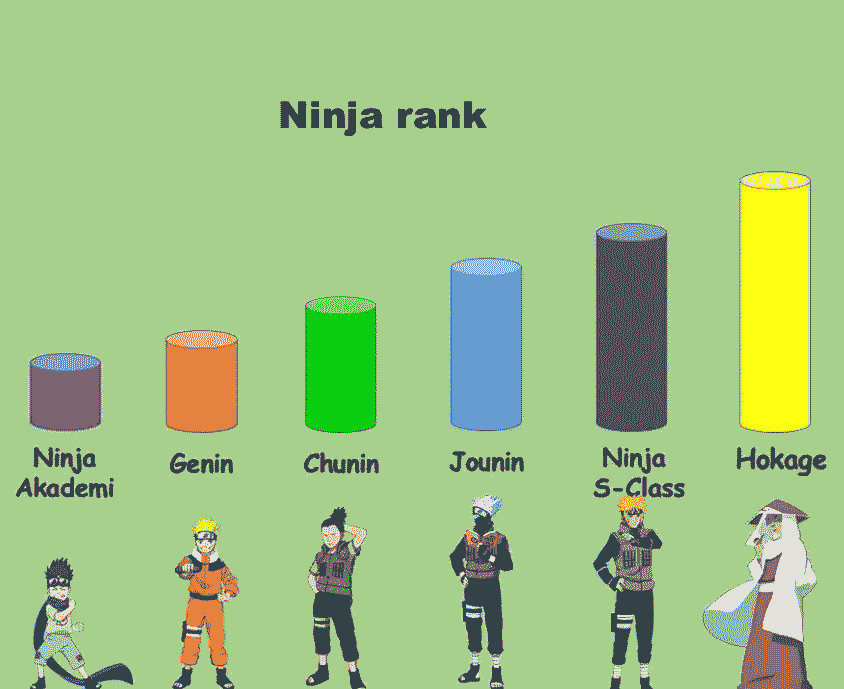

# 这篇文章描述了下一批密码百万富翁正在做什么

> 原文：<https://medium.com/coinmonks/pourquoi-il-faut-se-pr%C3%A9parer-maintenant-au-prochain-bull-market-82c34343587b?source=collection_archive---------54----------------------->

如果你目前没有为下一轮牛市做准备，那么你就是那 97%会亏损的人的一部分。当市场下跌时，你需要制定一个行动计划，当市场再次上涨时，就已经太晚了，你会在几周内匆忙去做几个月都没有做的事情。

相反，选择一个专业的方法，包括事前准备阶段和牛市中的“收获”阶段，事实上，这并不容易。这就是为什么我决定给你一些准备阶段的基础知识。我们走吧🚀

## 如果你想成为下一个周期的赢家之一，以下是 6 条基本规则:

## 1️⃣.自学

无论你目前的水平如何，教育都是必不可少的。

这不是你第一次听说了吧？很好，那你的路是对的。无论你选择什么工具，重要的是要明白投资不仅仅是一门学科，**它是一种职业。了解诀窍，获得策略，创造经验。**

要想在游戏中处于领先地位，你需要培养你的思维。愚蠢的决定让你赚了一次钱。**聪明的决定总能让你赚钱。**

以下是需要关注的三个重要领域:

*   如何做真正的基本面分析；
*   了解交易和技术分析的基础知识；
*   管理你的情绪和决策。

## 2️⃣.建设而不是观看

生活中，有说话的人，也有制造的人。没有其他的选择，如果我有任何建议给你，尽你所能成为行动者、创造者、建设者的一部分。这句话也适用于娱乐:例如，在社交网络上，更多地成为内容的创造者(和货币化者),而不是消费者。

参与进来，走在时代的前面。把你能想到的每一个想法都变成现实，即使你在过程中意识到其中一些想法是可行的。

建立业务、关系、品牌、工具、内容等。

> "只要头脑能想到并相信，它就能实现."拿破仑·希尔。

## 3️⃣.赚钱

如何创造货币？当然，还有其他资源。在这个世界上，**金钱无处不在**，它总会找到方法进入那些知道如何寻找它的人的口袋。然而，为了投资，**你需要钱**，所以进入你口袋的每一欧元都是你拥有的多一点膨胀你资产的力量。

这里有四种能让你赚钱的资源:

*   **你的时间:**作为员工，你用自己的时间换取金钱。确保这种交流对你有利。有益的交流是一份让你学习和提升自己的工作；这是你应得的报酬，而且**不会夺走你的精力和好心情**。
*   **你的专长:**这是你拥有的很少有人拥有的特殊技能；这是一种你可以销售的服务。服务业占了所有工作岗位的 75%以上，这并非毫无意义。学会推销自己，建立自己的事业。这可以是与你作为员工的工作相同的活动。
*   你的知识:可能有一个领域你比其他人更了解。**在线培训市场正处于高峰期**，好好利用它，打造自己的培训。
*   **你的钱:**是的，钱生钱。你有股票和流量。股票是你的资本(储蓄),流量是每个月的收入。你的目标是用你的钱创造被动收入。例如，你积累了稳定的收入:你有一只股票的事实允许你**创造一个流量，这个流量本身增加了股票。**

别忘了，你的收入来源越多，你就能投资得越多，创造的财富也就越多。这就是我们所说的**累积效应**。

## 4️⃣.分享你的观点

考虑到你已经获得的知识，总有一天你会对所有的主流内容不再感兴趣。我很遗憾地告诉你，你可能会愚蠢到极点。

但是不要迷惑，这是个好消息:每个人都会经历这个。你正在接近我倾向于称之为**的 1 级。**

这是你的时刻。你必须告诉全世界你的想法。到目前为止，在你的学习中，你从来没有真正面对过关于特定主题的不同意见，你从来没有必要建立一个论点或写一篇论文来教授你从各种经历中学到的和理解的东西。这是去参加会议的时间；开一个 Twitter 和 Discord 账号；启动您的 YouTube 或 Twitch 频道；让有能力的导师围绕在你身边；等等。

策划者是停留在愚蠢之山上的人和滑入谦卑之谷的人之间的分界点。

## 5️⃣.学习经济和金融

我知道这些不是最梦幻的领域，但如果你真的想成为一名伟大的投资者，你将不得不强迫自己理解这些学科的基本原理。

*   **微观经济学**会让你了解市场参与者(包括你)的行为、情绪、决策；
*   **宏观经济学**将给你一个关于市场运作和我们生活的(经济)世界的全球视角；
*   **市场金融**将让你吸收金融市场的传统工具，DeFi 和 WEB 3 的灵感来自于此；
*   **个人理财**在戒律 2 和戒律 3 中已经提到。你将学会管理你的股票，流入和流出；
*   **行为金融学**将挑战你作为投资者的心理。

积累这些学科的知识会让你比其他人领先一大步。

## 6️⃣.成为专家

在第一条规则中，我提到了训练自己的事实。区分有几个步骤:

首先，你必须通过一切可能的手段达到第一级或“Gennin”(见方案)。成为一名基因人意味着了解加密市场的基础知识，理解区块链和 WEB 3 生态系统所处的(经济)环境。当你是一个 *Gennin* 的时候，你知道**如何应对你赚钱的情况以及相反的情况**(当你的钱包出血的时候)。Gennin 必须能够过滤信息:对你在社交网络上听到的有一些看法；知道如何建立和维护一个观点是有利的。为了说明这一点，我使用了《火影忍者》中的忍者等级。让我们仔细看看:

当你是一个基因人时，你哪里也不擅长，但却处处平庸。这就是你决定专攻的时候。因此，你将通过你的专业的下一个水平。幸运的是，WEB3 的生态系统非常多样化，所以你很可能会找到一些你会花 10，000 小时成为专家的东西。WEB 3 中待开发主题的浅显选集:区块链；DeFiNFTs 元宇宙；交易；dApps 即玩即赚；shitcoins 众筹贷款；ICOs 采矿；堆叠；标记化；DAOs 分散式云；网络安全；粉丝令牌；等等。成为专家的领域和潜在收入来源一样多。

暂时就这些了。为了使阅读更加流畅和有趣，这些戒律被有意地合成了。如果你想要一篇完整的文章，请告诉我！✌️

[这里的](/@DouussCrypto.eth/pourquoi-il-faut-se-préparer-maintenant-au-prochain-bull-market-577962b46570)是这篇论文的法文版。

> 交易新手？试试[加密交易机器人](/coinmonks/crypto-trading-bot-c2ffce8acb2a)或者[复制交易](/coinmonks/top-10-crypto-copy-trading-platforms-for-beginners-d0c37c7d698c)