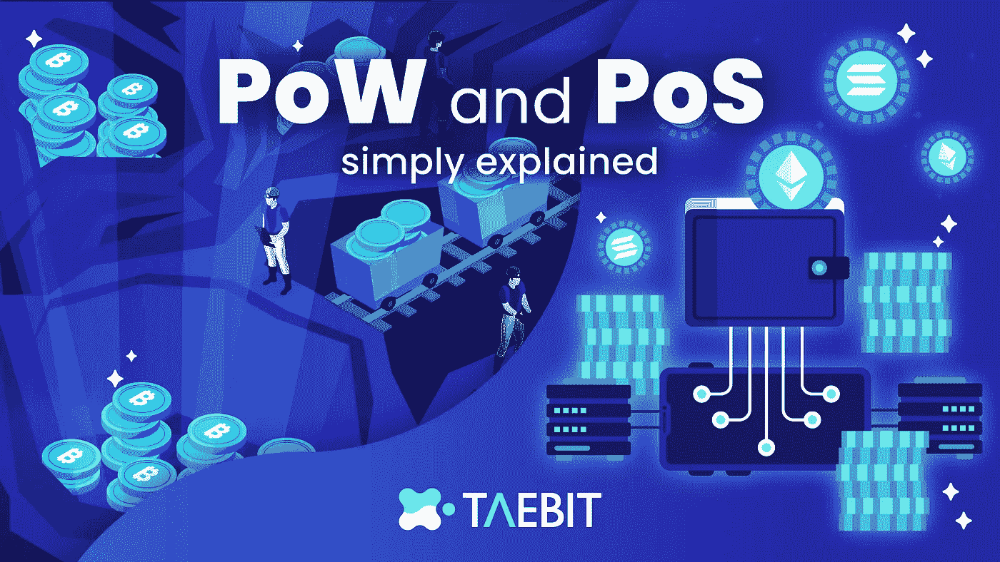

# 简单解释了 PoW、PoS 和合并

> 原文：<https://medium.com/coinmonks/pow-pos-and-the-merge-simply-explained-6824dafe7299?source=collection_archive---------24----------------------->

# **简介**

在之前的博客文章中，Taebit 团队已经讨论了[复杂的技术机制](/coinmonks/inter-stable-swap-deep-liquidity-amm-3-0-78330936517e)、[稳定的货币结构](/coinmonks/the-evolution-and-landscape-of-stablecoins-3f280de875c8)和[在加密货币领域建立社区的新方式](/coinmonks/how-twitter-spaces-become-the-best-communication-and-marketing-tools-for-daos-and-crypto-fd6bf9f7d73)。在本帖中，我们旨在回归基础，以更好地理解不同区块链所使用的共识机制。

这篇文章的目的是向读者提供区块链如何运作的内幕，并描述每个共识机制的权衡。

# **关键要点**

> 为了确保所有交易的合法性，区块链依靠一种叫做**【共识机制】**。共识机制可以被描述为用于验证交易和确定真实资产所有权的方法。
> 
> **PoW** 是一个依赖于节点(矿工)的系统，利用算法软件来求解复杂的方程。多方对这些等式的准确和同时完成/比较确保了区块链交易记录的有效性。
> 
> **PoS** 是一种共识机制，它依赖于区块链生态系统的利益相关者对其资产的“下注”。这种机制取代了 PoW 验证的“先来先服务”方面，因为块“提议者”现在是随机选择的，而不是按速度。
> 
> **合并**代表以太坊(今天使用的 Mainnet)的现有执行层与其新的利害关系证明共识层，即信标链的结合。
> 
> 以太坊合并的三个主要好处:降低能源成本、提高可扩展性和增强安全性
> 
> 索拉纳的目标是解决区块链三难困境指的是区块链无法同时完全可扩展、安全和分散——因此必须在区块链的三个特征中的至少一个上做出妥协。
> 
> **Solana** 高度可扩展，因为它使用了一种创新的混合共识模型，该模型将独特的**历史证明(PoH)算法**与闪电般快速的同步引擎相结合，这是利益证明(PoS)的一个版本。
> 
> Solana Network 理论上每秒可处理超过 710，000 笔交易，无需任何扩展解决方案。

# **共识机制**

## 什么是区块链技术？

简单来说，区块链技术是一种高效、可审计且安全的数据存储形式。相对于其他形式的数据库，与区块链技术一致的数据结构是独特的，主要是因为数据存储在形成区块链的互连的、带时间戳的“块”中。实际上，这些数据基本上可以是特定区块链内发生的任何交易。

## **区块链交易是如何运作的？**

为了使这个概念更容易理解，允许我们提供一个涉及两方的简单例子；在这个例子中，区块链中的每个块都作为一个历史记录，记录了在这两方之间转移的资金。现在假设甲方决定给乙方发送一个以太网。这将是一个在以太网上的单个块中提交和记录的交易的例子。当双方之间发生额外的交易时，每个块都填充有交易记录，按时间顺序记录。最终，在一定数量的事务之后，该块达到其数据存储容量，并且必须创建另一个块来记录未来的事务。这是导致区块链膨胀的一系列事件。

## **区块链科技如何验证和保护数据交易？**

一个合乎逻辑的问题应该是“谁记录这些交易？”，以及“如何确保这些交易的有效性和安全性？”。这就是数据验证发挥作用的地方。为了确保所有交易的合法性，区块链依靠一种叫做**【共识机制】**。共识机制可以被描述为用于验证交易和确定真实资产所有权的方法。这种形式的数据验证是由被称为“数据验证者”(传统上称为“挖掘者”)的外部方执行的。作为一个数据验证者，你有一个统计上的机会，因为你提供了一个经过验证的交易记录而被授予奖金。为了进一步激励准确的记录并抑制不准确的记录，奖金被设计成对准确性提供较大的潜在奖励，对不准确提供较小的潜在奖励。

# **工作证明(PoW)和利益证明(PoS)**

目前存在两种类型的共识机制。

# **工作证明:**

## **比特币的去中心化共识机制**

区块链技术中第一个广泛实施的共识机制被称为工作验证(PoW)共识机制。PoW 是一个依赖于节点(矿工)的系统，利用算法软件来解决复杂的方程。多方对这些等式的准确和同时完成/比较确保了区块链交易记录的有效性。

## **功率限制**

就 PoW 而言，奖金取决于矿商求解方程和验证交易的速度，最终意味着更高的计算能力意味着更大的潜在财务收益。作为一个电力网络上的矿工，与此相关的大量固定支出导致了很高的进入壁垒，因为普通人买不起具有竞争力所必需的硬件。还有一些与 PoW 共识机制相关的潜在高可变成本，例如能耗和设备冷却。这些费用及其相应的环境影响是一个双头兽，因为它们不仅增加了进入问题的障碍，而且当涉及到区块链技术时，也是公众和政府批评的要点之一。

# **利害关系证明:**

## **以太坊的选择**

为了试图解决上述问题，设计了一种被称为利害关系证明(PoS)的替代共识机制。PoS 是一种共识机制，它依赖于区块链生态系统的利益相关者对其资产的“下注”。这种机制取代了 PoW 验证的“先来先服务”方面，因为块“提议者”现在是随机选择的，而不是按速度。虽然预计这一变化将导致更低的准入门槛，并因此增加分散化，但值得注意的是，验证者的赔率与以太坊的赌注直接相关。换句话说，验证者押的以太币越多，他们赢得奖金的机会就越大。这将是一个有趣的观察机制，因为我们现在将能够比较哪个模型被证明是更真实的去中心化。

# **合并:为什么以太坊从 PoW 过渡到 PoS**

合并代表了以太坊(今天使用的 Mainnet)的现有执行层与其新的利害关系证明共识层(信标链)的结合。几个高度技术性的细节是以太坊从 PoW 到 PoS 转变的基础，但是为了这篇博文，我们将强调以太坊合并的三个主要好处。

1.  降低能源成本
2.  改进的可扩展性
3.  增强的安全性

## **1。降低能源成本**

预计合并将使以太坊的能耗降低约 99.95%，因为数据验证器将不再需要使用高性能计算机和过多的能源来完成工作。[当前以太坊每笔交易的能耗](/geekculture/is-eth-2-0-really-more-energy-efficient-bdc9515d7dbc#:~:text=Statista%20puts%20this%20at%20209.13,since%20the%20beginning%20of%202021.)约为。205kWh，相当于 15 立方英尺的冷冻机运行 10 小时。制成这极大地减少了整个网络的整体碳足迹。为什么这很重要？这有可能消除与区块链技术相关的一个核心问题和痛苦的耻辱:为网络供电带来的负面环境影响。当我们看到以太坊网络的碳足迹减少时，公众情绪可能会改善，我们可能会看到监管立场的转变。这有可能鼓励更多之前担心加密货币对环境影响的个人考虑在未来使用区块链技术。在大规模采用的道路上前进了一步。

## **2。改进的可扩展性**

PoS 提供了更大的可伸缩性潜力，原因有两个:数据验证器数量的增加和事务处理能力的提高。由于进入 PoS 数据验证机的门槛明显降低，网络自然会吸引更多的数据验证机。随着网络增加更多的数据验证器，网络的容量将继续增加，这有助于实现更快的共识和更分散的网络。

除了为更多的数据验证器打开大门，这一技术转变还将为扩展技术(如分片)的进一步创新奠定基础，预计这将对网络的交易能力产生重大影响。该网络的联合创始人兼首席开发人员 Vitalik Buterin 已经预示了这一点，因为他之前预测这一变化可能会导致网络最终能够保持每秒 100，000 次交易(TPS)，交易能力惊人地增长 769，000%。值得注意的是，Visa 和 Amex 多年来为其系统的性能提供了一系列数字，但对其最大交易能力似乎没有普遍共识。然而，所有报告的值都低于 ETH 的 10 万 TPS 的目标吞吐量。

## **3。增强的安全性**

由 PoS 共识机制供电的网络的特征在于相对于由 power 供电的网络具有更高程度的安全性。PoW 网络的一个关键安全问题是“51%攻击”(当某个怀有恶意的人通过拥有超过 50%的网络挖掘能力来获得对网络的控制，并可以更有效地验证交易)。PoS 不能消除 51%的攻击，但是它使得获得这种能力的成本更高，因为坏参与者需要拥有所有 ETH 赌注的 51%。

PoS 提高网络整体安全性和数据验证器完整性的另一种方式是通过对不诚实行为的潜在经济处罚。由于您需要将您的 ETH 作为验证者参与，因此如果出现与您相关的攻击或未能参与，您的 ETH 将面临被网络破坏的风险。处于被破坏风险中的 ETH 的数量取决于攻击或不诚实行为的程度，并且还可以根据网络上同时发生的其他攻击的数量而变化(也称为“相关性惩罚”)。如果受到处罚，数据验证器有可能失去 100%的赌注。这抑制了攻击者并提高了数据验证器的整体完整性，最终使网络相对于 PoW 更加安全。

## **合并对 DeFi 的影响**

合并不会对持有以太坊或参与以太坊网络协议的个人产生直接影响。这意味着用户不需要重组资金或担心跳过任何技术障碍。事实上，用户不需要做任何事情，因为该技术将无缝地实现到我们今天都在使用的现有界面中。合并可能影响 DeFi 的一个关键领域是易用性。以太坊区块链将突然有更多的交易输出，最终用户将因此受益。交易将更快地完成，极高的网络使用率不会像 PoW 系统那样严重地影响区块链质量。在整个区块链层中，索拉纳现在拥有整个区块链最高的 TPS。

# **为什么索拉纳是 DeFi 的最佳选择**

## **索拉纳:区块链困境的解决方案**

索拉纳·区块链于 2017 年创建，旨在解决以太坊创作者 Vitalik Buterin 提出的区块链三难问题。**区块链三难困境**指的是区块链无法同时做到完全可扩展、安全和分散——因此必须在区块链的三个特征中的至少一个上做出妥协。Solana 是高度可扩展的，因为它使用了一种创新的混合共识模型，该模型将独特的**历史证明(PoH)算法**与闪电般快速的同步引擎相结合，这是利益证明(PoS)的一个版本。由于这种混合结构，Solana 网络理论上每秒可以处理超过 710，000 笔交易，而不需要任何扩展解决方案。

## **完美的 DEX 系统**

**Solana** 是一个高度功能化的分散第 1 层智能合约平台，它提供了在没有第三方的情况下廉价而快速地执行点对点交易所必需的基础设施，使其成为像 [**Taebit**](https://taebit.io/) 这样的 DEX 的完美家园。Solana 通过在每笔交易上添加一个唯一的时间戳，修改了利害关系证明系统，允许网络递归地对块进行排序。这种“递归重新排序”有助于解决可伸缩性三难问题，因为 Solana 已经选择通过添加 PoH 组件来提供强大的安全性和可伸缩性。

## **高速、低成本**

尽管 Solana 的分发被一些人视为对集中化的妥协，但由此产生的区块链快速、安全，并允许广泛的零售和机构采用。Solana 速度极快，成本极低，每笔交易的平均费用不到 1 美分，这使它成为 Taebit 用户和 LP 提供商的完美家园。

此外，索拉纳是 [**Serum**](/@projectserum) 的所在地，这是一个深度和流动性的中央订单簿，支持快速交易、跨协议共享流动性以及赚取收益的附加机制。Serum 为投资者提供了定价、订单大小、费用和滑点的灵活性，允许用户完全控制交易体验。此外，Serum 提供跨链支持，这意味着交易者可以交易建立在以太坊或 Polkadot 等其他平台上的令牌。这是一个关键特性，它将允许**[**Alkemy**](https://alkemymint.io/)造币引擎直接插入 Serum，并与分散式外汇交易 Taebit 无缝配合。**

# ****结论****

**这篇文章旨在向读者介绍共识机制的功能，以及 DeFi 中最流行的共识机制有何不同。每个区块链都有独特的权衡，使他们能够有效地实现其最终目标。在寻找潜在的区块链时，你必须了解系统交易中的费用结构和权衡。Taebit 团队分析了每一个区块链，并得出结论，Solana 是创建一个快速、安全且对用户来说具有成本效益的外汇市场的最佳解决方案。**

> **交易新手？试试[加密交易机器人](/coinmonks/crypto-trading-bot-c2ffce8acb2a)或者[复制交易](/coinmonks/top-10-crypto-copy-trading-platforms-for-beginners-d0c37c7d698c)**