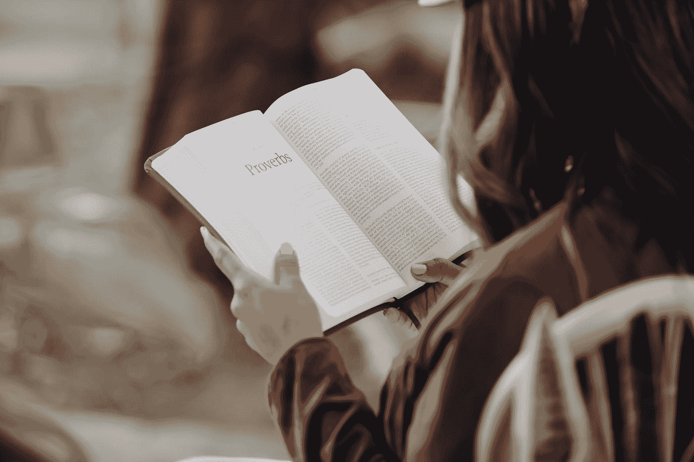

# 读书的力量！！！

> 原文：<https://medium.com/coinmonks/power-of-reading-books-c93a4eb52034?source=collection_archive---------13----------------------->

## 读书如何改变了我的生活

Photo by [Joel Muniz](https://unsplash.com/@jmuniz?utm_source=medium&utm_medium=referral) on [Unsplash](https://unsplash.com?utm_source=medium&utm_medium=referral)

从前有一个强壮的樵夫。樵夫去木材商那里找工作。看到他的体格，木材商欣然任命他做这项工作。工资很高，工作条件也很好。木材商给了他一把斧子，还给他看了他应该工作的地方。第一天，樵夫买了 18 棵树。他的主人非常高兴，并感谢他的努力。

在主人的鼓励下，樵夫第二天更加努力地工作，但他只砍了 15 棵树。第三天，他更加努力，但只能带回 10 棵树。日复一日，他带来的树越来越少。樵夫认为他一定是体力不支了。他去找老板道歉，说他不明白发生了什么事。

木材商问:“你上次磨斧子是什么时候？”

*樵夫答道，“磨刀？我没有时间磨利我的斧头。我一直忙于砍树…”*

我们的生活也变得和上面的故事有些相似。我们在日常活动中如此忙碌，以至于我们从来没有时间去研究我们的知识，学习新的技能和磨利我们的斧子。

你们中有多少人曾经买过自助和励志书籍，读了 10-15 页，却从未读完？

过去一年半以来，我每周都在读一本书，我可以说这完全改变了我的生活。我观察到我的思维方式发生了 360 度的转变。

我非常没有耐心，脾气暴躁，容易紧张，但现在我没有那么没有耐心，脾气暴躁，容易紧张。

我以前缺乏自我意识，现在我有点自我意识了。

这些都是我在一段时间内，仅通过书本学习和实践的。

据说你是和你一起度过大部分时间的 5 个人的平均值。可能是你的收入，你的习惯，你的技能，你的态度。你所拥有的一切是你花了大部分时间的 5 个人的平均值。所以，如果你想变得富有，花时间和富有的人在一起，你的收入会自动开始增长。

你们中的一些人可能会问，你想成为百万富翁，但为什么百万富翁会给你他们的时间。所以和他们相处的最好方式就是读他们的书。如果你想成为百万富翁，读读沃伦巴菲特、比尔盖茨、史蒂夫乔布斯写的书，这样你就可以把时间花在他们身上，提高你的平均水平。

如果想成为政治家，读读伟大领袖圣雄甘地、纳尔逊·曼德拉、阿卜杜勒·卡拉姆博士等人的书。

任何开始阅读书籍的人最初都面临两个主要困难，如何养成每天阅读的习惯/如何记住你所学的知识？

**所以，我要给你 3 个方法来让你每天都过得更好**

i) **拿起正确的书:**假设你肚子痛，有人说头疼，医生会吃。选择一本书就像类似的事情。你需要确定你在生活中面临的挑战，可能是时间管理、财务管理、动机、技能，然后相应地拿起你的书。与你的问题相关的书会与你有更好的联系，你会在两者之间感到厌倦。

ii) **放弃一本书，但永远不要放弃阅读习惯**:如果你对中间的任何一本书都失去了兴趣，放弃那本书比放弃阅读习惯要好。有些书可能和你的想法没有共鸣，完全没关系。继续看下一本书，但不要放弃你的习惯。

iii) **分享以记忆更久:**无论你学到什么，都要与你的朋友、家人或晚辈分享。你分享的越多，你记得的时间就越长。

这个世界上所有成功的人都有一个共同的习惯，那就是大量阅读。年轻的埃隆·马斯克在成长为特斯拉首席执行官之前，每天阅读 10 个小时。前微软 CEO 比尔·盖茨每周都会读一本新书。沃伦·巴菲特每天花大约 8 个小时阅读。看书其实不是一种习惯，而是一种生活方式。

最后我只想说 ***“只有一件事可以取代一本书，那就是下一本书。今天的读者就是明天的领导者。”***

> 交易新手？尝试[加密交易机器人](/coinmonks/crypto-trading-bot-c2ffce8acb2a)或[复制交易](/coinmonks/top-10-crypto-copy-trading-platforms-for-beginners-d0c37c7d698c)