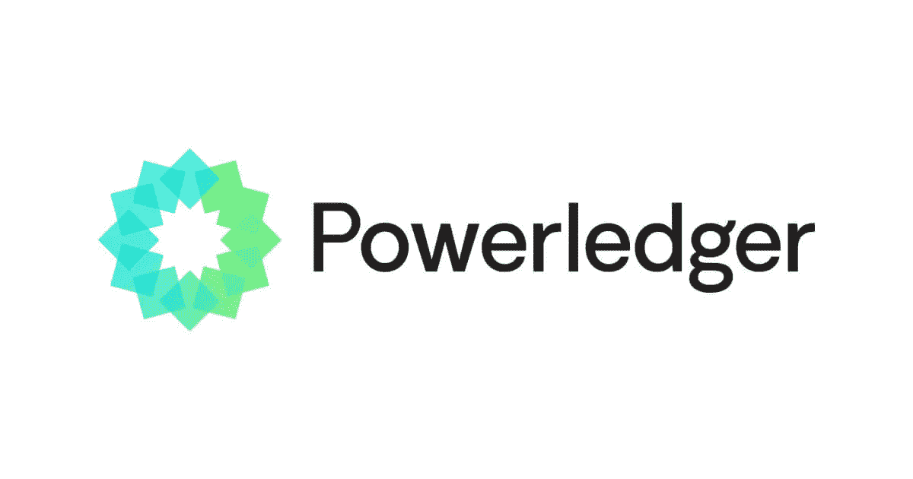
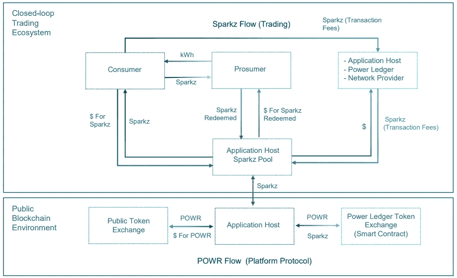
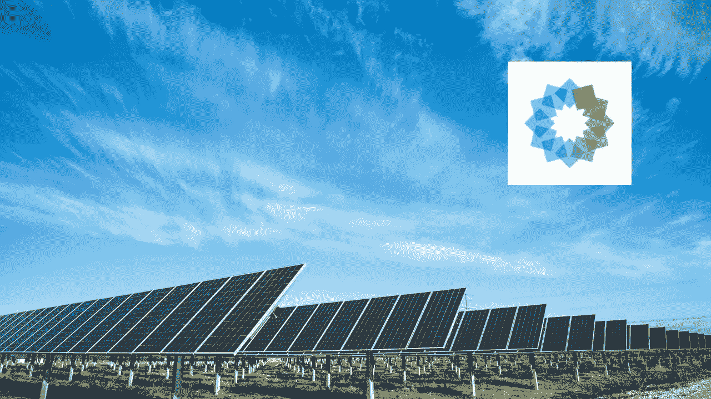

# Powerledger:保护环境的绿色加密货币

> 原文：<https://medium.com/coinmonks/powerledger-green-cryptocurrencies-for-the-environment-97d6b104d7d4?source=collection_archive---------28----------------------->

在这篇文章致力于接近协议的[之后，我继续回顾绿色加密货币。今天我要谈的是 Powerledger (POWR)，一家为可持续未来的分布式和分散式能源市场开发软件的技术公司。](/block6/near-protocol-green-cryptocurrencies-for-the-environment-511309dd3059)

Powerledger (POWR)

PowerLedger 的目的是帮助人们交易能源、交易环境商品和投资可再生能源，为其客户和合作伙伴开发软件，使消费者和生产者能够跟踪、追踪和交易每千瓦的能源。‍信息技术公司开发了一个位于区块链的平台，能够跟踪和交易能源、弹性服务和环境商品。它的目标是为完全现代化的、市场驱动的电网提供平台，在推动电力民主化的同时，为消费者提供能源选择。Powerledger 在 12 个国家拥有超过 30 家客户，其技术获得了全球认可，包括理查德·布兰森爵士在 2018 年举办的国际极限技术挑战。Powerledger 将其自己的区块链平台 Powerledger 能源区块链从以太坊迁移到了基于 Solana 的区块链，后者速度快得多，能够支持更高的交易吞吐量。现在，Powerledger 能源区块链是一个定制的许可索拉纳区块链，利用历史证明和利益证明(PoS)共识机制。

The dual token’s ecosystem of Powerledger

Solana 的 PoS 设计意味着验证者需要被 Powerledger 邀请，并且只有那些被 Powerledger 接受的人才能参与，同时考虑每个验证者使用的能源的来源，包括可再生能源。Powerledger 使用两个令牌，Powerledger (POWR)和 Sparkz 令牌。POWR 令牌将作为电力总账生态系统的燃料。POWR 代币有助于促进低成本和更好的电力回报。现有的 POWR (ERC-20)代币将保留在以太坊主网上，股份和奖励都可以用现有的 POWR 代币兑换和支付。为了全球同步生态系统并创建跨市场电力兼容性，第二个令牌 Sparkz 用于生态系统交易。Sparkz 代币以平台参与者的当地货币定价、发行和兑换。购买足够数量的 POWR 代币允许应用程序主机访问生态系统，从那里他们可以将他们的 POWR 代币转换为 Sparkz 并加入他们的客户群。要阅读白皮书，请点击[这里](https://www.powerledger.io/company/power-ledger-whitepaper)。

The purpose of PowerLedger is to help people transact energy, trade environmental commodities and invest in renewables

Powerledger 成立于 2016 年，总部位于西澳大利亚珀斯。该公司的领导人物是联合创始人兼执行主席 Jemma Green，致力于为消费者创造一个可行的可再生能源市场。

Dr. Jemma Green

她拥有著名的剑桥大学*可持续发展领导力*硕士学位。在伦敦摩根大通工作期间，格林博士很早就设定了自己的职业轨迹，成为了大额融资业务中可持续发展和企业社会责任的代言人。然后，她成为了科廷大学的研究员，珀斯市副市长，建立了澳大利亚第一个化石燃料免费养老基金，并加入了许多支持可持续商业的董事会。2018 年，格林博士获得了理查德·布兰森爵士的极限科技挑战奖，随后获得了 EY 金融科技年度企业家奖。她也是*区块链澳大利亚*的研究员。

Powerledger 已经自豪地获得了众多知名组织颁发的奖项，最近的奖项有:

- *亚洲可再生能源市场* — 2022 年

-*2021 年世界峰会因其对联合国可持续发展目标议程的贡献而获奖*，其在印度北方邦的对等项目赢得了钻石奖

- *Alperia Startup Factory 凭借其创新的能源交易平台荣获 2019 年*

-*2019 年世界绿色经济峰会*，由迪拜电力&水务局发起。

Powerledger 与泰国能源集团 TDED 合作，在全国范围内开发点对点能源交易和环境商品交易解决方案。在 Powerledger 的帮助下，TDED 设计了一系列名为“智能城市”的沙盒实验。试验的成功使得该项目进一步扩大了太阳能发电。“我们的项目是探索可能性。BCPG 总裁兼 TDED Bundit Sapianchai 董事长说:“这是这座城市将如何使用清洁分布式能源的一个缩影。

Powerledger 在 [Coinmarketcap](https://coinmarketcap.com/currencies/power-ledger/) 上的排名在最大写硬币的第 150 位和第 200 位之间波动。

在下面留下评论，告诉我你是否知道其他值得注意的绿色加密货币。把这个空间当成一个没有审查的谈话场所。

胜利者是永不放弃的梦想家。

***免责声明*** *:我不知道所使用的图片有任何第三方权利。如有任何资料来源，我保证予以引用，如有要求，我将调整立场。*

***免责声明*** *:交易加密货币具有很高的风险，可能不适合所有投资者。在决定交易加密货币之前，你应该仔细考虑你的投资目标和你的经验水平。自己做研究。此处表达的所有观点归各自作者所有，不应被视为任何形式的财务建议。*

> 交易新手？尝试[加密交易机器人](/coinmonks/crypto-trading-bot-c2ffce8acb2a)或[复制交易](/coinmonks/top-10-crypto-copy-trading-platforms-for-beginners-d0c37c7d698c)