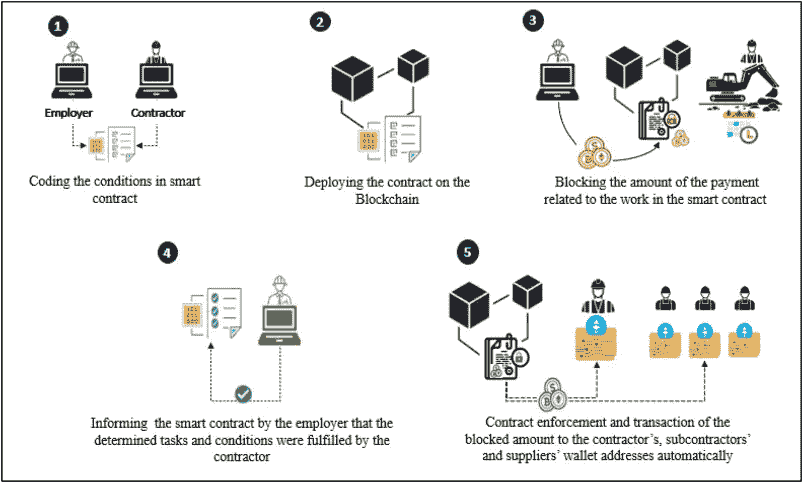

# 开发智能合同时的注意事项

> 原文：<https://medium.com/coinmonks/precautions-while-developing-smart-contracts-e90e8e42535f?source=collection_archive---------18----------------------->



Security Precautions

可升级性

由于需求或新的错误，您的智能合约中会有新功能的要求，但一旦您部署了智能合约，就不可能更改合约(嗯…)，但通常会更改概念和理解。

有许多方法可以升级您的合同功能:

1.  创建一个升级的合同，然后从旧合同联系它，但有一些需要考虑的问题，如它不应该破坏功能，数据不应该孤立，它不应该花费高昂的天然气费。这可以通过两种方式实现:

A.创建注册中心合同:注册中心合同将具有新的、更新的和旧的合同的地址，并在升级合同时更改角色

```
pragma solidity ^0.5.0;

contract RegisterContract {
    address backendContract; // new updated contract
    address[] previousBackends;// all the old version contract
    address owner;

    constructor() {
        owner = msg.sender;
    }

    modifier onlyOwner() {
        require(msg.sender == owner)
        _;
    }

    function changeBackend(address newBackend) public
    onlyOwner()
    returns (bool)
    {
        if(newBackend != address(0) && newBackend != backendContract) {
            previousBackends.push(backendContract);
            backendContract = newBackend;
            return true;
        }

        return false;
    }
}
```

这种方法的问题是应该知道最新的合同地址，因为有可能使用旧的合同。第二个问题是数据传输，如何传输数据需要非常小心。

2.创建中继协定并使用委托呼叫来传输数据

基本上，回退功能会将数据传输到当前版本的合同。制定了一个中继协定，它将通过回退功能将数据从旧协定传输到新协定，但这种方法的问题是它只能转发调用，不能返回值

```
pragma solidity ^0.5.0;contract Relay {
    address public currentVersion;
    address public owner; modifier onlyOwner() {
        require(msg.sender == owner);
        _;
    } constructor(address initAddr) {
        require(initAddr != address(0));
        currentVersion = initAddr;
        owner = msg.sender; // this owner may be another contract with multisig, not a single contract owner
    } function changeContract(address newVersion) public
    onlyOwner()
    {
        require(newVersion != address(0));
        currentVersion = newVersion;
    } fallback() external payable {
        (bool success, ) = address(currentVersion).delegatecall(msg.data);
        require(success);
    }
}
```

人们需要非常小心如何在新的合同中存储数据，它应该有与前一个相同的存储布局，否则它会损坏数据

# 断路器

停止除撤销之外的所有功能，受信任方只能撤销

# 减速带:

减速过程(冷静期)刀攻有 27 天资金回笼

# 限速

要求提款或认沽条件批准只有一定数量的钱可以提取

# 部署

合同应该有一个长时间的测试期——在大笔资金被置于风险之前。

至少，您应该:

*   拥有 100%测试覆盖率(或接近 100%)的完整测试套件
*   在您自己的测试网上部署
*   部署在公共测试网上，提供大量测试和 bug 奖励
*   详尽的测试应该允许不同的参与者大量地与合同进行交互
*   在测试版中在 mainnet 上部署，对风险金额进行限制

> 交易新手？试试[加密交易机器人](/coinmonks/crypto-trading-bot-c2ffce8acb2a)或者[复制交易](/coinmonks/top-10-crypto-copy-trading-platforms-for-beginners-d0c37c7d698c)