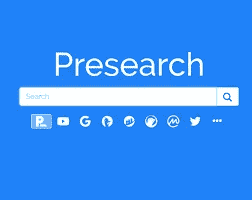
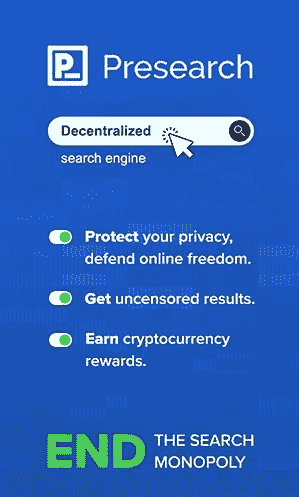

# 预搜索—浏览以获得

> 原文：<https://medium.com/coinmonks/presearch-browse-to-earn-1b0ee4ffd244?source=collection_archive---------32----------------------->

## 还可以免费做广告！—网络三大奇迹#1

想象一下通过浏览互联网赚钱。不用想象，现实生活中已经在发生了！事实上，今天有不止一个搜索引擎授予你密码，但我想深入研究[预搜索](https://presearch.com/signup?rid=3651041)，由于它的众多革命。

***上读*** [***镜像***](https://mirror.xyz/0xAEF7C59DE837249D696289A19Dd0DC029Dee0fcD/wpmxF4QTHVZNtHd2QhjkOvIF4TIiXKugQ-vhapfc2Jo) ***。上读*******。****

*预搜索是一个类似谷歌浏览器的搜索引擎，但是有很多改进。*

*1.首先&也是最简单的:你在每次搜索中都赚钱。多少钱？取决于 PRE， [Presearch](https://presearch.com/signup?rid=3651041) 的令牌值多少钱；这在公开的加密市场上不断变化。你每次搜索可以获得 0.01 代币，每天最多 30 次付费搜索，根据当前价格，每天总计约 0.30 美元。考虑到 PRE 的需求，我肯定不会建议你现在卖掉 PRE，因为从长远来看，它会比现在更高。不过如果你坚持的话，可以在 [Kucoin](https://www.kucoin.com/ucenter/signup?rcode=rJZ2FP6) 上卖。*

***此外，如果您使用** [**这个推荐链接**](https://presearch.com/signup?rid=3651041) **来注册，您将获得 25 英镑的 PRE 免费！***

***2。**下一个优势:[预搜索](https://presearch.com/signup?rid=3651041)是去中心化的。没有审查，也没有人能监视你——用户保留完全的隐私和选择权；不像今天的任何浏览器。虽然不是每个阿猫阿狗都关心这些问题，但本质上这是一种显著的品质。此外，它增加了去中心化 IoT(物联网)的基础，但那是它自己的主题。*

***3。**大发明:[预研](https://presearch.com/signup?rid=3651041)推出了一个全新的广告系统，叫做“关键词跑马圈地”。*

**

*他们设计了一种拍卖式的方法来“出价”以“借用”关键词，而不是现有的无休止地消耗营销预算的每次点击成本模式。你在你希望你的广告出现的词上下注[= reserve]PRE token(你可以在 Kucoin 上购买)，如果你是最高出价者，你的广告——每个关键词只有一个广告——就会出现在浏览器上。如果有一天有人出价比你高，你会得到通知，你可以添加 PRE 来重新获得第一名，或者取消那个广告，换一个不同的词。*

*假设你在巴黎经营一家名为“Délices Chinois”的餐馆，你想吸引顾客，我相信基本上有两个选择关键词的好策略；或者你选择你广告的主题，例如食物、巴黎、餐馆，或者你试着对搜索最多的热门词汇竞价，如天气、脸书、俄国等。当然，你必须专注于写一个吸引眼球的标题，以吸引观众…*

*在关键词标记面板上，你可以留意你的广告，看看哪些广告成功了，哪些没有。如果你对广告不再感兴趣，就取消你的广告，拿回你的钱！你现在体验了免费营销！*

*我知道你在对自己傻笑，心想“好吧，那就是*如果*价格保持不变……”*

*让我告诉你:我收购 PRE——完全不是出于广告目的——纯粹是作为一种投资！据我所知，世界上没有类似的宣传方法，对 PRE 的需求逐年增长，这也导致价格飙升！仅仅因为是全球经济衰退的一部分，它现在比 2021 年的上限下降了 77%,所以这是一个很大的折扣。在我个人看来，将下一个峰值定在 1.25 美元还是相当保守的。像 CoinMarketCap、Polk Audio、CoinGecko、加拿大人民党和反叛新闻、每日电讯、亚马逊大卖家以及更多的知名公司已经在 [Presearch](https://presearch.com/signup?rid=3651041) 上为关键词下注数百万预代币，更多的公司可能会在不久的将来抓住这个机会。*

*更多好处是:*

*4.如前所述，每次搜索你只会看到一个广告。*

*5.任何加密项目搜索的信息和链接的漂亮显示。*

*6.其他有趣的功能和设置。*

*7.如果你比较老练，你可以运行一个[预搜索](https://presearch.com/signup?rid=3651041)节点。*

**

*现在加入[预搜索](https://presearch.com/signup?rid=3651041)开始享受区块链的力量，并下载他们的[扩展](https://chrome.google.com/webstore/detail/presearchorg-search-exten/inpoelmimmiplkcldmdljiboidfkcfbh?hl=en-US)开始预令牌流…*

> *交易新手？试试[密码交易机器人](/coinmonks/crypto-trading-bot-c2ffce8acb2a)或[复制交易](/coinmonks/top-10-crypto-copy-trading-platforms-for-beginners-d0c37c7d698c)*