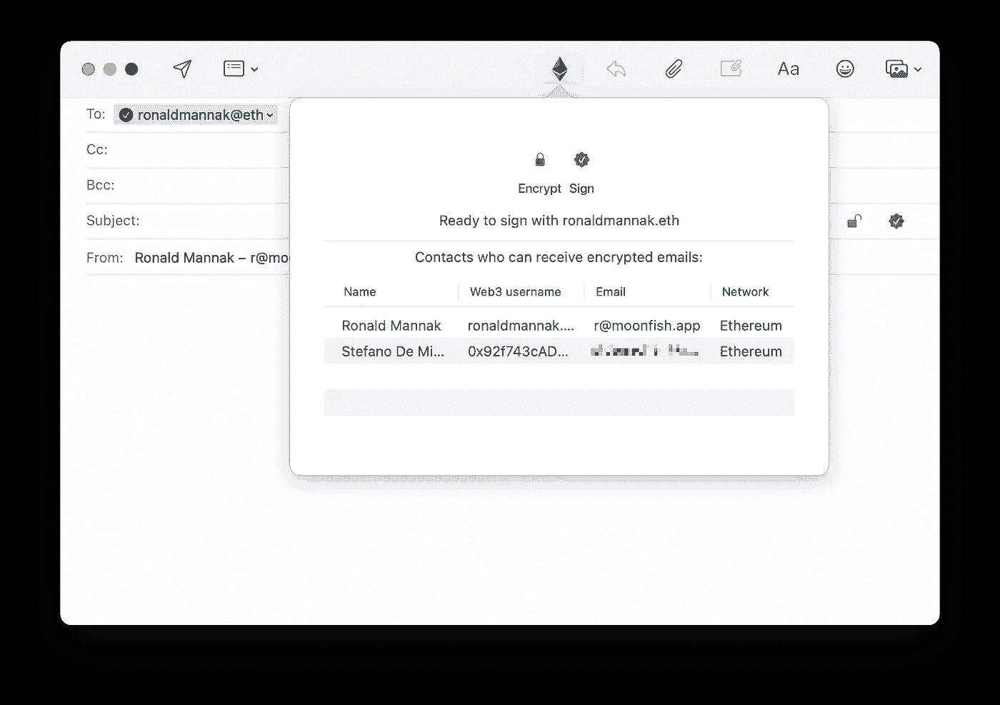
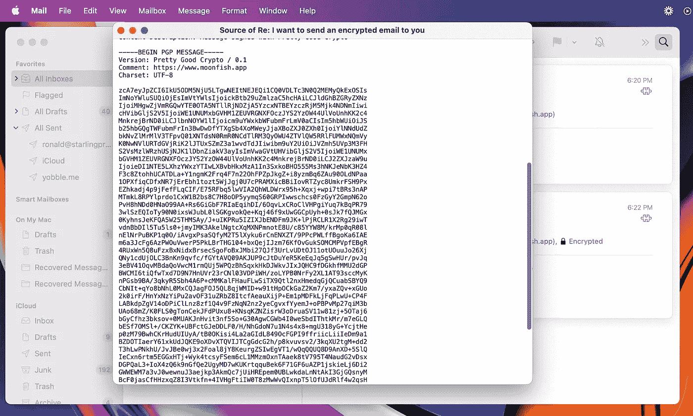

# 相当好的加密:以太坊加密电子邮件

> 原文：<https://medium.com/coinmonks/pretty-good-crypto-ethereum-encrypted-e-mail-e59bae3b78e?source=collection_archive---------14----------------------->

Pretty Good Crypto 使用以太坊密钥为普通消费者带来了企业级电子邮件加密和反网络钓鱼功能。

AI Generated Ethereum encrypted e-mail (Craiyon)

# 隐私很正常。除了电子邮件

[隐私是正常的](https://twitter.com/zooko/status/1558211567748988929?s=20)2022 年无处不在。[信号](https://signal.org)、 [FaceTime 和 iMessage](https://www.apple.com/ca/privacy/features/) 都是端到端加密的，https 加密网站流量，Zcash 加密加密交易。

然而，在 2022 年，电子邮件仍然不加密发送。电子邮件以不加密的方式存储在您的设备上。电子邮件以不加密的方式存储在邮件服务器上。

# 面向所有人的企业级电子邮件加密

端到端加密电子邮件确实存在。企业使用加密电子邮件(相当好的隐私，PGP T7)，但几乎没有人使用它。为什么？因为如果你是消费者或者小企业，PGP 是很难使用的。只需阅读“[我在 PGP 上认输，我在安全部门工作，如果你需要安全地联系我，请给我发短信，询问我的信号号码](https://arstechnica.com/information-technology/2016/12/op-ed-im-giving-up-on-pgp/)。”是的，有那么糟糕。

我们认为每个人都有隐私权。PGP 是安全的，但永远不会成为主流。至少目前还没有。因此，我们着手发明一种更好、更容易使用的 PGP 替代品:**open PGC——相当好的加密技术**。

OpenPGC 是一个新的区块链不可知的标准，它使用加密密钥对电子邮件进行加密和签名。签名和加密发生在链外，所以发送 OpenPCG 加密的电子邮件没有汽油费。

用户处于控制中。钥匙是自我保管的，OpenPCG 鼓励自我寻找外国身份。

OpenPGC 使用现有的链上身份协议来认证用户。例如，在下面的截图中，一封电子邮件被发送到链上，并使用 ENS web3 用户名进行验证。不喜欢 ENS？只需使用任何其他链上身份协议。或者使用多个。

OpenPGC: End-to-end encrypt e-mails using crypto keys. We built Moonfish as an OpenPGC technology demo. You can send e-mails directly to ENS web3 usernames. How awesome is that?

# 开放带来力量

开放性是 OpenPGC 的巨大优势。不仅使 it 用户能够选择他们最喜欢的区块链或身份协议，它还使 OpenPGC 能够随着新的、更好的、可能更安全的区块链和身份协议的发明而改进。这对于固定的孤立标准(如 PGP)来说几乎是不可能的。

OpenPGC build on proven standards where possible, such as EIP-1024 (Cross-client Encrypt/Decrypt), EIP-712 (Typed structured data hashing and signing) and RFC-4880 (OpenPGP).

# 接下来去哪里？

想看看 OpenPGC 的实际应用吗？看看[用 Moonfish 发送端到端的加密电子邮件](/@ronaldmannak/sending-end-to-end-encrypted-e-mail-with-moonfish-ba2ce1e649fb)。

想支持 OpenPGC？[支持我们的 Gitcoin 提案](https://gitcoin.co/grants/7217/open-pretty-good-crypto-enterprise-level-private-e)。

> 交易新手？试试[密码交易机器人](/coinmonks/crypto-trading-bot-c2ffce8acb2a)或者[复制交易](/coinmonks/top-10-crypto-copy-trading-platforms-for-beginners-d0c37c7d698c)