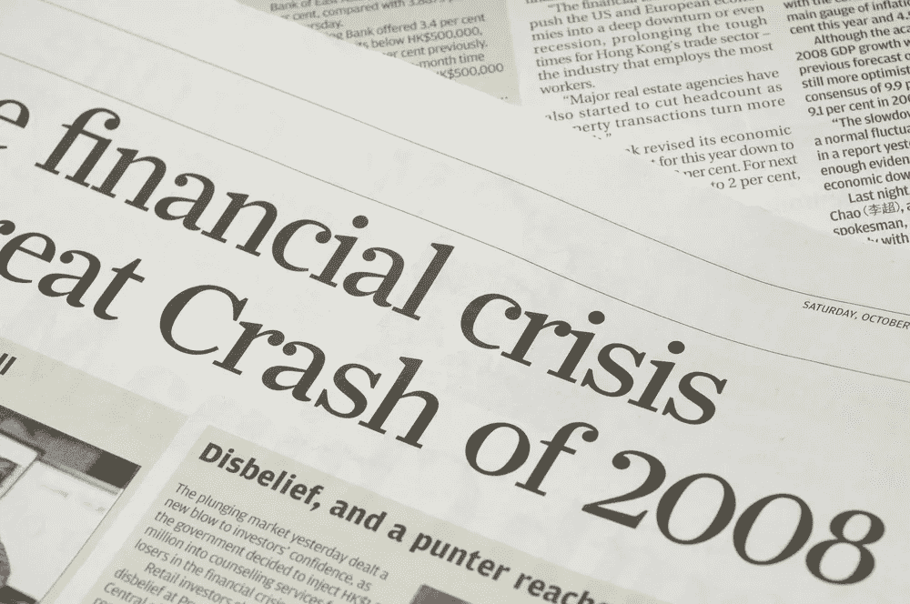

# 预防未来的金融危机:我们能从 2008 年危机中学到什么！

> 原文：<https://medium.com/coinmonks/preventing-future-financial-crises-what-we-can-learn-from-the-2008-crisis-3c3cfeeb2981?source=collection_archive---------20----------------------->

# 一.导言:

金融危机是指金融机构或资产突然失去大部分价值的情况。金融危机会给整个经济以及个人和企业带来严重后果。

Financial Crisis 2008

2008 年的金融危机是现代史上最严重的一次。它是由美国次级抵押贷款市场的崩溃引发的，导致了主要投资银行雷曼兄弟的破产。这场危机迅速蔓延到全球经济的其他领域，导致了大范围的经济衰退。许多国家实施了各种措施来应对危机，包括政府救助金融机构和一揽子刺激计划。

> 交易新手？在[最佳密码交易所](/coinmonks/crypto-exchange-dd2f9d6f3769)上尝试[密码交易机器人](/coinmonks/crypto-trading-bot-c2ffce8acb2a)或[复制交易](/coinmonks/top-10-crypto-copy-trading-platforms-for-beginners-d0c37c7d698c)

# 二。2008 年金融危机的原因:

2008 年金融危机的主要原因之一是次级抵押贷款市场。次级抵押贷款是发放给信用记录不良或债务水平高的借款人的房屋贷款。在危机爆发前的几年里，次级抵押贷款市场迅速扩张，部分原因是宽松的贷款标准和证券化的出现。证券化是将抵押贷款汇集在一起，作为证券出售给投资者的过程。

大型投资银行雷曼兄弟的倒闭是金融危机的另一个关键因素。雷曼兄弟大量投资于次级抵押贷款和其他高风险金融工具，当这些资产的价值开始下降时，该银行无法履行其金融义务。它在 2008 年 9 月的破产导致了流动性危机，因为其他持有雷曼兄弟债务的金融机构面临着巨大的损失。

衍生品和信用违约互换(CDS)的作用也助长了金融危机。衍生品是一种金融工具，其价值来源于基础资产，如抵押贷款或债券。信用违约掉期是一种衍生产品，作为债券违约的保险。这些工具的广泛使用，加上监管不足，导致金融机构相互关联，风险在全球金融体系中迅速传播。

# 三。金融危机的后果:

2008 年的金融危机给全球经济带来了严重后果，导致了大范围的经济衰退。许多国家经历了高失业率、房价下跌和经济增长放缓。这场危机还对全球经济产生了负面影响，因为贸易和投资流动放缓，金融市场经历了大幅波动。

世界各地的个人和企业都感受到了金融危机的影响。由于这场危机，许多人失去了工作、住房和存款。企业，特别是中小型企业，在获得信贷和保持盈利能力方面面临挑战。这场危机还对金融部门产生了长期影响，因为一些银行和金融机构被迫重组或与其他公司合并。

# 四。从金融危机中吸取的教训:

2008 年的金融危机带来了许多重要的教训，包括监管的重要性、政府干预的作用以及金融体系透明度和问责制的必要性。

一个教训是适当的监管对防止风险行为和确保金融体系稳定的重要性。这场危机暴露了监管框架的弱点，导致次级抵押贷款市场迅速扩张，衍生工具等风险金融工具激增。因此，许多国家实施了新的法规或加强了现有法规，以改善监督并降低未来危机的风险。

另一个教训是政府干预在解决金融危机中的作用。在危机期间，许多政府通过救助或其他措施向陷入困境的银行和其他金融机构提供金融支持。虽然这些行动可能会引起争议，但它们也可能是防止危机恶化和稳定金融体系所必需的。

最后，这场危机凸显了金融体系透明度和问责制的重要性。与某些金融工具(如次级抵押贷款和 CDS)相关的风险缺乏透明度，导致风险在全球金融体系中迅速传播。确保金融机构对其运营和风险保持透明有助于防止未来的危机。

# 动词 （verb 的缩写）预防未来金融危机的步骤:

可以采取一些措施来防止未来的金融危机。其中包括:

1.  加强监管框架:这包括实施新的法规或加强现有的法规，以更好地监督金融系统和防止风险行为。这可以包括提高金融机构资本要求和提高金融市场透明度等措施。
2.  增加透明度和问责制:确保金融机构对其业务和风险透明有助于防止未来的危机。这可以通过改进报告和披露要求以及利用独立审计员和其他监督机制来实现。
3.  减少对高风险金融工具的依赖:某些金融工具的使用，如次级抵押贷款和信用违约互换，在 2008 年的金融危机中发挥了重要作用。减少对这些工具的依赖，并找到降低其风险的方法，有助于预防未来的危机。这可能涉及引入新的法规或限制某些工具的使用。

# 不及物动词结论:

总之，2008 年的金融危机是对全球经济产生深远影响的重大事件。这是由多种因素造成的，包括次级抵押贷款市场的扩张、雷曼兄弟的倒闭以及衍生品等高风险金融工具的使用。这场危机导致了广泛的经济衰退，并对世界各地的个人和企业产生了负面影响。

我们可以从金融危机中吸取一些教训，包括监管的重要性、政府干预的作用以及金融系统透明度和问责制的必要性。为了防止未来的金融危机，重要的是实施预防性措施，如加强监管框架，提高透明度和问责制，以及减少对高风险金融工具的依赖。通过采取这些措施，我们可以努力确保金融体系的稳定性和弹性。

谢谢你走到这一步。有兴趣的可以在 [LinkedIn](https://www.linkedin.com/in/hazemmancy/) 、 [Twitter](https://twitter.com/HazemMancy) 、[脸书](https://www.facebook.com/HazeMancy/)关注我！

> 加入 Coinmonks [电报频道](https://t.me/coincodecap)和 [Youtube 频道](https://www.youtube.com/c/coinmonks/videos)了解加密交易和投资

# 另外，阅读

*   [加拿大最佳加密交易机器人](https://coincodecap.com/5-best-crypto-trading-bots-in-canada) | [库币评论](https://coincodecap.com/kucoin-review)
*   [火币的加密交易信号](https://coincodecap.com/huobi-crypto-trading-signals) | [HitBTC 审核](/coinmonks/hitbtc-review-c5143c5d53c2)
*   [TraderWagon 回顾](https://coincodecap.com/traderwagon-review) | [北海巨妖 vs 双子星 vs BitYard](https://coincodecap.com/kraken-vs-gemini-vs-bityard)
*   [如何在 FTX 交易所交易期货](https://coincodecap.com/ftx-futures-trading)
*   [OKEx vs KuCoin](https://coincodecap.com/okex-kucoin) | [摄氏替代品](https://coincodecap.com/celsius-alternatives) | [如何购买 VeChain](https://coincodecap.com/buy-vechain)