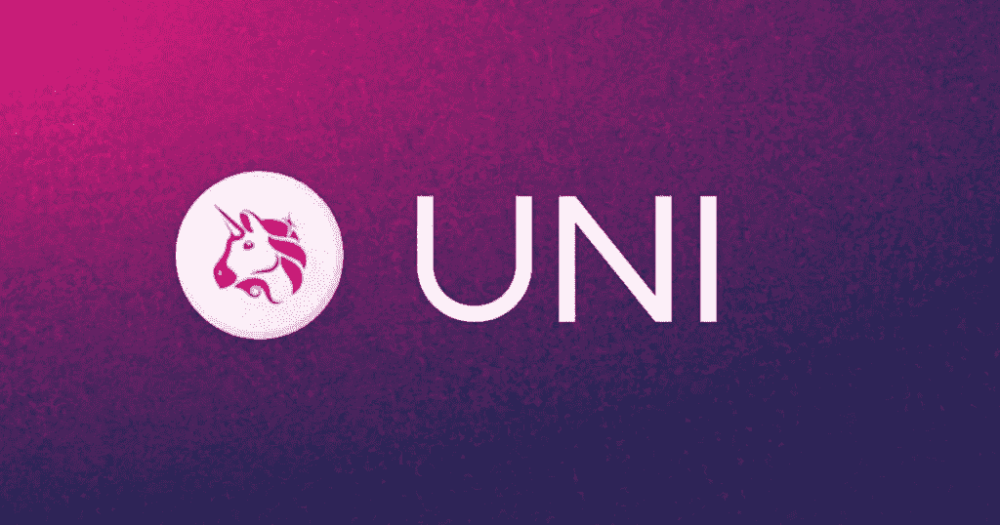

# 价格预测

> 原文：<https://medium.com/coinmonks/price-prediction-uniswap-uni-4a2458b3bba3?source=collection_archive---------27----------------------->

Source photo [Uniswap — Bing images](https://www.bing.com/images/search?view=detailV2&ccid=J1X2judn&id=122251538238ECF5BF461357C51CD24AE7F5E32C&thid=OIP.J1X2judnyRhWHUX3OYU5iAHaD5&mediaurl=https%3a%2f%2fwww.altcoinbuzz.io%2fwp-content%2fuploads%2f2020%2f11%2funiswap-logo-1024x538.jpg&cdnurl=https%3a%2f%2fth.bing.com%2fth%2fid%2fR.2755f68ee767c918561d45f739853988%3frik%3dLOP150rSHMVXEw%26pid%3dImgRaw%26r%3d0&exph=538&expw=1024&q=Uniswap&simid=607995635242505220&FORM=IRPRST&ck=FA8CD41E59F0AB1F5EFF7A9D0D470F54&selectedIndex=2&ajaxhist=0&ajaxserp=0)

分散式交易所 Uniswap 基于以太坊区块链，利用 UNI 作为其强大的加密令牌，使用户能够交易各种数字货币。

经过多年的成功运作，Uniswap 首次推出了一个令牌，允许其成员参与其协议的制定。由于……用户将能够对重要的改进和项目进行投票