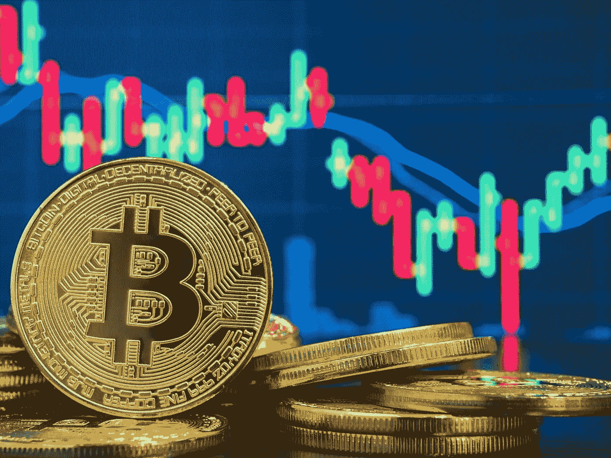

# 许多密码的价格在 6 月份走低，比 2021 年的高点下跌了 70%以上

> 原文：<https://medium.com/coinmonks/prices-for-many-cryptos-moved-lower-in-june-and-are-down-over-70-from-2021-highs-3be2c06cae21?source=collection_archive---------49----------------------->

# 像比特币[**【BTCUSD】、**、**、【ETHUSD】、【2.04%】**、](https://www.marketwatch.com/investing/cryptocurrency/BTCUSD?iso=kraken&mod=MW_story_quote)这样的加密货币近年来人气大增，现在个人投资者和大公司都在交易，比如[特斯拉](https://www.cnbc.com/2021/02/08/tesla-buys-1point5-billion-in-bitcoin.html) [**TSLA、0.08%**](https://www.marketwatch.com/investing/stock/TSLA?mod=MW_story_quote) 和[花旗银行](https://markets.businessinsider.com/news/currencies/13-top-banks-investing-cryptocurrency-blockchain-technology-funding-blockdata-bitcoin-2021-8)。