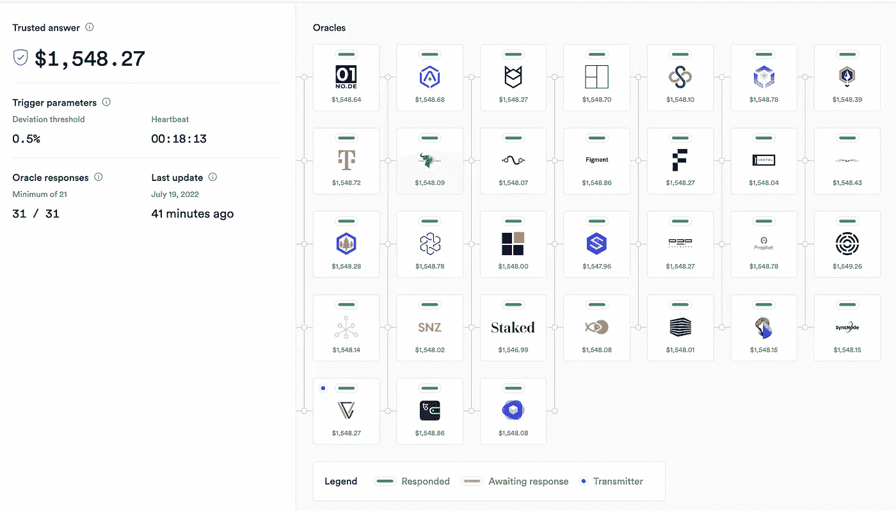

# 符合法规的定价神谕，允许新的机构投资机会

> 原文：<https://medium.com/coinmonks/pricing-oracles-that-are-consistent-with-regulations-to-permit-new-institutional-investment-193d2e84fb9b?source=collection_archive---------61----------------------->

# Kaiko 现在为机构投资者和企业提供许可的、符合 GAAP 和 AIFMD 的加密货币定价数据。

焦点在于对加密货币领域进行更多监管的呼声越来越高，这将如何影响 web 3 的基本原则。为 DeFi 和更大的行业提供动力的数据来源是一个经常被忽视的领域。

像 oracles 这样的数据流将各种价格数据源组合成一个可靠的数据源。该方法使用信任聚合作为数据准确性的衡量标准。

世界上最大的 oracles 之一 Chainlink 使用“认证提要”来增加聚合过程的安全性。然而，这些信息可能不符合美国证券交易委员会或 ESMA 法规所涵盖的机构公司的标准。

[caption id = " attachment _ 249083 " align = " align center " width = " 469 "]

来源:Chainlink[/caption]

然而，甲骨文的定价操纵已经显著增长，导致镜像协议、逆向金融和德乌斯金融等系统上的昂贵利用。当有太多被利用的数据源，Oracle 定价不再准确反映真实世界的价值时，问题就出现了。这种利用可能会导致资金被抽走，利用短期贷款从差价中获利。

Kaiko 的创作者 Alexander Coenegrachts 在 EthCC 上表示，该公司赢得了演员挑战赛，该挑战赛提供

“企业家可获得高达 15 万€的奖金，每位获奖者都将有机会与国际机构进行真正的安全令牌交易。”

Kaiko 为“符合监管要求”的数据流提供“商业级”解决方案，允许成熟的机构参与者从加密货币市场中获利。欧盟的 AIFMD 和美国的公认会计原则框架都要求特定机构行为者遵守数据流。

获得完全符合要求的定价神谕可能会为加密指数铺平道路，因为获得此类信息的难度使美国无法拥有现货比特币 ETF。一旦其他监管障碍被克服，使用这种神谕也可能使包含前 10 大加密货币的一篮子 ETF 成为可能。

符合 AIFMD 或 GAAP 的解决方案也需要数据提供商的合规性。最近与 Kaiko 的许可协议使

根据美国通用会计准则和欧盟 AIFMD，“Kaiko 的综合报价是市场上第一个由买方提供的证券定价解决方案，以标记至矩阵或标记至模型的数字资产。”

对于加密货币行业来说，这是一个重大进步，因为它正在努力获得现有金融系统的认可。S&P 全球、道琼斯、GBBC，以及莱杰、梅萨里和 Coin Shares 等大量加密货币专用业务已经在使用 Kaiko 的数据。

> 交易新手？试试[加密交易机器人](/coinmonks/crypto-trading-bot-c2ffce8acb2a)或者[复制交易](/coinmonks/top-10-crypto-copy-trading-platforms-for-beginners-d0c37c7d698c)