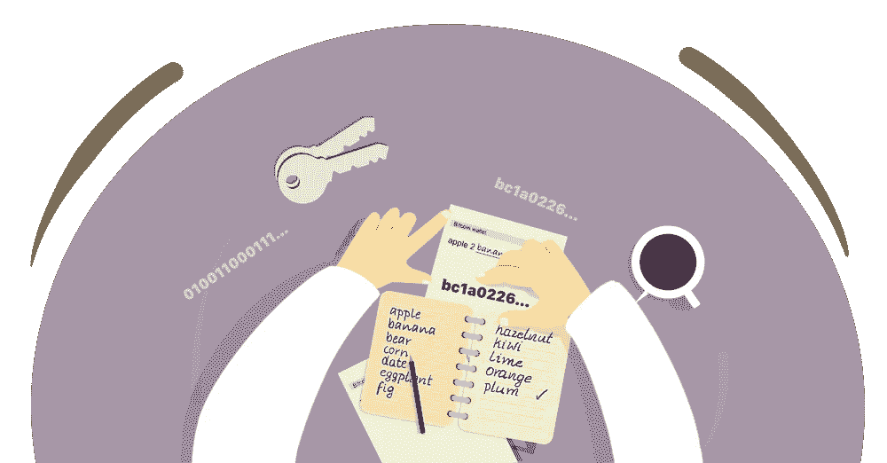
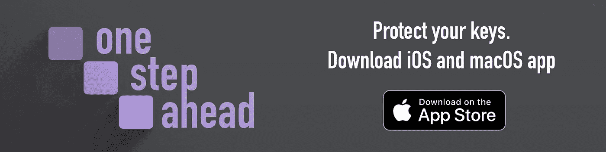

# 简而言之就是私钥

> 原文：<https://medium.com/coinmonks/private-keys-in-nutshell-5d1f224acfaf?source=collection_archive---------25----------------------->

区块链有许多同样重要的组成部分；没有他们，这个谜题就不完整。其中一个是私钥。

每个进入加密货币领域的人都应该知道私钥的作用，并了解它是如何工作的。

私钥永远不会单独出现，它总是与公钥一起创建。私钥应该始终以最高的私密性来保管，并且永远不要与他人共享。它*构成所有权，*而失去它，就相当于失去了资产。重新创建私钥在技术上是不可能的；因此，好好照顾它们应该是你的首要任务。

公钥允许接收加密资金(公共地址从它得到)；私钥允许发送资金。

Private Key front image

One Step Ahead app for iOS and macOS

# 助记短语

***注:*** *我们在本文中使用术语* ***助记短语****；然而，还有许多其他名字在流传。常见的有“***”、“* ***种子短语*** *”、“* ***种子*** *”、“* ***恢复词*** *”或“* ***恢复键****

**当你设置钱包时，你很可能会收到一个叫做**助记短语的东西。****

**一个**助记短语**是一组 12 到 24 个单词，只不过是一个私钥的简单表示。在助记短语被引入之前(BIP39 提案——BIP 代表比特币改进提案),钱包的私钥对最终用户来说并不友好。通常，它们是长的、随机的字母数字字符，难以记忆，并且容易犯代价高昂的错误。**

**这些单词不仅仅是从英语词典中提取的单词；这些是符合特定标准的 2048 款精选产品。**

***你可以在这里找到完整的单词列表:*[*https://github . com/bitcoin/bips/blob/master/bip-0039/English . txt*](https://github.com/bitcoin/bips/blob/master/bip-0039/english.txt)**

***更多关于 BIP-39 和助记短语提议的详细信息，可以在这里找到:*[*https://github . com/bitcoin/bips/blob/master/bip-0039 . mediawiki*](https://github.com/bitcoin/bips/blob/master/bip-0039.mediawiki)**

## **为什么字数会有差别？**

**最常用的两种私钥长度是 128 位和 256 位。256 位版本被认为更安全。在撰写本文时，大多数钱包仍以 128 位运行。256 位私钥由 24 个字表示，而 128 位由 12 个字表示。**

**大多数情况下，您选择的钱包会为您生成私钥，作为一个助记短语。但是，您可以自己创建密钥。创建密钥的过程需要一些技术知识。你可以找到许多关于这个主题的在线教程，所以我们不会在这里涵盖细节。**

***如果你想自己生成一个私钥，可以按照本文来尝试:*[*https://www . freecodecamp . org/news/how-to-generate-your-very-own-bit coin-private-key-7 ad 0 f 4936 E6 c/*](https://www.freecodecamp.org/news/how-to-generate-your-very-own-bitcoin-private-key-7ad0f4936e6c/)**

## **相同的密钥，不同的格式**

**私钥有许多不同的格式。目前最流行的是**助记短语**，但它也可以用二进制形式(1 和 0)、十六进制(0–9 a-f)和字母数字字符串来表示。知道任何格式都足以再造一个钱包。**

**借助一些技术知识，您可以将一种格式转换为另一种格式，从一长串 1 和 0 中重新创建一个助记短语，然后将该助记短语转换为十六进制或字母数字字符串。**

## **一个钱包里的私钥能在另一个钱包里工作吗？**

**每个私钥对于特定的区块链技术都是唯一的。因此，如果你在一个钱包中创建了比特币的私钥，你可以在另一个支持比特币区块链的钱包中轻松恢复它。一般来说，你不能使用比特币钱包的私钥进入支持以太坊资产的钱包。虽然这听起来对一些人来说是显而易见的，但对许多人来说，这需要清楚。**

*****注*** *:一些应用钱包(即 Exodus)使用 BIP-39 助记符短语创建一个通用密钥来访问跨不同区块链的资产。***

**直接在应用程序 wallet 中使用助记短语来恢复资产可能会稍微复杂一些。钱包必须支持 BIP-39 提案。一些钱包有自定义的单词集或使用不同的技术，输入您的种子可能不起作用。经常检查钱包是否与你的助记短语兼容——钱包支持 BIP39 吗？钱包需要 12 个字还是 24 个字？**

# **猜测私钥的可能性有多大？**

**猜测任何现有的私钥几乎是不可能的。如果你想暴力破解一个特定的 128 位私钥，它将带你无限的处理能力已经存在。**

**那么助记短语怎么样？他们似乎更容易理解，所以它一定更容易猜测，对不对？不会。要猜 12 个单词，你必须从 2048 个单词的集合中知道确切的单词及其位置。当您尝试以 12 个字、十六进制、二进制或字母数字的形式暴力破解私钥时，没有任何区别。**

## **量子计算机怎么样？**

**量子计算不是主流，看起来近期也不会。**

**技术进步是渐进的，而不是突然的。量子计算机的采用将在旅途中实施必要的变革；量子计算机不会在一夜之间改变行业。关于量子电阻区块链的讨论是必要的，但不是至关重要的。**

**资源:**

** [## bips/bip-0039 . mediawiki at master bit coin/bips

### BIP: 39 层:应用程序标题:生成确定性密钥的助记码作者:马雷克·帕拉蒂努斯·帕沃尔·鲁斯纳克…

github.com](https://github.com/bitcoin/bips/blob/master/bip-0039.mediawiki)  [## 比特币大师 bips/english.txt

### 此时您不能执行该操作。您已使用另一个标签页或窗口登录。您已在另一个选项卡中注销，或者…

github.com](https://github.com/bitcoin/bips/blob/master/bip-0039/english.txt) 

[*https://www . freecodecamp . org/news/how-to-generate-your-very-own-bit coin-private-key-7 ad 0 f 4936 E6 c/#:~:text = Formally % 2C % 20a % 20 private % 20 key % 20 for，a%20series%20of%2032%20bytes。*](https://www.freecodecamp.org/news/how-to-generate-your-very-own-bitcoin-private-key-7ad0f4936e6c/#:~:text=Formally%2C%20a%20private%20key%20for,a%20series%20of%2032%20bytes.)

 [## 如何生成你自己的比特币私钥

### 在加密货币中，私钥允许用户访问他们的钱包。持有私钥的人…

www.freecodecamp.org](https://www.freecodecamp.org/news/how-to-generate-your-very-own-bitcoin-private-key-7ad0f4936e6c/) 

**下载我们领先一步的应用程序，帮助您保护您的钥匙:**

 [## 领先一步

### “领先一步”应用程序允许您在某种程度上保护您的机密信息，因此没有任何单一事件会导致…

apps.apple.com](https://apps.apple.com/de/app/one-step-ahead/id1592642367?l=en&mt=12) 

关注我们:

 [## 由脸书连接

www.facebook.com](https://www.facebook.com/OneStepAheadApp)  [## 领先一步

### u/OneStepAheadApp:领先一步应用的创始人

www.reddit.com](https://www.reddit.com/user/OneStepAheadApp) 

我们的网站:

 [## 脱机安全管理器

### 以独特的方式保护您的机密信息，因此没有任何单一事件会导致无法访问您的数据…

onestepahead.info](https://onestepahead.info/) 

> 交易新手？尝试[加密交易机器人](/coinmonks/crypto-trading-bot-c2ffce8acb2a)或[复制交易](/coinmonks/top-10-crypto-copy-trading-platforms-for-beginners-d0c37c7d698c)**