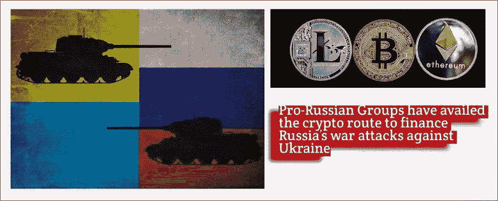
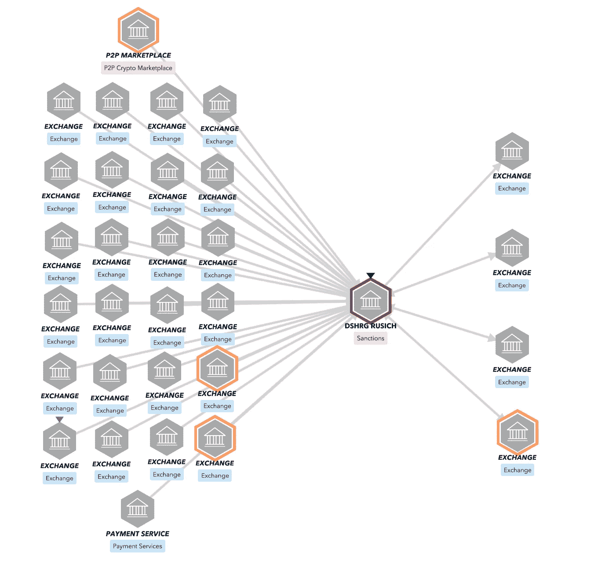
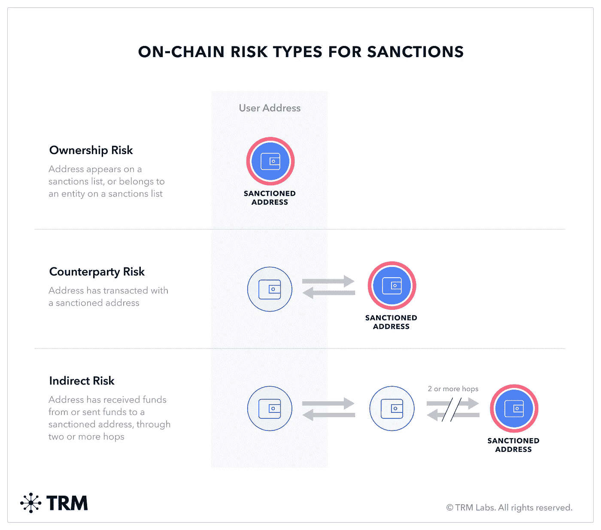

# 亲俄团体利用这一秘密途径资助俄罗斯对乌克兰的战争攻击

> 原文：<https://medium.com/coinmonks/pro-russian-groups-have-availed-the-crypto-route-to-finance-russias-war-attacks-against-ukraine-c322d1bdd55e?source=collection_archive---------32----------------------->

# 极端组织利用加密技术资助俄罗斯对乌克兰的攻击

随着熊市上演其戏剧，Crypto 现在可能对投资者没有吸引力，但它被禁止和制裁的实体如任务组 Rusich T1 用来资助俄罗斯对乌克兰的战争。

俄罗斯特遣部队是一个残忍的组织，2014 年活跃在俄罗斯在中东、非洲和乌克兰的作战行动中。由于该组织的极端主义行动，他们受到美国、欧盟、澳大利亚、加拿大和瑞士的制裁。

***不幸的是，自 2022 年 3 月以来，俄罗斯特遣部队已经能够使用 Telegram 等加密信息平台筹集 13.8 万美元的资金，以支持俄罗斯对乌克兰的攻击。***

***因此，使用受制裁的替代融资途径使集团很难使用传统的银行和支付渠道进行资金转移。***

# 受制裁的极端主义团体——俄罗斯特遣部队的秘密交易摘要

区块链分析组织 TRM 已经确定了与集团及其个人相关的活跃加密地址，并在此提供了一份[报告](https://www.trmlabs.com/post/who-is-task-force-rusich-the-neo-nazi-paramilitary-group-sanctioned-by-ofac-yesterday)，详细介绍了他们的加密基金交易。

[报告](https://www.trmlabs.com/post/who-is-task-force-rusich-the-neo-nazi-paramilitary-group-sanctioned-by-ofac-yesterday)称，11 个加密地址已被确认与俄罗斯特遣部队及其两名头目有关。

这些加密地址一直在接收加密资金，用于为该组织采购必要的设备，以继续他们对乌克兰的作战行动。

在这 11 个加密地址中，有 5 个已于 9 月 14 日被美国财政部外国资产控制办公室(OFAC)列入制裁名单。TRM 还发现了 6 个与 Rusich 特别工作组有关联的加密地址。

# 使用主要交易所的服务装卸加密资金

[Source](https://www.trmlabs.com/post/who-is-task-force-rusich-the-neo-nazi-paramilitary-group-sanctioned-by-ofac-yesterday)

上面提到的这 11 个加密地址[从托管在主要加密交易所和虚拟资产服务提供商(VASPs)的地址收到了](https://www.trmlabs.com/post/who-is-task-force-rusich-the-neo-nazi-paramilitary-group-sanctioned-by-ofac-yesterday)价值至少 60，000 美元的资金。

同样，来自这 11 个地址的价值至少 64，000 美元的密码被发送到 3 个密码交易所，在那里它们可能被转换成现金供俄罗斯极端主义组织特遣部队使用。

# 加密企业可以使用区块链分析解决方案识别受制裁的实体和地址

通过使用 TRM 区块链分析公司提供的解决方案，每个基于 DEFI 或加密的商业组织都可以防止向受制裁实体提供服务，并遵守监管规定。

***TRM 解决方案帮助加密企业识别与受制裁地址有互动的区块链交易，当然也识别任何受制裁地址或与受制裁实体或个人有关联的地址。***

[Source](https://www.trmlabs.com/post/who-is-task-force-rusich-the-neo-nazi-paramilitary-group-sanctioned-by-ofac-yesterday)

因此，通过这种方式，受制裁实体任务组 Rusich 可能无法使用已确定的 11 个加密地址中剩余的未使用余额 9000 美元。

# 在防止这些极端主义实体利用秘密渠道筹集资金方面普遍存在的挑战

***不幸的是，俄罗斯有许多*** [***不合规的加密交易所***](https://decrypt.co/111080/pro-russian-groups-raising-sanctions-evading-funds-crypto) ***不收集用户的 KYC 信息，供此类团体用于获取加密资金进行加密交易。***

在这个领域也有黑暗的市场，一些团体可以利用这些市场进行他们需要的加密交易，获得资金并将其转换成现金。

嗯……耸耸肩。

政府监管机构和 Chainanalysis、TRM 等区块链分析公司将不得不继续致力于跟踪和追踪此类交易。

这将有助于制裁有关的加密地址，这肯定会使这些极端主义实体难以为其筹资目的进行加密交易。

***感谢您阅读***

> 交易新手？尝试[加密交易机器人](/coinmonks/crypto-trading-bot-c2ffce8acb2a)或[复制交易](/coinmonks/top-10-crypto-copy-trading-platforms-for-beginners-d0c37c7d698c)