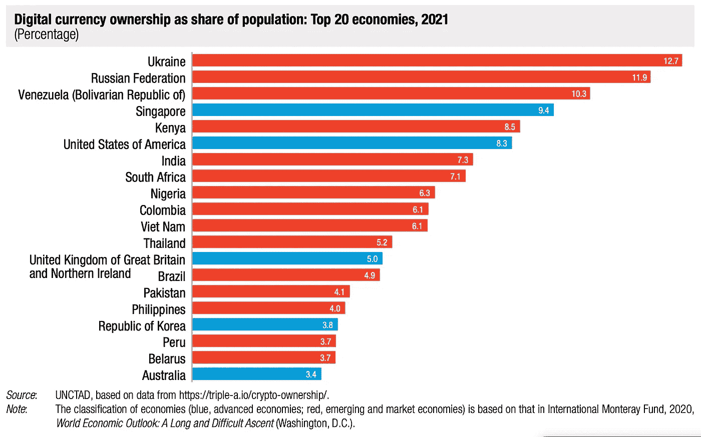

# ProBit Bits — ProBit Global 的每周区块链 Bits 第 13 卷

> 原文：<https://medium.com/coinmonks/probit-bits-probit-globals-weekly-blockchain-bits-vol-13-acad6ff0006?source=collection_archive---------27----------------------->

如果你错过了，以下是我们认为你会感兴趣的过去一周的重大进展。是另一个版本的 ProBit(区块链)Bits。

**以太坊 PoS 机上电推迟至 9 月 19 日**

在过去的一周里，以太坊核心开发者建议将 9 月作为合并升级的新时间表。在 7 月 14 日星期四举行的第 91 次双周[会议](https://github.com/ethereum/pm/issues/566)之后，开发者表示，他们预计在 Goerli testnet 的结果出来后，以太坊从工作证明到利益证明机制的转换将在 9 月 19 日的一周内暂时进行。

Goerli 是 Sepolia 合并后升级的两个测试网之一，计划于 8 月 8 日开始。它的更新将在 8 月 12 日星期五的第 6 次合并社区电话会议上讨论。

首席开发人员 Vitalik Buterin 在他的 ETH Shanghai Web 3.0 开发人员峰会演讲中指出，升级将于 8 月进行，但如果有风险，可能会推迟到 9 月或 10 月。

**摄氏放弃破产**

在其运营的不确定性之后，陷入困境的加密贷款公司 Celsius Network LLC (CNL)，[在纽约南区的美国破产法院申请破产](https://www.cnbc.com/2022/07/13/embattled-crypto-lender-celsius-informs-state-regulators-that-its-filing-for-bankruptcy-imminently-source-says-.html?__source=androidappshare)。

备案文件显示，该公司持有 43 亿美元的资产和 55 亿美元的负债，资产负债表上的赤字为 11.9 亿美元。据报道，该贷方除了其金融和贸易业务外，还经营着美国最大的加密采矿企业之一。文件显示，在 2020 年 11 月 1 日至 2021 年期间，Celsius 以高达 7.5 亿美元的价格购买了采矿钻机，目前拥有 80850 台钻机，其中 43632 台正在运行。它计划到 2022 年底运营约 120，000 台钻机。Celsius 的破产发生在 5 月份 TerraUSD 的破产和 7 月 6 日另一家加密贷款公司 Voyager Digital Ltd 的破产之后。

联合国机构称发展中国家的密码增长了 2300%

联合国贸易和发展会议(UNCTAD)在[发布了一份报告](https://unctad.org/system/files/official-document/presspb2022d8_en.pdf)，显示加密货币生态系统在 2019 年 9 月至 2021 年 6 月间扩大了 2300%，尤其是在发展中国家。它确定了疫情期间发展中国家加密货币使用增加的两个主要原因。

传统汇款服务的成本已经很高，在封锁期间甚至更高，因此加密货币的使用在价格和速度方面成为汇款的一个有吸引力的选择，这是一个旨在促进世界贸易国家中发展中国家利益的政府间组织。报告还指出，加密货币已成为保护家庭储蓄的一种方式，因为它们主要由发展中国家的中等收入个人持有，特别是在面临货币贬值和通胀上升的国家，他们将加密货币视为金融投资和投机的一部分。

**2022 年，混音器收到的加密比以往任何时候都多**

chain analysis[数据显示](https://blog.chainalysis.com/reports/cryptocurrency-mixers/)由于几个原因，2022 年，混合者收到的加密货币比以往任何时候都多。价值混合器收到的价值可能每天都在波动，但其 30 天移动平均线在 2022 年 4 月 19 日达到了价值 5180 万美元的加密货币的历史最高水平，大约是 2021 年同一时间点流入量的两倍，这是总部位于区块链的检测和防止非法使用加密货币的数据平台。

混合器旨在为加密货币交易提供更多隐私，在用户存款的加密货币和他们提取的加密货币之间建立了一个断开连接，以混淆流程。混合器有时被用来掩盖资金来源，以“愚弄”区块链调查人员，因此自然对网络犯罪分子有吸引力。

换句话说，虽然网络罪犯可以使用它们，但混合器已经成为调查人员和合规专业人员了解的工具。它们还被用于合法的原因，如确保金融隐私，特别是对于生活在压迫性政府下的人或需要匿名进行合法交易的人。

**巴拉圭离合法承认比特币活动又近了一步**

参议员费尔南多·席尔瓦·法塞蒂证实，一项监管巴拉圭加密资产活动的法案已经获得参议院批准。

巴拉圭众议院[在五月下旬通过了该法案](https://www.theblockcrypto.com/post/149240/paraguays-crypto-industry-regulation-advances-despite-pushback-from-central-bank)，并提交给参议院和总统批准使其成为法律。

如果获得批准，比特币采矿以及加密货币交易所等行业参与者将获得法律认可。除了为矿商和投资者的投资提供急需的法律确定性，它还带来了一个法律框架的创建，以推动该国和整个地区与加密货币行业相关的公司。

国会议员卡里托斯·雷贾拉在推特上写道，提议的采矿作业将使用 100%的水电可再生能源。

**电费下降不利于比特币的未来价格前景**

与此同时，摩根大通表示，开采一枚比特币的电力成本正在下降。跨国投资银行[报告](https://www.bloomberg.com/news/articles/2022-07-14/jpmorgan-says-bitcoin-cost-of-production-may-be-down-to-13-000#xj4y7vzkg)称，一枚比特币的电费已经从 6 月初的约 24000 美元降至现在的约 13000 美元。

报告称，这是由于矿商部署了更高效的钻机，也是由于采矿用电减少。虽然这一进展可能有助于矿商的长期盈利能力，并减轻他们出售比特币的压力，但这可能被视为对定价的负面影响。

***在 Twitter(https://twitter.com/ProBit_Exchange/)和 Telegram(https://t.me/ProBitGlobalOfficial)上关注我们，了解更多信息，包括正在寻求登上大舞台的新加密宝石的注释。***

***不要错过！***

[【www.probit.com】](http://www.probit.com)

> *交易新手？试试[加密交易机器人](/coinmonks/crypto-trading-bot-c2ffce8acb2a)或者[复制交易](/coinmonks/top-10-crypto-copy-trading-platforms-for-beginners-d0c37c7d698c)*