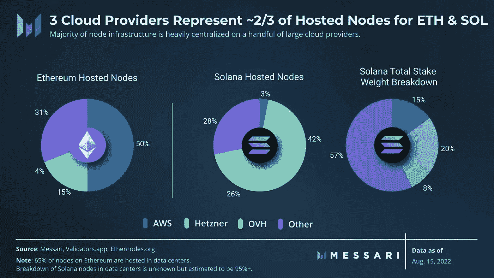

# ProBit Bits(第 18 卷)— ProBit Global 的每周区块链 Bits

> 原文：<https://medium.com/coinmonks/probit-bits-vol-18-probit-globals-weekly-blockchain-bits-83a55b95f87c?source=collection_archive---------19----------------------->

ProBit Bits weekly — (Vol. 18)

*从以太坊合并的更新到对* 3AC 传奇的简要思考，以及 2022 年迄今为止有多少 DeFi 协议被盗，*喜欢阅读第 18 版的 ProBit Global 每周区块链比特。*

**以太坊试图纠正对即将到来的升级的误解**

Ethereum.org 上周发表了一些关于即将到来的以太坊合并升级的流行误解。其中最热门的话题是升级不会导致更低的汽油费。他们说，它将从工作验证(PoW)过渡到利益验证(PoS)共识，但不会直接影响网络容量或吞吐量。

即使努力集中在扩展第二层的用户活动上，他们说另一个需要纠正的误解是升级不太可能影响第一层的交易速度。PoS 终结可能会提供额外的安全保证，但不会显著加快交易速度。使用 PoS 时，块的生成频率将比使用 PoW 时高 10%,但是这种变化不太可能被用户注意到。三分之一的人认为，自 2020 年以来将 ETH 押在信标链上的验证者可以在合并后退出。他们说这也不会发生。即使启用，验证器退出也是有速率限制的，因此赌注者不能一次全部退出。

其他观点包括，任何人都可以免费运行他们的节点，以维护以太网的分散化，而不是认为他们需要为此付出 32 ETH。

**硬分叉支持者希望 ETH 持有者退出有限合伙人**

尽管仍未证实会发生这种情况，但 ETHW 核心上周开始建议每个持有人从流动性池(LPs)中撤出他们的 ETH。他们声称，如果硬分叉真的发生，持有人在 Uniswap、Sushiswap 和 Compound 等 LP 中的 ETH“将会被黑客和科学家用废弃的、毫无价值的 USDT、USDC 和 WBTC 交换或借出”。

ETHW 核心表示，将引入 LP (DEX 和 lending protocol)冻结技术，以在硬分叉后保护用户的 ETHW 令牌。

ETHW 团队也发布了他们的第一个代码。它包括取消 EIP-1559 法案——该提案引入了以太坊交易中基础费用的燃烧——以将费用分配给矿工。

当一个社区成员[在代码中发现一个漏洞](https://twitter.com/z_j_s/status/1558966983932014592?s=21&t=tqzRQXMgzjvpRrx_vQxlmQ)将所有块回滚到伦敦分叉之前，一个补丁被迅速发布以遏制该漏洞。

**梅萨里说，云中的节点不是分散的**

在一项以太坊相关的开发中，加密数据提供商 Messari 呼吁对节点进行去中心化。It [声称，三大云提供商](https://twitter.com/MessariCrypto/status/1560068983390318594)负责数据中心托管的 65%以太坊节点中的大约三分之二(69%)。据报道，同一组云提供商还托管了数据中心托管的大约 95%的 Solana 节点中的 72%。超过 50%来自亚马逊网络服务(Amazon Web Services)，超过 15%来自赫茨纳，4.1%来自 OVH。

节点服务提供商一般[在后台运行分布式节点客户端](https://ethereum.org/en/developers/docs/nodes-and-clients/nodes-as-a-service/)，为普通用户提供一个 API key，用于读写区块链。

以太坊仍然是最大的支持智能合约的公共区块链。然而，由于其高需求导致高汽油费的主要缺点，像索拉纳这样的新区块链正迅速获得牵引力。

**7 月份记录的最大 ENS 注册量**

与此同时，以太坊名称服务(ENS)上周的注册总数超过了 200 万。ENS 是基于区块链的[开源命名协议](/the-ethereum-name-service/how-dns-tld-owners-can-get-involved-in-ens-1a2e187de567)，旨在补充和扩展 DNS 的实用性。它关注的是目前没有使用 DNS 的用例，如加密支付和[分散式网站](/the-ethereum-name-service/all-the-ways-you-can-surf-the-decentralized-web-today-bf8e7a42fa27)。

据 Dune 称，七月 ENS 注册量超过 378，000，成为最多的一个月，有超过 525，000 个地址参与了注册. eth 域名的拍卖过程。注册和续费超过 686 万美元

**两位 3AC 合伙人离开后，风险管理并没有得到改善**

还记得 3AC 传奇吗？嗯，纽约杂志 Intelligencer 上周发表的一篇专题文章暗示，两名香港合伙人的离开可能是导致三箭资本(T3)崩溃的一个因素。

两人“通常每周工作 80 至 100 小时，管理 3AC 的大部分业务”，同时退休。他们的离开将大部分工作留给了首席风险官凯尔·戴维斯(3AC 的联合创始人，与苏铸一起)。

一位前朋友认为，“在戴维斯接手之前，他们的风险管理要好得多”。这位朋友说，另一方面，朱不愿意雇佣新员工，尽管员工抱怨工作时间太长。除了担心新人会“泄露商业秘密”，据说朱把在 3AC 工作的机会视为一种恩惠。

**加拿大交易所对散户投资者实施购买限制**

为了保护加密投资者，加拿大的一些加密交易所上周为他们的用户引入了新的监管变化。现在，散户投资者的“受限币”每年“购买限额”为 3 万加元，他们可以购买任意数量的比特币(BTC)、以太币(ETH)、莱特币(LTC)和比特币现金(BCH)。

对于牛顿来说，账户的净买入限额[不适用于 BC 省、阿尔伯塔省、马尼托巴省或魁北克省的居民。Bitbuy](https://help.newton.co/hc/en-us/articles/8216687424915-What-are-these-new-regulatory-changes-August-2022-) 也发布了类似的通知，称这一限制“在一个连续的 12 个月期间(过去 365 天)内，计算你所有的加密购买减去你的销售(按平均成本)”。

**截至 2022 年 7 月，价值 19 亿美元的密码被黑客窃取**

上周发布的一份连锁分析报告显示，截至 2022 年 7 月，价值高达 19 亿美元的密码被黑客窃取。在 2021 年的同一时间点，它还不到 12 亿美元。

可能还有更多。8 月的第一周见证了 cross-chain bridge Nomad 的 1 . 9 亿美元黑客攻击和 T2 的几个 Solana 钱包的 500 万美元黑客攻击。区块链分析公司将 DeFi 协议被盗资金[惊人的增长](https://blog.chainalysis.com/reports/chainalysis-web3-report-preview-safety-compliance-defi/)归因于他们的平台[特别容易受到黑客攻击](https://blog.chainalysis.com/reports/2022-defi-hacks/)。它说，DeFi 协议的开放源代码和他们对进入市场和快速增长的渴望是可能导致安全漏洞的因素。到目前为止，2022 年朝鲜附属团体已从 DeFi protocols 窃取了约 10 亿美元的加密货币。

**排名前 40 的公司在区块链/加密上投入了 60 亿美元**

在分析公司 AUM 资产管理公司对投资区块链/加密的前 100 家银行进行分析后，Blockdata 上周发现，40 家顶级公司在 2021 年 9 月至 2022 年 6 月中旬期间投资了区块链。

它们包括三星、大华银行、花旗集团和高盛。其他公司包括 Alphabet、贝莱德、摩根士丹利、BNY 梅隆和 PayPal。这 40 家公司总共向区块链的初创公司投资了约 60 亿美元。

*您是否对任何加密趋势和问题不清楚？建议或评论？或者你只是需要一个关于特定密码术语或主题的 ELI5(就像我 5 岁一样解释)？*

*欢迎给我们留言，我们会尽最大努力传播更多信息。我们总是在这里回答你的问题。*

*关注我们的*[*Twitter*](https://twitter.com/ProBit_Exchange/)*和*[*Telegram*](https://t.me/ProBitGlobalOfficial)*了解更多信息，包括正在寻求登上大舞台的新加密宝石的笔记。*

不要错过！

[*www.probit.com*](http://www.probit.com/)

> 交易新手？试试[加密交易机器人](/coinmonks/crypto-trading-bot-c2ffce8acb2a)或者[复制交易](/coinmonks/top-10-crypto-copy-trading-platforms-for-beginners-d0c37c7d698c)