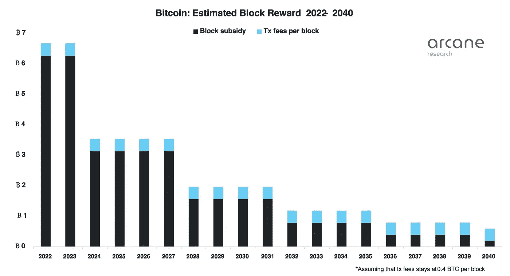

# ProBit Global 的每周区块链位— ProBit Bits 第 19 卷

> 原文：<https://medium.com/coinmonks/probit-globals-weekly-blockchain-bits-probit-bits-vol-19-205d98b6e31?source=collection_archive---------26----------------------->

*从以太坊合并到日本审查税收制度以将加密初创企业留在日本的更新，到* SEC 再次拒绝 VanEck 的 ETF 申请，*享受阅读第 19 版 ProBit Global 的每周区块链位。*

**以太坊合并更新**

根据 OKLink 的说法，合并升级的建立提高了以太坊矿工地址[的当前余额。这些地址增长到三年来的最高水平，值为 254，846.35 ETH。](https://oklink.com/en-us/chainhub/eth/chart-details/71?startTime=1435593600000&tabs=dashboard)

随着以太坊基金会[推出](https://blog.ethereum.org/2022/08/24/mainnet-merge-announcement)期待已久的合并升级的更新路线图，这一披露也随之而来。在一个相关的举措中，ETHW 运动下以太坊链的提议分支的支持者上周发布了第二次代码更新。他们做了 [EIP-155 更新](https://github.com/ethereumpow/go-ethereum)使得交易用链 ID 签名。这也是为了防止可能来自未来分叉的重放攻击。

在链分裂的情况下，顶部的挖掘池 Antpool 表示，它将无法在 PoS 链上维护用户的 ETH 资产。它认为合并有审查的风险，它必须保护客户的资产安全。

**Tornado Cash 的 Pertsev 与俄罗斯联邦安全局有关联，被拘留三个月**

我们这里指的是这份每周摘要的第 17 卷版。Crypto mixer Tornado Cash 受到美国财政部外国资产控制办公室(OFAC)的制裁。随后，29 岁的 Tornado Cash 开发商 Alexey Pertsev 在阿姆斯特丹被荷兰财政信息和调查局逮捕。

上周，一份来自情报公司 Kharon 的报告称，Pertsev 受雇于一家与俄罗斯安全局有联系的公司。该报道几乎是在荷兰[的一名法官裁定被指控协助洗钱的 Pertsev](https://www.coindesk.com/policy/2022/08/24/alleged-tornado-developer-pertsev-must-stay-in-jail-dutch-judge-rules/?utm_medium=referral&utm_source=rss&utm_campaign=headlines) 必须在监狱中至少再呆 90 天的时候发布的。截至这两起事件发生时，佩尔采夫尚未被正式指控犯有任何罪行。

**日本考虑通过税收审查来扩大加密创业空间**

据报道，为了阻止其他地方的秘密创业公司外流，日本政府正在寻求在 2023 年的税收改革中减少相关实体的税收负担。金融厅和经济产业省正在考虑审查公司为筹集资金而发行的加密资产的公司税收制度。这是为了防止秘密创业公司离开日本，在新加坡等国家建立海外业务，当地媒体报道。

加密项目使用一种被称为初始硬币发行(ICO)的众筹机制来为他们新颖的区块链想法筹集资金。根据目前的日本税收制度，在特定时期结束时，根据市场价值对 ICO 之后的项目持股部分征税。结果，未实现的收益被征税。新的考虑明年可能不再如此。

**伊朗缴获非法加密采矿设备**

据报道，自 2022 年 3 月初以来，德黑兰已经缴获了 9404 台非法加密货币采矿设备，大德黑兰配电公司首席执行官 Kambiz Nazerian 上周表示。

德黑兰 22 个区的检查员在伊朗伊斯兰共和国进行例行检查时，发现了这些非法活动。

该国最近出现了与非法秘密采矿活动有关的问题。一份 Chainalysis 加密犯罪报告[强调【2015 年至 2021 年间，非法采矿占该国加密货币活动的 85%左右。](https://www.financialexpress.com/digital-currency/illegal-bitcoin-miners-accounted-for-85-of-cryptocurrency-based-activity-in-iran-report/2551112/)

尽管这些非法活动有导致冬季新的断电的风险，但更多的人被吸引到挖掘加密货币来赚取收入。虽然电力成本较低，但最近采矿活动的增加被归因于伊朗货币贬值。

**这是 2040 年开采比特币的成本**

神秘研究公司上周[发布了一份到 2040 年比特币发展所需能源的估计](https://arcane.no/research/how-much-energy-will-bitcoin-consume-in-the-future)。如果到 2040 年比特币价格达到 200 万美元，该公司声称比特币每年可能消耗 894 万亿瓦时，这是今天水平的 10 倍。

如果比特币的价格到那时达到 50 万美元，它表示比特币每年将消耗 223 TWh 大约是目前水平的两倍。如果比特币的价格在 2040 年达到 200 万美元，交易费保持在历史平均水平，比特币在全球能源消耗中的份额将为 0.36%。

尽管作者认为，到 2040 年，大多数比特币矿工将使用比电网电力便宜得多的闲置能源。他们指出，比特币价格是决定这种顶级加密货币未来能耗的最关键因素。

与此同时，Swan Private Client Services 的董事总经理 Steven Lubka 认为，比特币有助于激励能源行业的发展，因为它有助于提供最高效的能源生产设施，增加现金流。

**SEC 再次拒绝 VanEck 的 ETF 申请**

证券交易委员会(SEC)对 VanEck 在 7 月份提交的申请的回应于上周出炉。这家资产管理公司申请现货市场[比特币交易所交易基金](https://decrypt.co/resources/bitcoin-etf-explained-guide-learn-easy)再次没有获得监管机构的批准。相反，SEC 花时间将对 VanEck 申请的决定又推迟了 45 天。到 10 月，监管机构希望“批准或不批准，或提起诉讼以决定是否不批准拟议的规则变化。”

美国证券交易委员会[去年拒绝了总部位于纽约的公司的首次申请](https://www.sec.gov/rules/sro/cboebzx/2021/34-93559.pdf)，因为它不相信比特币市场能够抵御欺诈和操纵。

4

> 交易新手？尝试[加密交易机器人](/coinmonks/crypto-trading-bot-c2ffce8acb2a)或[复制交易](/coinmonks/top-10-crypto-copy-trading-platforms-for-beginners-d0c37c7d698c)