# 生产合同安全——第 3 部分

> 原文：<https://medium.com/coinmonks/production-contract-security-part-3-40fa3ac7f78a?source=collection_archive---------10----------------------->

在我们之前的文章中，我们深入研究了多签名钱包的世界以及围绕它们的最佳实践。如果您不熟悉 Gnosis multisig，在开始本练习之前，请查看一下[第 1 部分](https://cipherz.medium.com/production-contract-security-part-1-81583b7bde75)和[第 2 部分](https://cipherz.medium.com/production-contract-security-part-2-b631a67b6b4e)。


# **目的**

本文的目的是向开发人员展示如何创建现实生活中的智能契约，该契约具有适当的安全控制并由多签名契约拥有。我们将构建一个具有以下属性的智能合约:

*   访问控制
*   归多重签名所有

# 入门指南

我们将使用`hardhat`来生成一个需要`node`的示例项目。如果你还没有它，你可以在这里安装。

一旦安装了`node`，就可以运行下面的代码来生成一个示例`hardhat`项目

```
# Create a project directory
mkdir upgrademe && cd upgrademe# Init the project as a node project
npm init# Install hardhat local to the project
npm install --save-dev hardhat# Begin new project wizard
npx hardhat# Example Output
✔ What do you want to do? · Create a TypeScript project
✔ Hardhat project root: · /mnt/c/Users/markm/projects/datchat/upgrademe
✔ Do you want to add a .gitignore? (Y/n) · y
✔ Do you want to install this sample project's dependencies with npm ([@nomicfoundation/hardhat-toolbox](http://twitter.com/nomicfoundation/hardhat-toolbox))? (Y/n) · y
```

现在您已经配置了一个启动项目，让我们运行一些命令，确保一切正常。

```
# Compile the smart contract
npx hardhat compile# Run the unit tests
npx hardhat test# Run the standalone deploy script
npx hardhat run scripts/deploy.ts
```

您可能想知道这是在什么区块链上运行的——毕竟，我们没有指定任何目标区块链。Hardhat 旋转一个独立的临时节点，在后台执行这些命令。这对我们来说已经足够好了，但是您可以通过`--network`参数将它发送到一个特定的网络，并在`hardhat.config.ts`文件中定义一个相应的网络。这超出了本文的范围，但是有很好的证明。

# 合同

我们只是要更新由`hardhat`创建的示例契约，因为这对我们的示例来说已经足够了。契约是一个简单的令牌锁，契约所有者可以将`eth`发送给它，并在指定的时间后解锁。

如果我们看一下`test/Test.ts`，我们应该会看到它的正确用法。

这是一个很好的起点，但是我们希望`Lock.sol`合同的所有者是一个 multisig。如果你注意到，契约的`deployer`被设置为`owner`，并且没有办法改变它。我们将对这个契约进行一点点更新，以便在将`access control`设置为特定功能时给我们更多的灵活性，并给我们一种方法来将所有者从`deployer`更改为`multisig`。

## 访问控制

OpenZeppelin 最初是一个公共可靠性模式和契约的开源库，是一个非常有价值的工具。我们将使用他们的`AccessControl`合同来扩展我们的合同，并提供我们需要的功能。

```
# Install the openzeppelin contracts library
npm i @openzeppelin/contracts
```

现在我们可以添加`AccessControl`合同`Lock.sol`作为依赖项，如下所示:

Rudimentary addition of AccessControl

你会注意到合同中有几处增加/删除，所以让我们检查一下。

```
# Imported the contract
import "@openzeppelin/contracts/access/AccessControl.sol";# removed the `owner` variable as we don't need that anymore# set the owner via a helper method of AccessControl - note that DEFAULT_ADMIN_ROLE comes by default, but you can define custom roles as well.
_setupRole(DEFAULT_ADMIN_ROLE, msg.sender);# Decorated withdraw() method with onlyRole(DEFAULT_ADMIN_ROLE) to set the security access
```

如果您清理并再次运行测试，您将看到与返回的错误消息相关的错误。

```
# Clean
npx hardhat clean# Test
npx hardhat test2) Lock
       Withdrawals
         Validations
           Should revert with the right error if called from another account:
     AssertionError: Expected transaction to be reverted with reason 'You aren't the owner', but it reverted with reason 'AccessControl: account 0x70997970c51812dc3a010c7d01b50e0d17dc79c8 is missing role 0x0000000000000000000000000000000000000000000000000000000000000000'
```

将失败的测试替换为:

```
it("Should revert with the right error if called from another account", async function () {
        const { lock, unlockTime, otherAccount } = await loadFixture(
          deployOneYearLockFixture
        );// We can increase the time in Hardhat Network
        await time.increaseTo(unlockTime);// We use lock.connect() to send a transaction from another account
        await expect(lock.connect(otherAccount).withdraw()).to.be.revertedWith(
          "AccessControl: account 0x70997970c51812dc3a010c7d01b50e0d17dc79c8 is missing role 0x0000000000000000000000000000000000000000000000000000000000000000"
      );
});
```

您还必须替换另一个测试，因为`owner`变量已经不存在了。将`Should set correct owner`测试替换为:

```
it.only("Should set the right owner", async function () {
      const { lock, owner } = await loadFixture(deployOneYearLockFixture);
      expect(await lock.hasRole(await lock.DEFAULT_ADMIN_ROLE(), owner.address)).to.be.true;
});
```

现在您的测试应该通过了:)我们现在准备创建一个 hardhat 脚本，将我们的合同所有者从`deployer`更改为`multisig`合同。系好安全带…

## 重新分配所有权

到目前为止，我们一直使用本地 hardhat 节点来运行我们的部署和测试，只是为了确保一切正常。

现在，我们将使用一个 testnet 来部署我们的契约，并创建一个定制的 hardhat 脚本来将契约的所有权分配给我们在[第 1 部分](https://cipherz.medium.com/production-contract-security-part-1-81583b7bde75)中创建的 multisig。

**RPC**

为了与 testnet 交互，您需要为您的应用程序创建一个 rpc 端点。我建议使用 [infura](https://infura.io/) 或 [alchemy](https://www.alchemy.com/) 来创建一个指向`ethereum` 网络和`rinkeby` 测试网的 rpc 节点。你可以用这个水龙头为你的交易做一些测试。

**Hardhat.config.ts**

下面是您应该在项目中使用的更新的`hardhat.config.ts`。我们增加了几样东西

*   将合同所有权从部署者转移到 multisig 的安全帽
*   rinkeby 的`network`定义。
*   部署者帐户的私钥——您用于`rinkeby` testnet 的那个。

## 。包封/包围（动词 envelop 的简写）

因为这是一篇关于安全性的文章，所以最好向您展示如何在代码中隐藏秘密，而不是直接将它们放入配置文件中。你会惊讶地发现有多少开发者不知不觉地将他们的秘密提交给了公共存储库…

```
# Install dotenv package
npm i --save-dev dotenv# Install hardhat ethers
npm i --save-dev @nomiclabs/hardhat-ethers 'ethers@^5.0.0'# Install chai to test assertions
npm i --save-dev chai
```

用以下值在项目的根目录下创建一个`.env`文件

```
RPC_URL=https://https://eth-rinkeby.alchemyapi.io/v2/<your api key>DEPLOYER_PRIVATE_KEY=<your private key>
```

请注意，在我们的`.gitignore`文件中，我们排除了所有名为`.env`的文件，因此这将永远不会提交给我们的回购。

## 我们要去林克比

现在我们已经配置好了一切，让我们继续将我们的合同部署到`rinkeby` testnet。我们实际上要修改一下我们的`deploy.ts`脚本，把以太的锁定量从 1 减少到 0.01。Testnet eth 很难获得，所以我们不要锁定整个 eth。此外，我们将把锁定时间减少到 5 分钟，这样我们就可以看到真正成功的`withdrawal`，而不是等待一年。

将`scripts/deploy.ts`中的第 5 行改为

```
const ONE_YEAR_IN_SECS = 5 * 60; // 5 minutes
```

将`scripts/deploy.ts`中的第 8 行改为

```
const lockedAmount = ethers.utils.parseEther(".01");
```

**展开**

让我们继续使用下面的命令部署合同

```
# Deploy to Rinkeby
npx hardhat run scripts/deploy.ts --network rinkeby
```

脚本应该返回已部署的契约地址，如下所示

```
Lock with .01 ETH deployed to: 0x73f701a4a56AA14513a2A108624b4D00f90D27b2
```

**多信号**

现在，让我们来看看在本系列的第 2 部分中我们用 Gnosis 为 Rinkeby 部署的 multisig 契约。在下一步中，我们将使用这个地址和部署的契约地址。

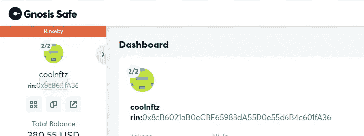

**将合同所有权转让给 Multisig**

接下来，我们将运行我们创建的定制任务，将契约的所有权从部署者帐户转移到 rinkeby 上的 multisig

```
npx hardhat xfer-contract-multisig --multisig 0x8cB6021aB0eCBE65988dA55D0e55d6B4c601fA36 --contract 0x73f701a4a56AA14513a2A108624b4D00f90D27b2 --network rinkeby
```

您应该会看到类似下面的输出

```
Grant DEFAULT_ADMIN_ROLE to multisig: 0x8cB6021aB0eCBE65988dA55D0e55d6B4c601fA36
Revoke DEFAULT_ADMIN_ROLE from deployer: 0xec2FFc240CbDE001643a045e2C1Ad928D9eB8aee
Transferred ownership to: 0x8cB6021aB0eCBE65988dA55D0e55d6B4c601fA36
```

现在，我们的合同已经完成部署，所有权也已转移到我们的 multisig，让我们继续设置我们的 *OpenZeppelin Defender* 应用程序，以便为我们的 *Gnosis* multisig 签名。

## OpenZeppelin 防御者

让我们在 https://defender.openzeppelin.com/的[创建一个帐户，用于管理我们已部署合同的操作。Defender 是一个很有用的工具，可用于编排我们已部署合同的提案和签名，它可以做很多事情，但我们主要是用它来管理我们的 multisig 行动。](https://defender.openzeppelin.com/)

**添加 Gnosis Multisig**

一旦你创建了你的 OpenZeppelin 账户，点击右上角的`Add Contract` 按钮添加我们的 multisig 合同。

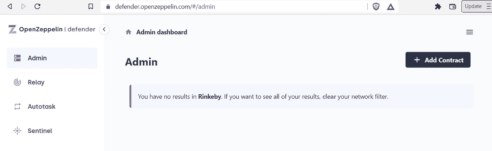

输入可以从 Gnosis 应用程序获得的名称、网络和合同地址。这将把合同导入到 OpenZeppelin Defender 中，以便我们可以使用它进行签名。

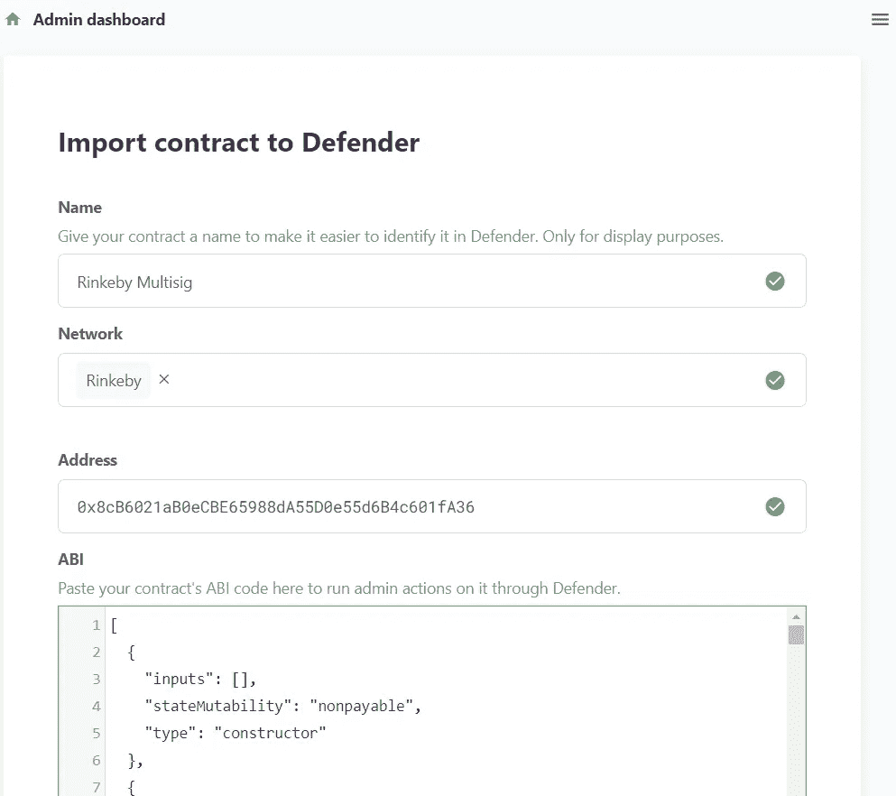

滚动到底部并点击`Add`，我们就都好了。您现在应该看到 Defender 将我们的合同识别为 multisig，它显示如下。

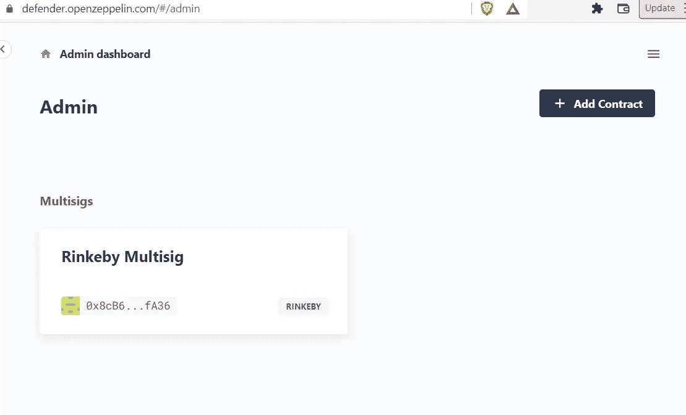

**添加锁定合同**

再次点击`Add Contract`，添加我们部署到 Rinkeby 的`Lock`契约。同样的做法—只需给它一个名称、网络和地址。然而，由于该合同未在 Rinkeby 上验证，我们需要粘贴`abi`以添加该合同。你可以在`artifacts/contracts/Lock.sol/Lock.json`文件中找到`abi`。找到`abi`属性并将整个值复制/粘贴到 Defender abi 部分。您应该可以点击`Add`来完成添加您的合同。现在，您应该可以在仪表板中看到这两个合同，如下所示。

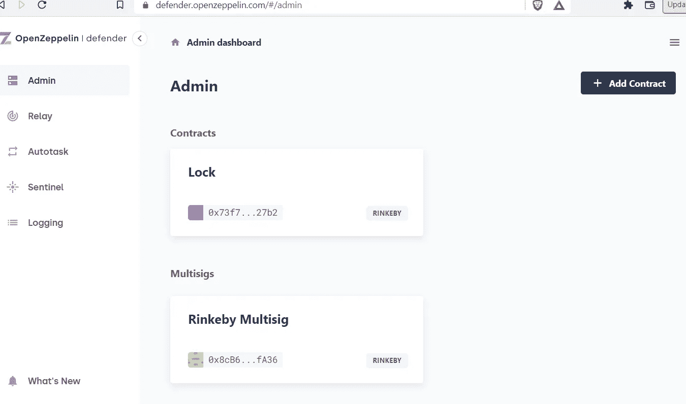

我们现在处于一个非常好的状态，一切都配置好了，现在我们可以在我们的合同上创建一个提案，并通过 multisig 的多个签署人来执行它。

## 把所有的放在一起

在我们最后的努力中，我们将做以下事情

*   为我们的`Lock`合同创建提案
*   用多个授权账户签署提议的交易
*   参见 multisig 执行提案

## 创建建议

导航到 Defender 中的`Dashboard => Contracts => Lock => New Proposal => Admin Action`。选择`withdraw`动作和`Multisig`的执行策略，选择导入的 multisig。输入标题和描述的简介，然后点击`Create Admin Action`。请注意，任何人都可以创建提案，但是只有有效的签名者可以授权该提案。当您完成填写后，该表单应该类似于下面的表单。

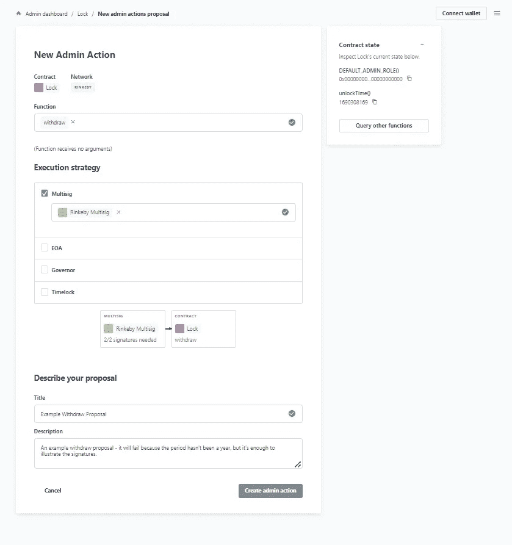

**签署建议书**

既然我们的提案已经创建，我们可以使用分配给 Gnosis multisig 的所有者帐户对其进行签名。请访问您的 Gnosis multisig，检查哪些签名者获得了授权。它应该看起来像这样。

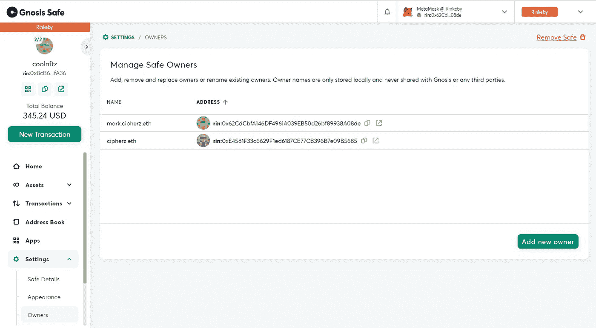

使用 Metamask 登录到此处列出的帐户之一，并再次导航到 Defender 中的提案页面。您现在应该会看到一个可选择的`Approval`按钮。如下所示，单击按钮批准该提议，并使用元掩码签名。

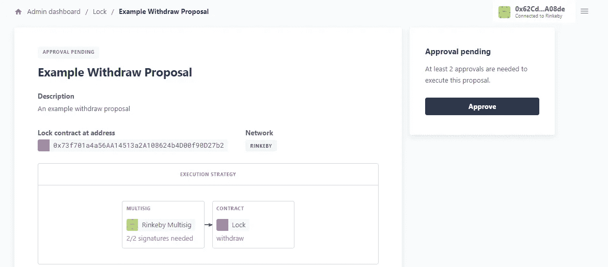

Defender 随后会告诉您，您只有一个批准，还有多少个，如下所示。在这种情况下，我们还有一个批准要做。

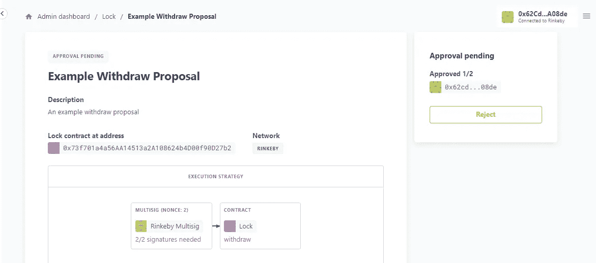

此时，您可以连接另一个元掩码帐户和`Approve and Execute`或仅仅是`Approve`。如果你只是批准了这个提议，其中一个签名者仍然必须执行它。有时，如果这是一笔耗油量很大的交易，其中一个较富裕的所有者将需要执行它。一旦所有批准人签署了交易并执行后，交易将被发送到区块链进行验证。

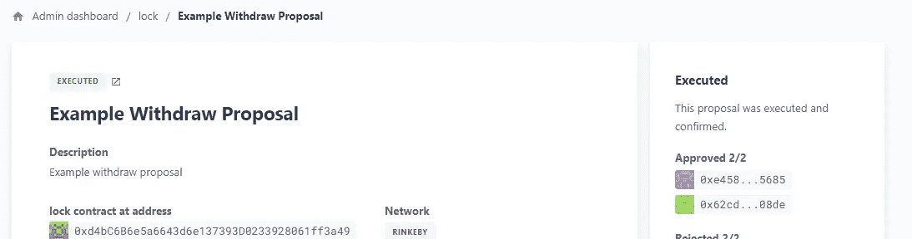

**验证**

现在，我们的 multisig 事务已经处理完毕，让我们验证一下一切是否如预期的那样工作。我们应该看到从`Lock`合同到我们的 multisig 的. 01 ETH 存款，所以让我们通过查看我们的 Gnosis multisig 来验证这一点。正如您在下面看到的，执行了`withdraw`函数，如果我们查看 etherscan 上的事务，我们可以看到. 01 ETH 的传输。

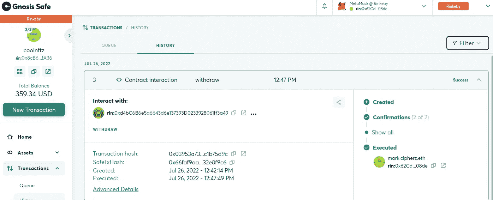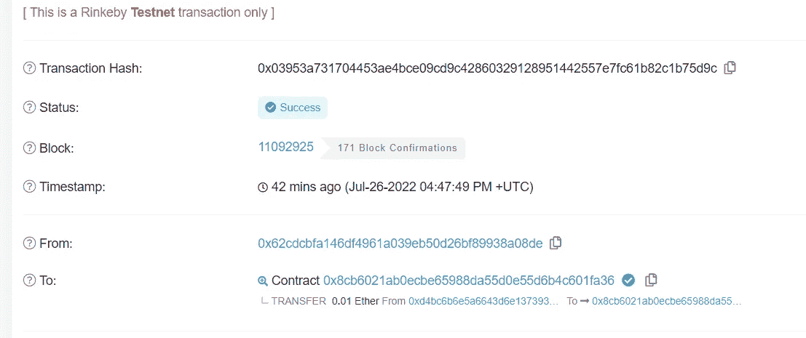

成功！祝贺您在 multisig 管理的合同上执行了第一笔交易。

## 摘要

在本文中，我们学习了如何

*   从头开始创建一个安全帽项目
*   运行和修改测试
*   延长我们与 OpenZeppelin 资源(AccessControl)的合同
*   对我们的合同做些小的修改
*   在我们的项目中安全地保管本地私钥
*   为我们的应用程序创建一个 RPC 端点，以便与区块链交互
*   部署我们的合同
*   编写自定义安全帽任务(将所有权转移给 multisig)
*   将合同和 multisig 导入 OpenZeppelin Defender
*   创建一个建议
*   签署并执行提案

唷，太多了！您正在成为一名更好的具有安全意识的区块链开发人员。感谢您阅读本文，并根据需要随时返回本文和[第 1 部分](https://cipherz.medium.com/production-contract-security-part-1-81583b7bde75)或[第 2 部分](https://cipherz.medium.com/production-contract-security-part-2-b631a67b6b4e)。

> *交易新手？试试* [*密码交易机器人*](/coinmonks/crypto-trading-bot-c2ffce8acb2a) *或* [*复制交易*](/coinmonks/top-10-crypto-copy-trading-platforms-for-beginners-d0c37c7d698c)